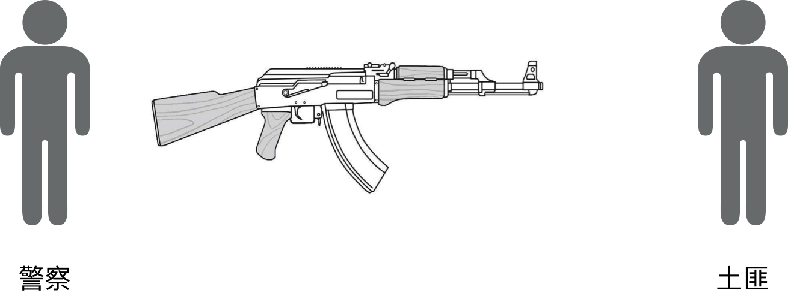
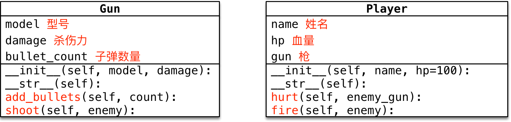

# 反恐精英 —— 面向对象实战

## 1. 目标

* 理解 **一个对象的属性** 可以是 **另外一个类创建的对象**
* 强化对面向对象 **封装** 特性的理解
    1. **封装** 是面向对象编程的一大特点
    2. 面向对象编程的 **第一步** —— 将 **属性** 和 **方法** **封装** 到一个抽象的 **类** 中
    3. **外界** 使用 **类** 创建 **对象**，然后 **让对象调用方法**
    4. **对象方法的细节** 都被 **封装** 在 **类的内部**
    
## 2. 需求说明



* **警察** 拿起 **AK47**，向 **土匪** 射击

**类图**



### 2.1 枪类

1. 使用 `Gun` 类可以创建 **枪对象**
2. 枪有三个属性：
    * **型号 model**：字符串
    * **杀伤力 damage**：整数
    * **子弹数量 bullet_count**：整数，**枪初始没有子弹**
3. 调用 `add_bullets` 方法可以增加 **子弹数量**
4. 调用 `shoot` 方法可以给参数 **敌人对象** 造成伤害
    * 如果 **没有子弹**，则 **提示玩家** 并且返回
    * 如果 **有子弹**，则：
        * **子弹数量** 减少
        * 调用 **敌人对象** 的 `hurt` 方法，**给敌人造成伤害**
        
**注意：**

在调用 `shoot` 方法时：

* 如果传入的 `enemy` 是由 `Player` 创建的对象，就让 `enemy` 调用 `hurt` 方法，处理 `enemy` 的受伤细节
* 如果传入的 `enemy` 是 `None`，表示 **没有打中敌人，只需要做子弹减少的操作**

### 2.2 玩家类

1. 使用 `Player` 类可以创建 **警察对象** 和 **土匪对象**
2. 玩家有三个属性：
    * **姓名 name**：字符串
    * **血量 hp**：整数
    * **枪 gun**：使用 `Gun` 类创建的对象，**玩家初始没有枪**
3. 调用 `hurt` 方法可以让 **当前玩家** 受到参数 `enemy_gun` 的伤害，具体流程如下：
    * 1> **玩家血量** 减去 **枪对象** 的 `damage` 伤害度
    * 2> 判断修改后的 **玩家血量** 
        * 如果 `血量 <= 0`，提示 **玩家挂了**
        * 否则，提示 **玩家受伤以及当前血量**
4. 调用 `fire` 方法可以向参数 `enemy` 开火，具体流程如下：
    * 1> 判断 **自己** 是否有武器，如果没有直接返回
    * 2> 检查 **自己的枪** 是否有子弹，如果没有，**自动装填子弹**
    * 3> 让 **自己的枪** 调用 `shoot` 方法，并传递 **要射击的敌人对象** 

### 2.3 主程序流程

1. 创建 **枪对象** 并 **测试装填和发射子弹**
2. 创建 **警察对象 policeman** 和 **土匪对象 badman**
3. 将 **枪交给警察**，警察 **向土匪开火**
4. 利用 **循环** 消灭土匪

## 3. 案例实战

### 3.1 准备武器

* 1) 新建枪类

```python
class Gun(object):
    """枪类"""
    def __init__(self, model, damage):
        self.model = model          # 型号
        self.damage = damage        # 杀伤力
        self.bullet_count = 0       # 子弹数量

    def __str__(self):
        return "型号: %s，杀伤力: %d，剩余子弹: %d" % (
            self.model,
            self.damage,
            self.bullet_count)
```

> 在 **主程序** 准备一个 `test` **测试函数**，并且创建一个 **AK47 枪对象**

```python
def test():
    """测试函数"""
    # 1. 创建枪对象
    ak47 = Gun("AK47", 50)
    print(ak47)


if __name__ == '__main__':
    test()
```

输出内容如下：

```
型号: AK47，杀伤力: 50，剩余子弹: 0
```

* 2) 实现 `add_bullets` **装填子弹** 方法

```python
def add_bullet(self, count):
    """装填子弹

    :param count: 子弹数量
    """
    self.bullet_count += count
    print("装填子弹完成，剩余子弹数量: %d" % self.bullet_count)
```

> 在 **test 函数** 测试 **装填子弹**

```python
# 1. 创建枪对象
ak47 = Gun("AK47", 50)
print(ak47)
ak47.add_bullet(10)             # 装填子弹
print(ak47)
```

输出内容如下：

```
型号: AK47，杀伤力: 50，剩余子弹: 0
装填子弹完成，剩余子弹数量: 10
型号: AK47，杀伤力: 50，剩余子弹: 10
```

* 3) 实现 `shoot` **发射子弹** 方法，方法流程如下：
    * 如果 **没有子弹**，则 **提示玩家** 并且返回
    * **子弹数量** 减少
    * 如果 **有子弹**，则：
        * 调用 **敌人对象** 的 `hurt` 方法，**给敌人造成伤害**

```python
def shoot(self, enemy):
    """向敌人发射子弹

    :param enemy: 要射击的敌人
    """
    # 1. 判断是否有子弹，如果没有直接返回
    if self.bullet_count <= 0:
        print("没有弹药了，无法射击...")
        return

    # 2. 减少子弹数量
    self.bullet_count -= 1
    print("发射 1 发子弹，剩余: %d" % self.bullet_count)
    
    # 3. 调用敌人的 hurt 方法，让敌人受伤
    if enemy is not None:
        enemy.hurt(self)
```

**提示** 由于 `Player` 类还没有设计，所以在调用 `hurt` 方法前，先判断一下传入的 `enemy` 参数是否为 `None`

> 在 **test 函数** 测试 **发射子弹**

```python
# 1. 创建枪对象
ak47 = Gun("AK47", 50)
print(ak47)
ak47.shoot(None)                # 测试没有子弹能否发射
ak47.add_bullet(10)             # 装填子弹
ak47.shoot(None)                # 测试装填子弹后，能否发射，观察子弹数量
print(ak47)
print("-" * 10 + " 枪类测试完成 " + "-" * 10)
```

输出内容如下：

```
型号: AK47，杀伤力: 50，剩余子弹: 0
没有弹药了，无法射击...
装填子弹完成，剩余子弹数量: 10
发射 1 发子弹，剩余: 9
型号: AK47，杀伤力: 50，剩余子弹: 9
---------- 枪类测试完成 ----------
```

### 3.2 准备玩家类

* 1) 新建玩家类

```python
class Player(object):
    """玩家类"""
    def __init__(self, name, hp=100):
        self.name = name            # 姓名
        self.hp = hp                # 血量
        self.gun = None             # 玩家初始没有枪

    def __str__(self):

        # 判断玩家是否挂了
        if self.hp <= 0:
            return "%s 已经挂了..." % self.name

        # 判断玩家是否有武器
        if self.gun is None:
            return "%s[%d] 没有武器" % (self.name, self.hp)

        return "%s[%d] 武器: {%s}" % (self.name, self.hp, self.gun)
```

> 在 **test 函数** 创建 **警察** 和 **土匪** 两个对象

```python
# 2. 创建警察和土匪
policeman = Player("警察")
print(policeman)

badman = Player("土匪", 70)
print(badman)

# 把 AK47 交给警察
policeman.gun = ak47
print(policeman)
print("-" * 10 + " 玩家类属性准备完成 " + "-" * 10)
```

输出内容如下：

```
警察[100] 没有武器
土匪[70] 没有武器
警察[100] 武器: {型号: AK47，杀伤力: 50，剩余子弹: 9}
---------- 玩家类属性准备完成 ----------
```

* 2) 实现 `hurt` **受伤** 方法，方法流程如下：
    * 1> **玩家血量** 减去 **枪对象** 的 `damage` 伤害度
    * 2> 判断修改后的 **玩家血量** 
        * 如果 `血量 <= 0`，提示 **玩家挂了**
        * 否则，提示 **玩家受伤以及当前血量**

```python
def hurt(self, enemy_gun):
    """玩家被 enemy_gun 击中

    :param enemy_gun: 敌人的枪
    """
    # 1. 用敌人枪的 damage 修改玩家血量
    self.hp -= enemy_gun.damage

    # 2. 判断玩家是否挂了
    if self.hp <= 0:
        print("%s 被 %s 击毙!!!" % (self.name, enemy_gun.model))
    else:
        print("%s 被 %s 击中，剩余血量: %d" % (self.name, enemy_gun.model, self.hp))
```

> 在 **test 函数** 测试 **受伤** 方法

```python
# 3. 测试土匪被击中
badman.hurt(ak47)
badman.hurt(ak47)
print(badman)
print("-" * 10 + " 受伤方法测试完成 " + "-" * 10)
```

输出内容如下：

```
土匪 被 AK47 击中，剩余血量: 20
土匪 被 AK47 击毙!!!
土匪 已经挂了...
---------- 受伤方法测试完成 ----------
```

* 3) 实现 `fire` **开火** 方法，方法流程如下：
    * 1> 判断 **自己** 是否有武器，如果没有直接返回
    * 2> 检查 **自己的枪** 是否有子弹，如果没有，**自动装填子弹**
    * 3> 让 **自己的枪** 调用 `shoot` 方法，并传递 **要射击的敌人对象**

```python
def fire(self, enemy):
    """向 enemy 开火

    :param enemy: 要射击的敌人
    """
    # 1. 检查是否有武器，如果没有直接返回
    if self.gun is None:
        print("%s 没有武器，请先装配武器" % self.name)
        return

    # 2. 检查 自己的枪 是否有子弹，如果没有，自动装填子弹
    if self.gun.bullet_count <= 0:
        self.gun.add_bullet(10)

    # 3. 让 自己的枪 调用 shoot 方法，射击敌人
    print("%s 正在向 %s 开火..." % (self.name, enemy.name))
    self.gun.shoot(enemy)
```

> 在 **test 函数** 测试 **开火** 方法

```python
# 4. 测试警察向土匪开枪
policeman.fire(badman)
policeman.fire(badman)
print(policeman)
print(badman)
```

输出内容如下：

```
警察 正在向 土匪 开火...
土匪 被 AK47 击中，剩余血量: 20
发射 1 发子弹，剩余: 8
警察 正在向 土匪 开火...
土匪 被 AK47 击毙!!!
发射 1 发子弹，剩余: 7
警察[100] 武器: {型号: AK47，杀伤力: 50，剩余子弹: 7}
土匪 已经挂了...
```

### 3.3 调整主程序

* 重新调整主程序如下：

```python
def main():
    """主程序"""
    # 1. 创建 AK47
    ak47 = Gun("AK47", 50)

    # 2. 创建 警察 和 土匪
    policeman = Player("警察", 100)
    print(policeman)

    banman = Player("土匪", 80)
    print(banman)
    print("-" * 10 + " 玩家就绪 " + "-" * 10)

    # 3. 警察拿枪
    policeman.gun = ak47

    # 4. 向土匪连续射击
    while banman.hp > 0:
        policeman.fire(banman)

    print("-" * 10 + " 交战结果 " + "-" * 10)
    print(policeman)
    print(banman)
```

**关于游戏设计的一点补充** 

* `fire` 方法中的 **自动装填子弹** 可以简化玩家的操作难度，这个在很多射击类游戏中是有体现的

## 4. 封装小结

* **玩家类** 中封装了 **开火** 方法，在主程序中，创建完对象之后，只需要让 **警察对象**  调用 **开火** 方法，即可向 **土匪对象** 射击，其他的细节，全部封装在类的内部
* **玩家类** 中封装了 **受伤** 方法，在 **枪类** 的 `shoot` 方法中，只需要调用 `hurt` 方法，即可处理 **玩家对象** 被击中的细节

