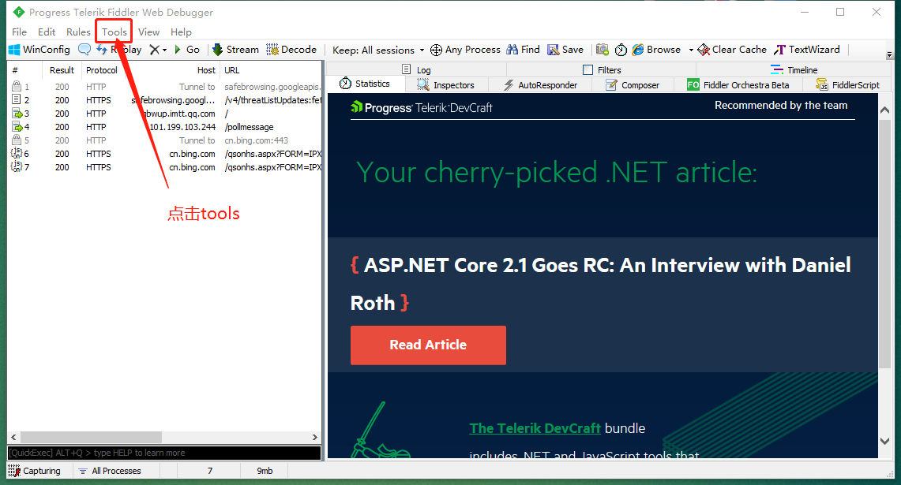
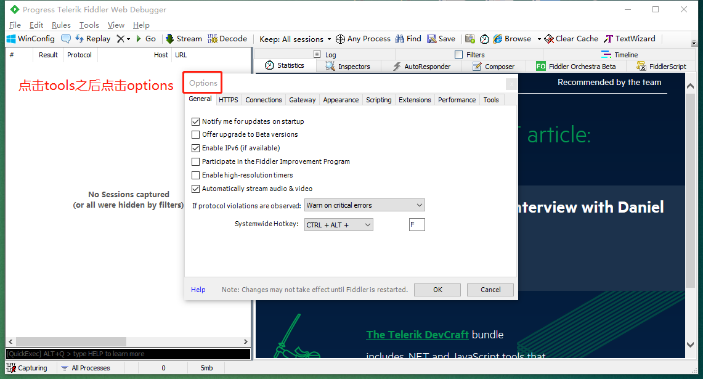
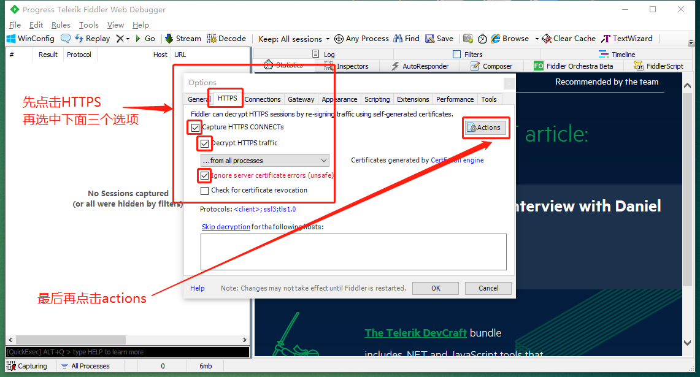
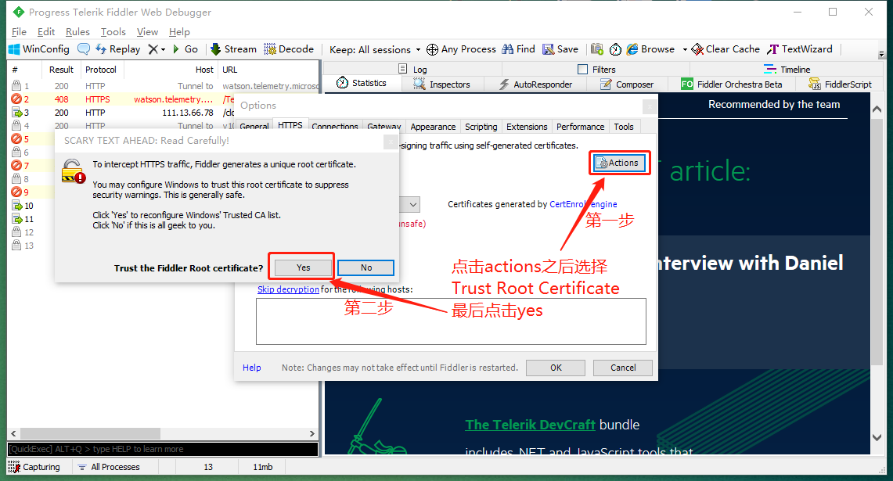
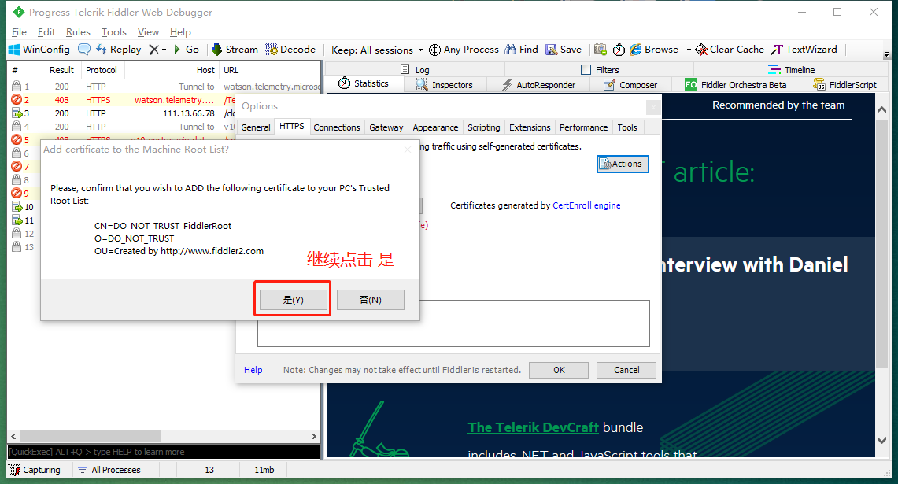
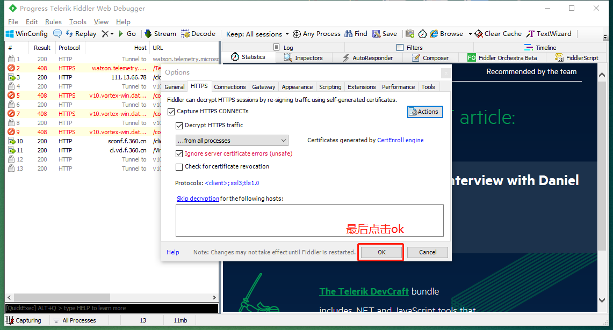
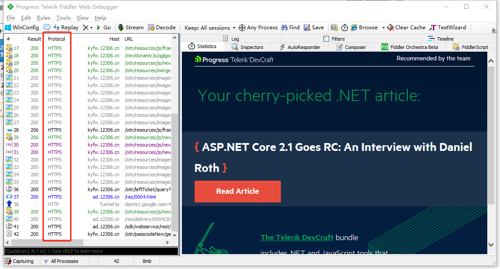

## Fiddler抓取https的设置

> 已经下载并安装了Fiddler，且chrome浏览器安装使用配置正常

### 第1步

 

### 第2步

 

### 第3步

 

### 第4步

 

### 第5步

 

### 第6步

 

### 现在就可以抓取https的请求以及相响应了

 

### 其他参考

> https://www.cnblogs.com/joshua317/p/8670923.html