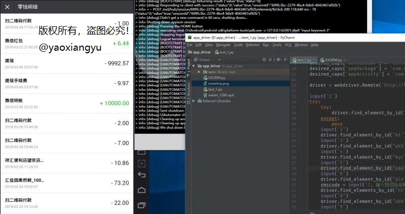

## appium介绍
##### 学习目标：
了解 appium使用场景
_________________

### 1. 什么是Appium
是一个开源、跨平台的测试框架，可以用来测试原生及混合的移动端应用。Appium支持iOS、Android及FirefoxOS平台
> appium是测试app的；selenium是测试pcweb的

### 2. 使用入门
https://testerhome.com/topics/9270

### 3. **注意**：
1. 难点在于环境的搭建，不同的电脑各种不同的坑，需要各种百度各种尝试！
2. 安卓模拟器非常占用资源！一般的笔记本的尽量就不要尝试了！
3. **安卓模拟器推荐使用夜神**！
4. 如果真的需要使用appium上生产环境，推荐使用百度移动云测试类似的虚拟模拟器环境http://mtc.baidu.com/
5. 特别注意移动设备的串号，app是可以获取移动设备尤其是安卓的一切信息，这里需要关键词`设备指纹`、`反薅羊毛`
6. 如果想规避安卓的设备指纹识别，请选择使用appium+ios

#### 爬虫应用场景
1. 抓取授权用户的芝麻信用分
2. 抓取授权用户的微信钱包明细
 

