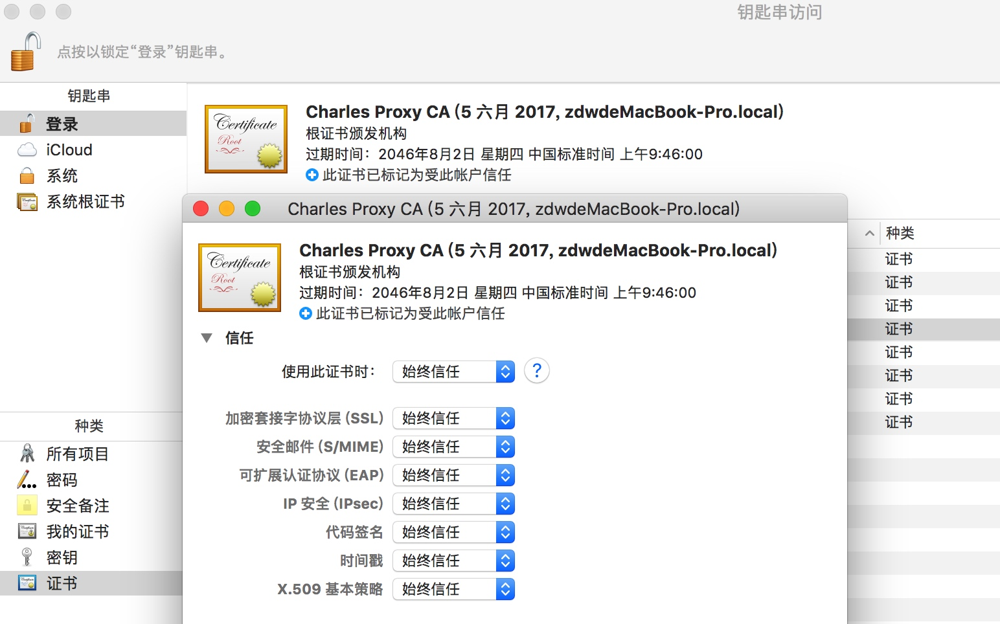
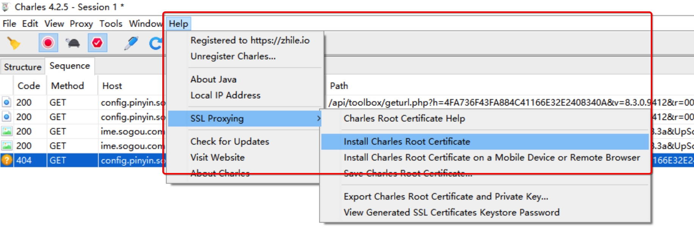
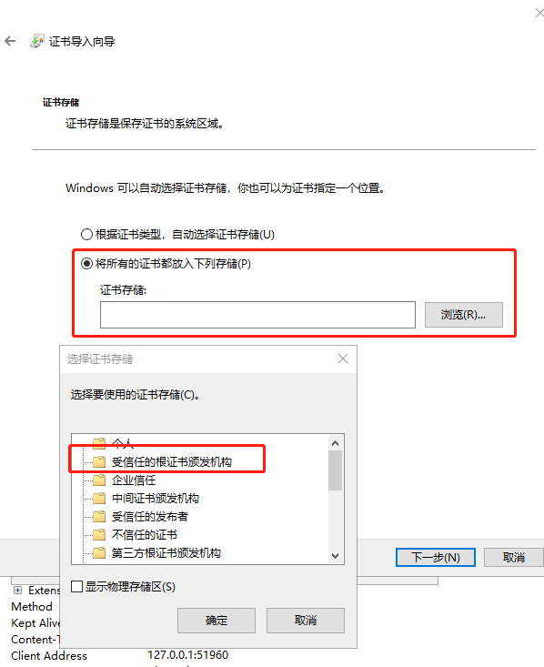

# charles使用指南

## 目标
掌握charle抓包工具的使用

## 1.charles软件的介绍
charles软件是在windows，mac，linux下通用的抓包工具

## 2.下载charles软件
下载地址：https://www.charlesproxy.com/download/

## 3. 输入注册码
点击help，点击register输入用户和key

```
// Charles 4.2目前是最新版，可用。
Registered Name: 	https://zhile.io
License Key: 		48891cf209c6d32bf4
```

## 4. mac下实现charles抓https的包
1. 点击proxy勾选macOS Proxy

    
   
2. 点击安装证书

    

3. 勾选全部为始终信任

    
 
4. 使用百度首页测试https抓包是否成功

    

## 5. windows下实现charles抓https的包
1. 点击勾选proxy下的Windows Proxy

    

2. 点击安装证书

    

3. 安装证书

    

    

    


4. 使用百度首页测试https抓包是否成功

    

## 5. charles 实现手机抓包


1. 手机和电脑在同一个局域网下，设置wifi的代理为电脑的ip，端口号为8888
2. 手机访问`chls.pro/ssl`安装证书到手机中
3. 手访问百度首页，测试是否能够抓包


## 6. 具体的抓包实现
除了使用charle，在windows下还可以使用fiddler抓包，具体的操作视频地址在：链接: https://pan.baidu.com/s/1qYI7QF5dZT-6gLG8l3avNg 密码: waju

