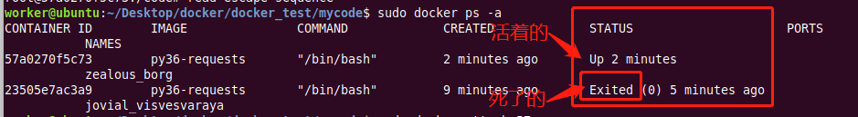

## docker简单使用
##### 学习目标：
了解 docker的简单使用
_________________

### 1. 什么是docker？
1. Docker 是一个开源的应用容器引擎，基于 Go 语言 并遵从Apache2.0协议开源。
2. Docker 可以让开发者打包他们的应用以及依赖包到一个轻量级、可移植的容器中，然后发布到任何流行的 Linux 机器上，也可以实现虚拟化。
3. 容器是完全使用沙箱机制，相互之间不会有任何接口（只能通过与宿主机即运行docker的机器进行通讯）,更重要的是容器性能开销极低
4. 你可以把它简单的理解为VM虚拟机！

### 2. 在ubuntu中安装docker

#### 2.1 安装

**注意ubuntu是 docker.io**

```
sudo apt-get update
sudo apt-get install docker.io # 默认安装到/var/lib/docker
```
#### 2.2 将docker设置为linux自启动模式
此步骤可省略，可以手动启动docker服务`sudo servcice docker`

```
sudo update-rc.d docker defaults 
sudo systemctl enable docker
```
#### 2.3 添加linux用户权限
此步骤可省略，如果不添加用户权限，每次使用docker命令时都要加上`sudo`

```
sudo su
gpasswd -a xxx docker # xxx为你的linux用户名
su xxx
```
#### 2.4 查看是否安装成功

```
service docker status # 查看docker服务的状态
sudo docker info # 查看是否安装成功
```

### 3. 使用docker1：在docker中运行一个python程序

#### 3.1 搜索网络上的docker镜像
搜索名字中带有ubuntu的镜像

`docker search ubuntu`

#### 3.2 下载网络上的镜像
1. 下载名为ubuntu镜像
`docker pull ubuntu`
2. 查看本地已存在的镜像
`docker images`

#### 3.3 通过dockerfile创建镜像

##### 3.3.1 创建名为dockerfile的文件，**注意没有扩展名**

```
# 基础镜像来源
FROM ubuntu 
# 镜像制作者
LABEL author="itcast" 

# 安装python3.6必要的包。
# 安装ifconfig vim curl wget等工具
RUN apt-get update
RUN apt-get install -y vim net-tools curl wget

#安装python
RUN apt-get install -y python3
RUN apt install -y python3-dev
RUN apt install -y python3-venv

#安装pip
RUN wget https://bootstrap.pypa.io/get-pip.py
RUN python3 get-pip.py

# print()时在控制台正常显示中文
# ENV PYTHONIOENCODING=utf-8
```


##### 3.3.2 创建指定名称的新镜像
1. 生成名为ubuntu-py-test的新镜像

    ```
    docker build -t ubuntu-py-test . 
    ```
2. 查看新生成的镜像
    `docker images`

#### 3.4 执行命令生成新的容器，并进入
```
docker run -it ubuntu-py-test /bin/bash
```

#### 3.5 运行一个简单的python程序
1. 进入一个文件夹下创建python文件

    ```
    cd /home
    vi a.py
    ```
2. 创建一个a.py文件，如下：

    ```
    print('this is my docker-python!')
    ```
3. 执行a.py
    ```
    python3 a.py
    ```

#### 3.6 退出容器
在容器中的终端执行`exit`

#### 3.7 查看容器及其状态
`docker ps -a`
 

#### 3.8 删除容器
`docker rm -f [CONTAINER_ID]`

#### 3.9 删除镜像
`docker rmi [镜像id]`

### 4. 使用docker2：在docker中通过crontab运行定时python程序

> 问题1：如何能够让刚才的容器在后台运行呢？
> 问题2：如何在后台运行的docker容器中通过crontab运行定时任务呢？
> 下面我们就来解决这个问题

#### 4.1 在原有镜像基础上创建一个新的镜像
1. 新的dockerfile文件

	```
	FROM ubuntu-py-test 
	# 继承自ubuntu-py-test镜像
	LABEL author="itcast"

	# 创建目录
	RUN mkdir /code

	# 指定工作路径
	WORKDIR /code

	#安装需要的python库
	RUN pip3 install requests

	# 安装crontab工具
	RUN apt-get install -y cron
	```

2. 生成新的名为py36-requests的镜像

`docker build -t py36-requests .  `

#### 4.2 在本地创建一个python文件
1. 进入桌面，创建main.py文件

	```
	cd ~/Desktop
	vi main.py
	```

2. main.py文件内容如下：

	```
	import requests

	url = 'https://www.baidu.com'

	resp = requests.get(url)

	print(resp.content)
	```

#### 4.3 以挂载的方式在后台运行容器

```
docker run -dit -v /home/worker/Desktop/:/code/ py36-requests /bin/bash
```

#### 4.4 查看并进入后台运行的容器
1. 查看

`docker ps -a`

2. 根据容器id进入后台运行的容器

`docker attach [container_id]`

3. 此时执行`ls`命令，能够看到`main.py`说明容器挂载运行成功！

#### 4.5 启动容器中crontab服务

1. 注释掉/etc/pam.d/cron文件中的"session    required     pam_loginuid.so"这一行

2. 执行`/etc/init.d/cron start`，让crontab服务启动

#### 4.6 通过修改crontab配置文件来添加定时任务

1. 进入crontab配置文件

	```
	crontab -e
	```

2. 在文件中最后添加内容并保存退出：

	```
	* * * * * python3 /code/main.py >> /code/main.log 2>&1
	```

#### 4.7 安全退出docker容器，使其能够在后台运行
> 重要！
键盘操作 ctrl + P + Q 就能退出当前容器，并且该容器切换至后台运行

> 注意：
> 按住ctrl不松手，快速的先按住P，再按住Q，最后三个按键同时松手！


### 5. docker更多的内容

> 查看文档或搜索docker关键字：
> http://www.runoob.com/docker/docker-command-manual.html


### 小结
1. 了解docker的简单使用
2. 了解crontab在docker中的使用

