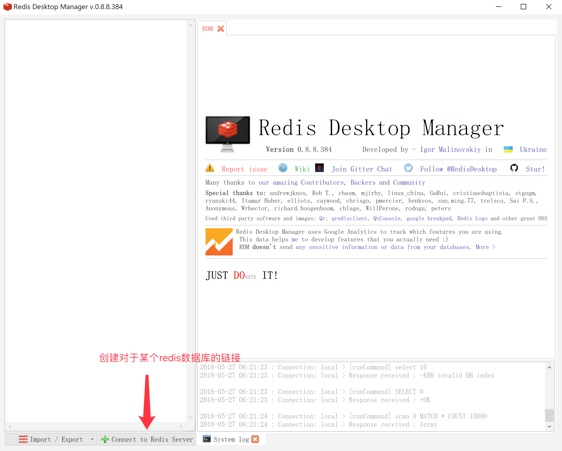
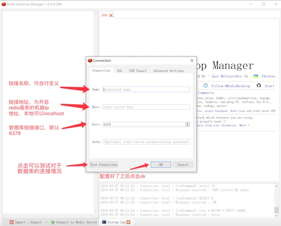
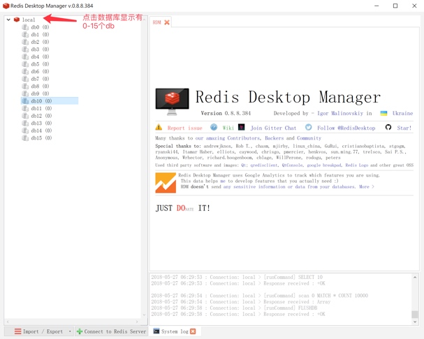
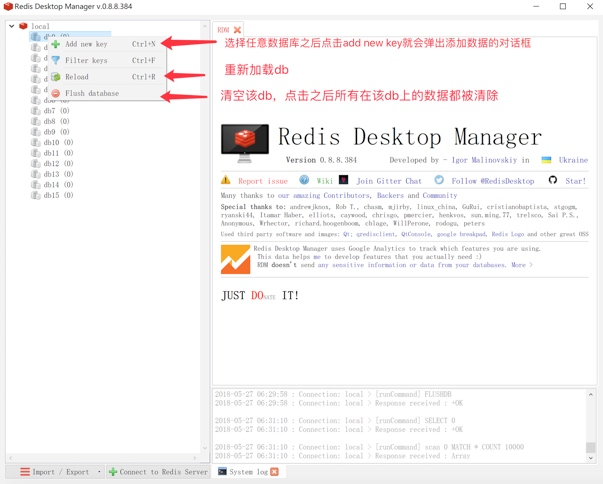
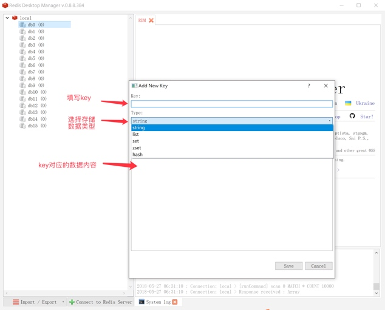
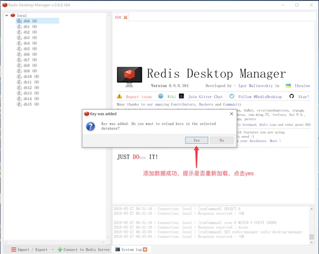
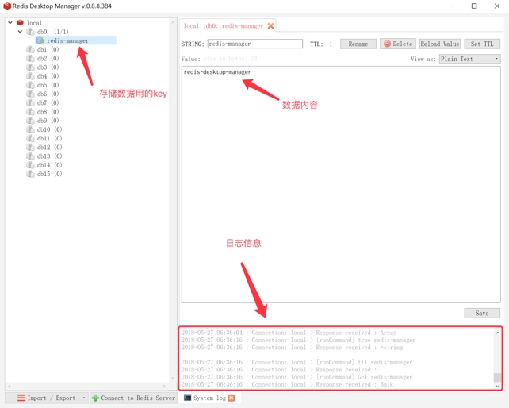
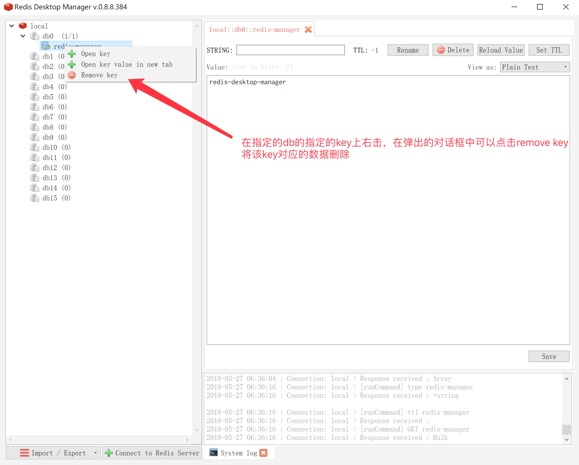

# redis-manger-desktop的使用
1.	 创建对于数据库的链接

    
2. 配置数据库链接，填写连接名，数据库地址，端口号(默认6379)

    
    
    配置好之后可以尝试点击Test Connection,如果确定没有问题可以直接点击ok进行数据库链接

3. 默认有16个db，可以选择任意一个db使用，scrapy默认使用db0

    
4. 选中任意一个db，邮件点击弹出菜单，add new key用于添加数据，flush database用于清空该db

    

5. 点击add new key之后弹出对话框，可以添加数据，分别填入key,选择type,然后在填写key对应的数据

    
    
    添加数据结束之后会提示是否刷新数据库，点击yes 

    

6. 在使用的db中会有响应的key，点击之后在右侧会出现

    
7. 删除数据

    
    
    redis-desktop-manager的使用相对而言简单,此处只需要掌握该工具的简单使用即可。

