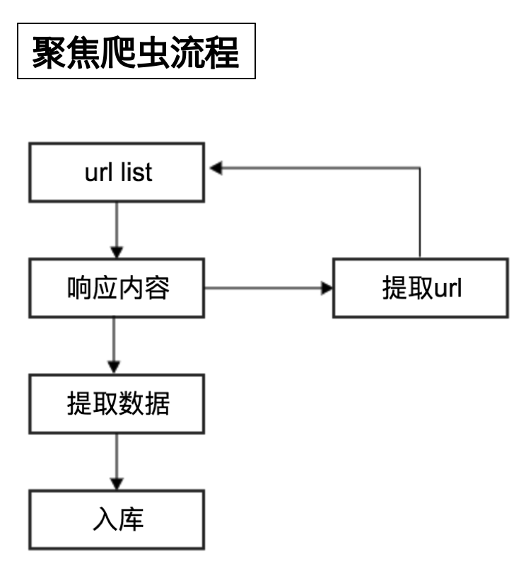

## 爬虫的分类和爬虫的流程
##### 学习目标：
1. 了解 爬虫分类
2. 记忆 爬虫流程
3. 了解 robots协议
_________________

### 1 爬虫的分类
> 在上一小结中，我们介绍`爬虫爬取到的数据用途`的时候，给大家举了两个例子，其实就是两种不同类型的爬虫

根据被爬网站的数量的不同，我们把爬虫分为：
- 通用爬虫 ：通常指搜索引擎的爬虫（https://www.baidu.com）

- 聚焦爬虫 ：针对特定网站的爬虫

### 2 爬虫的流程
> 请思考：如果自己要实现一个和百度新闻一样的网站需要怎么做？

爬虫的工作流程：

- 向起始url发送请求，并获取响应
- 对响应进行提取
- 如果提取url，则继续发送请求获取响应
- 如果提取数据，则将数据进行保存

### 3 robots协议
> 在百度搜索中，不能搜索到淘宝网中某一个具体的商品的详情页面，这就是robots协议在起作用

Robots协议：网站通过Robots协议告诉搜索引擎哪些页面可以抓取，哪些页面不能抓取，但它仅仅是互联网中的一般约定

例如：[淘宝的robots协议](https://www.taobao.com/robots.txt)

_________________

### 小结
1. 爬虫分类：通用爬虫、聚焦爬虫
2. 爬虫的流程：
 - 向起始url发送请求，并获取响应
 - 对响应进行提取
 - 如果提取url，则继续发送请求获取响应
 - 如果提取数据，则将数据进行保存
3. robots协议：无需遵守该协议

