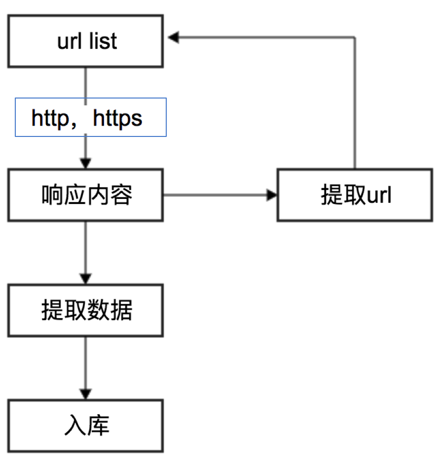
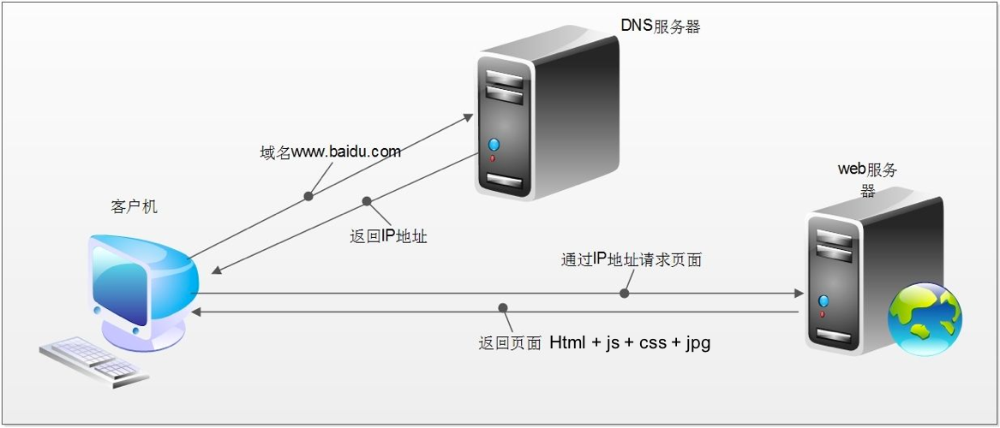
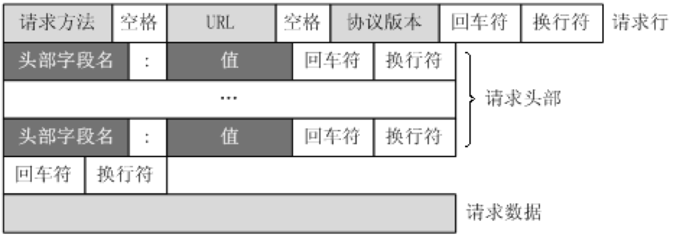

## HTTP和HTTPS的复习
##### 学习目标：
1. 记忆 http、https的概念和区别 
2. 记忆 浏览器发送http请求的过程 
3. 记忆 http请求头的形式
4. 记忆 http响应头的形式 
5. 了解 http响应状态码 
_________________

### 1  为什么要复习http和https


在`发送请求，获取响应`的过程中 就是发送http或https的请求，获取http或https的响应

### 2  http和https的概念
- HTTP
  - 超文本传输协议
  - 默认端口号:80
- HTTPS
  - HTTP + SSL(安全套接字层)，即带有安全套接字层的超本文传输协议
  - 默认端口号：443

HTTPS比HTTP更安全，但是性能更低

### 3  浏览器发送HTTP请求的过程(重点理解)


##### 3.1 http请求的过程
1. 浏览器先向地址栏中的url发起请求，并获取相应

2. 在返回的响应内容（html）中，会带有css、js、图片等url地址，以及ajax代码，浏览器按照响应内容中的顺序依次发送其他的请求，并获取相应的响应

3. 浏览器每获取一个响应就对展示出的结果进行添加（加载），js，css等内容会修改页面的内容，js也可以重新发送请求，获取响应

4. 从获取第一个响应并在浏览器中展示，直到最终获取全部响应，并在展示的结果中添加内容或修改————这个过程叫做浏览器的**渲染**

##### 3.2 注意:
但是在爬虫中，爬虫只会请求url地址，对应的拿到url地址对应的响应（该响应的内容可以是html，css，js，图片等）  

浏览器渲染出来的页面和爬虫请求的页面很多时候并不一样  

**所以在爬虫中，需要以url地址对应的响应为准来进行数据的提取**


### 4 HTTP请求的形式


这个图大家见过很多次，那么在浏览器headers中，点击view source来具体观察其中的请求行，请求头部和请求数据是什么样子的

### 5 HTTP常见请求头
1. Host (主机和端口号)
2. Connection (链接类型)
3. Upgrade-Insecure-Requests (升级为HTTPS请求)
4. User-Agent (浏览器名称)
5. Accept (传输文件类型)
6. Referer (页面跳转处)
7. Accept-Encoding（文件编解码格式）
8. Cookie （Cookie）
9. x-requested-with :XMLHttpRequest  (表示该请求是Ajax异步请求)

### 6 HTTP重要的响应头
1. Set-Cookie （对方服务器设置cookie到用户浏览器的缓存）

### 7 响应状态码(status code)
常见的状态码：
  - 200：成功
  - 302：临时转移至新的url
  - 307：临时转移至新的url
  - 404：找不到该页面
  - 500：服务器内部错误
  - 503：服务不可用，一般是被反爬

_________________
### 小结
1. 记忆 http、https的概念和区别：
  - http: 超本文传输协议
  - https: HTTP + SSL，即带有安全套接字层的超本文传输协议
2. 记忆 浏览器发送http请求的过程:
  - 浏览器先向地址栏中的url发起请求，并获取相应
  - 在返回的响应内容（html）中，会带有css、js、图片等url地址，以及ajax代码，浏览器按照响应内容中的顺序依次发送其他的请求，并获取相应的响应
  - 浏览器每获取一个响应就对展示出的结果进行添加（加载），js，css等内容会修改页面的内容，js也可以重新发送请求，获取响应
  - 从获取第一个响应并在浏览器中展示，直到最终获取全部响应，并在展示的结果中添加内容或修改
3. 记忆 http请求头的形式：
  ```
  GET /item/503/1227315?fr=aladdin HTTP/1.1
  Host: www.baidu.com
  ......
  ```
4. 记忆 http响应头的形式 :
  ```
  HTTP/1.1 200 OK
  Connection: keep-alive
  ......
  ```
5. 了解 http响应状态码
  - 200：成功
  - 302：临时转移至新的url 
