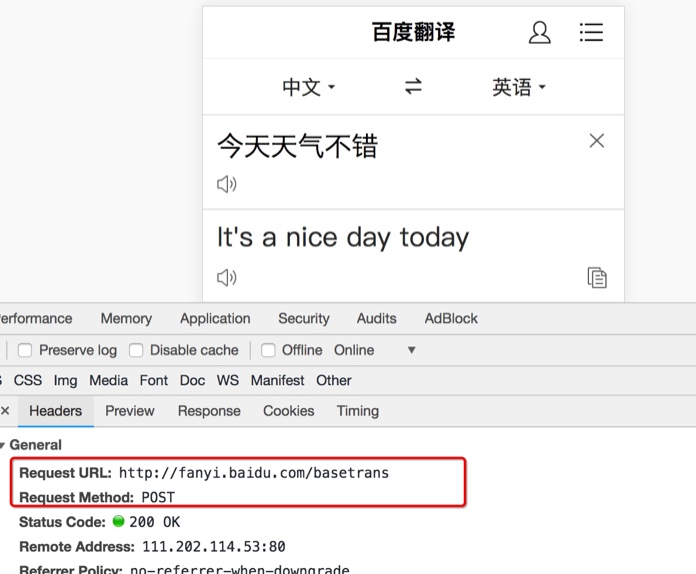

## requests模块的深入使用

##### 学习目标：

1. 能够应用requests发送post请求的方法
2. 能够应用requests模块使用代理的方法
3. 了解代理ip的分类

_________________

### 1 使用requests发送POST请求

> 思考：哪些地方我们会用到POST请求？

1. 登录注册（ POST 比 GET 更安全）
2. 需要传输大文本内容的时候（ POST 请求对数据长度没有要求）

所以同样的，我们的爬虫也需要在这两个地方回去模拟浏览器发送post请求


#####  1.1 requests发送post请求语法：

- 用法：

    ```python
    response = requests.post("http://www.baidu.com/", \
    data = data,headers=headers)
    ```

- data 的形式：字典

##### 1.2 POST请求练习
下面面我们通过手机版百度翻译的例子看看post请求如何使用：

地址：http://fanyi.baidu.com/


##### 思路分析
1. 抓包确定请求的url地址
    
    

2. 确定请求的参数
    
    

3. 确定返回数据的位置
    
    

4. 模拟浏览器获取数据

#### 1.3 小结
在模拟登陆等场景，经常需要发送post请求，直接使用`requests.post(url,data)`即可


### 2 使用代理

##### 2.1 为什么要使用代理
1. 让服务器以为不是同一个客户端在请求

2. 防止我们的真实地址被泄露，防止被追究

##### 2.2 理解使用代理的过程


##### 2.3 理解正向代理和反向代理的区别


通过上图可以看出：
- 正向代理：对于浏览器知道服务器的真实地址，例如VPN
- 反向代理：浏览器不知道服务器的真实地址，例如nginx

##### 2.4 代理的使用
- 用法：
    
    ```
    requests.get("http://www.baidu.com",  proxies = proxies)
    ```

- proxies的形式：字典

- 例如：

    ```json
    proxies = { 
    	"http": "http://12.34.56.79:9527", 
    	"https": "https://12.34.56.79:9527", 
    	}
    ```

##### 2.5 代理IP的分类

根据代理ip的匿名程度，代理IP可以分为下面四类：

- 透明代理(Transparent Proxy)：透明代理虽然可以直接“隐藏”你的IP地址，但是还是可以查到你是谁。
- 匿名代理(Anonymous Proxy)：使用匿名代理，别人只能知道你用了代理，无法知道你是谁。

- 高匿代理(Elite proxy或High Anonymity Proxy)：高匿代理让别人根本无法发现你是在用代理，所以是最好的选择。

在使用的使用，毫无疑问使用高匿代理效果最好

从请求使用的协议可以分为：

- http代理
- https代理
- socket代理等

不同分类的代理，在使用的时候需要根据抓取网站的协议来选择


##### 2.6 代理IP使用的注意点
- 反反爬

    使用代理ip是非常必要的一种`反反爬`的方式
    
    但是即使使用了代理ip，对方服务器任然会有很多的方式来检测我们是否是一个爬虫，比如：
    
    - 一段时间内，检测IP访问的频率，访问太多频繁会屏蔽
    
    - 检查Cookie，User-Agent，Referer等header参数，若没有则屏蔽
    
    - 服务方购买所有代理提供商，加入到反爬虫数据库里，若检测是代理则屏蔽
    
    所以更好的方式在使用代理ip的时候使用随机的方式进行选择使用，不要每次都用一个代理ip

- 代理ip池的更新

    购买的代理ip很多时候大部分(超过60%)可能都没办法使用，这个时候就需要通过程序去检测哪些可用，把不能用的删除掉。

_________________

### 3 小结
1. requests发送post请求使用requests.post方法，带上请求体，其中请求体需要时字典的形式，传递给data参数接收
2. 在requests中使用代理，需要准备字典形式的代理，传递给proxies参数接收
3. 不同协议的url地址，需要使用不同的代理去请求

