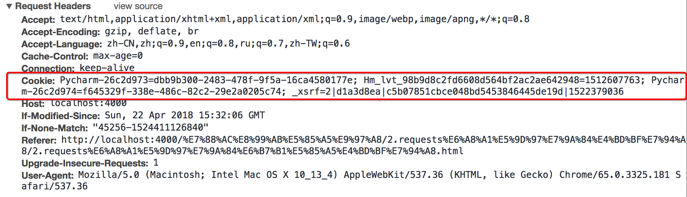

## requess模块处理cookie相关的请求

##### 学习目标
- 1. 掌握requests处理cookie的三种方法
_________________

### 1 爬虫中使用cookie

> 为了能够通过爬虫获取到登录后的页面，或者是解决通过cookie的反扒，需要使用request来处理cookie相关的请求

##### 1.1  爬虫中使用cookie的利弊
1. 带上cookie的好处
    - 能够访问登录后的页面
    - 能够实现部分反反爬

2. 带上cookie的坏处
    - 一套cookie往往对应的是一个用户的信息，请求太频繁有更大的可能性被对方识别为爬虫
    - 那么上面的问题如何解决 ?使用多个账号

##### 1.2 requests处理cookie的方法
使用requests处理cookie有三种方法：

1. cookie字符串放在headers中
2. 把cookie字典放传给请求方法的cookies参数接收
3. 使用requests提供的session模块

### 2 cookie添加在heades中

##### 2.1 headers中cookie的位置



- headers中的cookie：
    - 使用分号(;)隔开
    - 分号两边的类似a=b形式的表示一条cookie
    - a=b中，a表示键（name），b表示值（value）
    - 在headers中仅仅使用了cookie的name和value

##### 2.2 cookie的具体组成的字段


由于headers中对cookie仅仅使用它的name和value，所以在代码中我们仅仅需要cookie的name和value即可


##### 2.3 在headers中使用cookie

复制浏览器中的cookie到代码中使用

```python
headers = {
"User-Agent":"Mozilla/5.0 (Macintosh; Intel Mac OS X 10_13_4) AppleWebKit/537.36 (KHTML, like Gecko) Chrome/65.0.3325.181 Safari/537.36",
"Cookie":" Pycharm-26c2d973=dbb9b300-2483-478f-9f5a-16ca4580177e; Hm_lvt_98b9d8c2fd6608d564bf2ac2ae642948=1512607763; Pycharm-26c2d974=f645329f-338e-486c-82c2-29e2a0205c74; _xsrf=2|d1a3d8ea|c5b07851cbce048bd5453846445de19d|1522379036"}

requests.get(url,headers=headers)
```
##### 注意：
 cookie有过期时间 ，所以直接复制浏览器中的cookie可能意味着下一程序继续运行的时候需要替换代码中的cookie，对应的我们也可以通过一个程序专门来获取cookie供其他程序使用；当然也有很多网站的cookie过期时间很长，这种情况下，直接复制cookie来使用更加简单

### 3 使用cookies参数接收字典形式的cookie

- cookies的形式：字典

```json
cookies = {"cookie的name":"cookie的value"}
```
- 使用方法：

```python
requests.get(url,headers=headers,cookies=cookie_dict}
```
    
### 4 使用requests.session处理cookie
> 前面使用手动的方式使用cookie，那么有没有更好的方法在requets中处理cookie呢？

requests 提供了一个叫做session类，来实现客户端和服务端的`会话保持`

会话保持有两个内涵：

- 保存cookie，下一次请求会带上前一次的cookie
- 实现和服务端的长连接，加快请求速度


##### 4.1 使用方法

```python
session = requests.session()
response = session.get(url,headers)
```

session实例在请求了一个网站后，对方服务器设置在本地的cookie会保存在session中，下一次再使用session请求对方服务器的时候，会带上前一次的cookie

##### 4.2 动手练习：

动手尝试使用session来登录人人网：
http://www.renren.com/PLogin.do (先不考虑这个url地址从何而来)，请求体的格式：`{"email":"username", "password":"password"}`

##### 思路分析
1. 准备url地址和请求参数
2. 构造session发送post请求
3. 使用session请求个人主页，观察是否请求成功
	
_________________

### 5 小结
1. cookie字符串可以放在headers字典中，键为Cookie，值为cookie字符串
2. 可以把cookie字符串转化为字典，使用请求方法的cookies参数接收
3. 使用requests提供的session模块，能够自动实现cookie的处理，包括请求的时候携带cookie，获取响应的时候保存cookie

