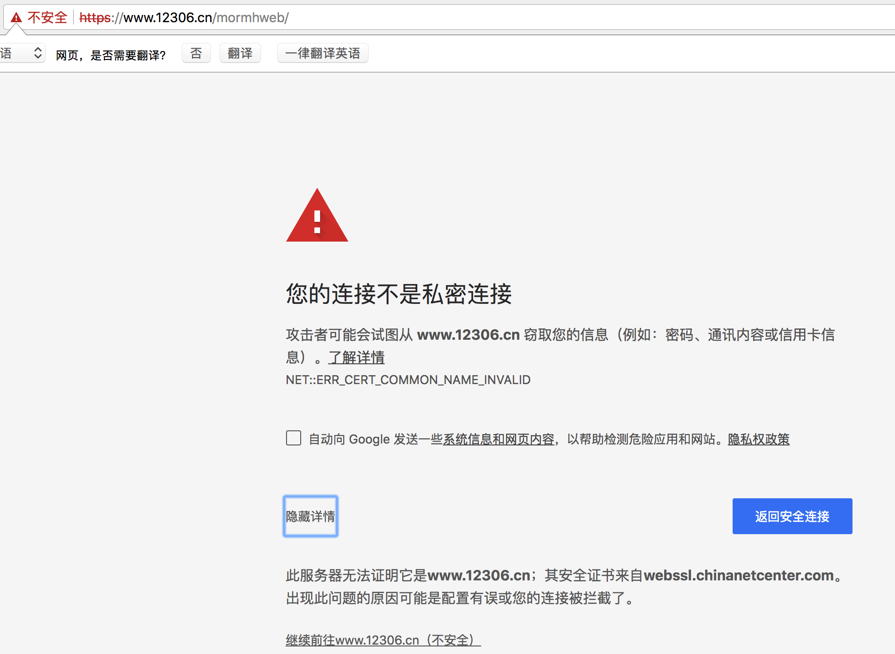

## requests模块的其他方法

##### 学习目标
1. 掌握requests中cookirJar的处理方法
2. 掌握requests解决https证书错误的问题
3. 掌握requests中超时参数的使用
4. 掌握retrying模块的使用
_________________

### 1 requests中cookirJar的处理方法
> 使用request获取的resposne对象，具有cookies属性，能够获取对方服务器设置在本地的cookie，但是如何使用这些cookie呢？

##### 1.1 方法介绍
1. response.cookies是CookieJar类型
2. 使用requests.utils.dict_from_cookiejar，能够实现把cookiejar对象转化为字典


##### 1.2 方法展示

```python
import requests

url = "http://www.baidu.com"
#发送请求，获取resposne
response = requests.get(url)
print(type(response.cookies))

#使用方法从cookiejar中提取数据
cookies = requests.utils.dict_from_cookiejar(response.cookies)
print(cookies)
``` 

输出为:

```python
<class 'requests.cookies.RequestsCookieJar'>
{'BDORZ': '27315'}
```
##### 注意：
在前面的requests的session类中，我们不需要处理cookie的任何细节，如果有需要，我们可以使用上述方法来解决


### 2 requests处理证书错误
> 经常我们在网上冲浪时，经常能够看到下面的提示：



出现这个问题的原因是：ssl的证书不安全导致

##### 2.1 代码中发起请求的效果
那么如果在代码中请求会怎么样呢？

```
import requests

url = "https://www.12306.cn/mormhweb/"
response = requests.get(url)
```

返回证书错误，如下：

```
ssl.CertificateError ...
```


##### 2.2 解决方案
为了在代码中能够正常的请求，我们修改添加一个参数

```
import requests

url = "https://www.12306.cn/mormhweb/"

# requests.packages.urllib3.disable_warnings() # 不显示安全提示 

response = requests.get(url,verify=False)
```


### 3 超时参数的使用
> 在平时网上冲浪的过程中，我们经常会遇到网络波动，这个时候，一个请求等了很久可能任然没有结果

>在爬虫中，一个请求很久没有结果，就会让整个项目的效率变得非常低，这个时候我们就需要对请求进行强制要求，让他必须在特定的时间内返回结果，否则就报错

##### 3.1 超时参数使用方法如下：

```
response = requests.get(url,timeout=3)
```

通过添加timeout参数，能够保证在3秒钟内返回响应，否则会报错

##### 注意：
这个方法还能够拿来检测代理ip的质量，如果一个代理ip在很长时间没有响应，那么添加超时之后也会报错，对应的这个ip就可以从代理ip池中删除


### 4 retrying模块的使用
>使用超时参数能够加快我们整体的请求速度，但是在正常的网页浏览过成功，如果发生速度很慢的情况，我们会做的选择是**刷新页面**，那么在代码中，我们是否也可以刷新请求呢？

对应的，retrying模块就可以帮助我们解决

##### 4.1 retrying模块的使用
retrying模块的地址：https://pypi.org/project/retrying/

retrying 模块的使用
    
1. 使用retrying模块提供的retry模块
2. 通过装饰器的方式使用，让被装饰的函数反复执行
3. retry中可以传入参数`stop_max_attempt_number`,让函数报错后继续重新执行，达到最大执行次数的上限，如果每次都报错，整个函数报错，如果中间有一个成功，程序继续往后执行

##### 4.2 retrying和requests的简单封装

实现一个发送请求的函数，每次爬虫中直接调用该函数即可实现发送请求，在其中

- 使用timeout实现超时报错
- 使用retrying模块实现重试

代码参考:

```
# parse.py
import requests
from retrying import retry

headers = {}

#最大重试3次，3次全部报错，才会报错
@retry(stop_max_attempt_number=3) 
def _parse_url(url)
    #超时的时候回报错并重试
    response = requests.get(url, headers=headers, timeout=3) 
    #状态码不是200，也会报错并重试
    assert response.status_code == 200
    return response


def parse_url(url)
    try: #进行异常捕获
        response = _parse_url(url)
    except Exception as e:
        print(e)
        #报错返回None
        response = None
    return response
```

_________________

### 小结

1. requests.utils.dict_from_cookiejar能够实现cookiejar转化为字典
2. 请求方法中添加verify=False能够实现请求过程中不验证证书
3. 请求方法中添加timeout能够实现强制程序返回结果的能够，否则会报错
4. retrying模块能够实现捕获函数的异常，反复执行函数的效果，和timeout配合使用，能够解决网络波动带来的请求不成功的问题


