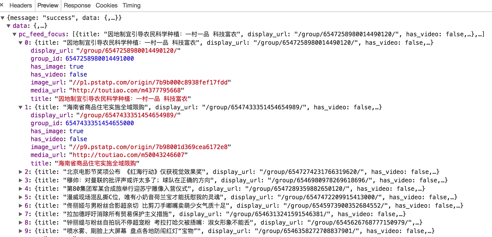

### 数据提取的概念和数据的分类
##### 学习目标

了解 爬虫的数据的分类

_________________

### 1 爬虫中数据的分类
> 在爬虫爬取的数据中有很多不同类型的数据,我们需要了解数据的不同类型来又规律的提取和解析数据.

- 结构化数据：json，xml等
    - 处理方式：直接转化为python类型
- 非结构化数据：HTML
    - 处理方式：正则表达式、xpath

下面以今日头条的首页为例，介绍结构化数据和非结构化数据

- 结构化数据例子：



- 非结构化数据：


- XML数据：

```xml
<bookstore>
<book category="COOKING">
  <title lang="en">Everyday Italian</title> 
  <author>Giada De Laurentiis</author> 
  <year>2005</year> 
  <price>30.00</price> 
</book>
<book category="CHILDREN">
  <title lang="en">Harry Potter</title> 
  <author>J K. Rowling</author> 
  <year>2005</year> 
  <price>29.99</price> 
</book>
<book category="WEB">
  <title lang="en">Learning XML</title> 
  <author>Erik T. Ray</author> 
  <year>2003</year> 
  <price>39.95</price> 
</book>
</bookstore>
```

从上面可以看出，xml数据也是结构非常明显的

_________________

### 小结
  1. 爬虫中数据分类之结构化数据: json,xml
  2. 爬虫中数据分类之非结构化数据:Html,字符串
  3. 结构化数据处理的方式有:jsonpath,xpath,转换python类型处理,bs4
  4. 非结构化数据处理方式有:正则表达式,xpath,bs4

