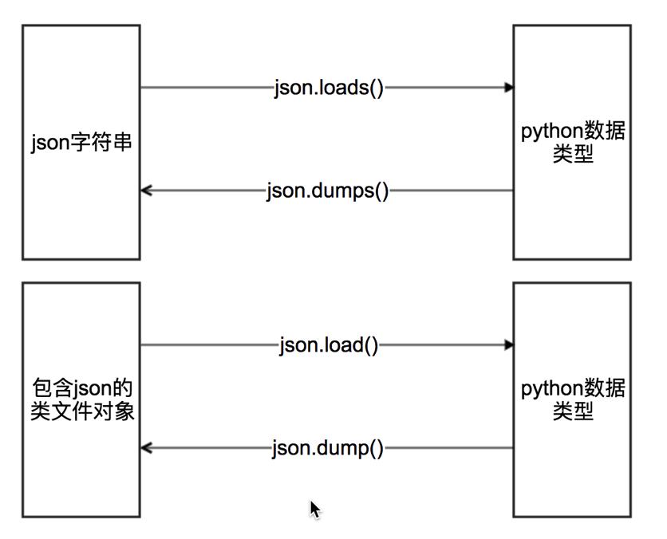

## json的数据提取

##### 学习目标
1. 掌握 json相关的方法(load loads dump dumps)
2. 了解 jsonpath的使用(提取 json中的数据)

_________________

### 2  复习什么是json
JSON(JavaScript Object Notation) 是一种轻量级的数据交换格式，它使得人们很容易的进行阅读和编写。同时也方便了机器进行解析和生成。适用于进行数据交互的场景，比如网站前台与后台之间的数据交互。

### 3 json模块中方法的学习


其中类文件对象的理解：

>具有read()或者write()方法的对象就是类文件对象，比如f = open(“a.txt”,”r”) f就是类文件对象

具体使用方法：

```
import json

mydict = {
    "store": {
        "book": [
            {"category": "reference",
             "author": "Nigel Rees",
             "title": "Sayings of the Century",
             "price": 8.95
             },
            {"category": "fiction",
             "author": "Evelyn Waugh",
             "title": "Sword of Honour",
             "price": 12.99
             },
        ],
    }
}

# json.dumps 实现python类型转化为json字符串
# indent实现换行和空格
# ensure_ascii=False实现让中文写入的时候保持为中文
json_str = json.dumps(mydict, indent=2, ensure_ascii=False)
print('json.dumps python_type-->json_str: {}'.format(type(json_str)))

# json.loads 实现json字符串转化为python的数据类型
my_dict = json.loads(json_str)
print('json.loads json_str-->python_type: {}'.format(type(my_dict)))

# json.dump 实现把python类型写入类文件对象
with open("json模块示例文件.txt", "w") as f:
    json.dump(mydict, f, ensure_ascii=False, indent=2)
input('json.dump 已成功写入文件')

# json.load 实现类文件对象中的json字符串转化为python类型
with open("json模块示例文件.txt", "r") as f:
    my_dict = json.load(f)
    print('json.load 读取文件--> {}: {}'.format(type(my_dict), my_dict))
```


### 4 jsonpath模块的学习
##### 4.1 jsonpath介绍
  用来解析多层嵌套的json数据;JsonPath 是一种信息抽取类库，是从JSON文档中抽取指定信息的工具，提供多种语言实现版本，包括：Javascript, Python， PHP 和 Java。
  
##### 4.2 JsonPath 对于 JSON 来说，相当于 XPath 对于 XML。
```
    安装方法：pip install jsonpath

    官方文档：http://goessner.net/articles/JsonPath
```

##### 4.3 JsonPath语法：

##### 4.4 语法使用示例
```json
book_dict = { 
  "store": {
    "book": [ 
      { "category": "reference",
        "author": "Nigel Rees",
        "title": "Sayings of the Century",
        "price": 8.95
      },
      { "category": "fiction",
        "author": "Evelyn Waugh",
        "title": "Sword of Honour",
        "price": 12.99
      },
      { "category": "fiction",
        "author": "Herman Melville",
        "title": "Moby Dick",
        "isbn": "0-553-21311-3",
        "price": 8.99
      },
      { "category": "fiction",
        "author": "J. R. R. Tolkien",
        "title": "The Lord of the Rings",
        "isbn": "0-395-19395-8",
        "price": 22.99
      }
    ],
    "bicycle": {
      "color": "red",
      "price": 19.95
    }
  }
}

from jsonpath import jsonpath

print(jsonpath(book_dict, '$..author')) # 如果取不到将返回False # 返回列表，如果取不到将返回False
```


JSONPath | Result
- | -
`$.store.book[*].author`	| store中的所有的book的作者
`$..author`	| 所有的作者
`$.store.*`|	store下的所有的元素
`$.store..price`	|store中的所有的内容的价格
`$..book[2]`	| 第三本书
`$..book[(@.length-1)]` &#124; `$..book[-1:]` |	最后一本书
`$..book[0,1]` &#124; `$..book[:2]` |前两本书
`$..book[?(@.isbn)]` | 获取有isbn的所有数
`$..book[?(@.price<10)]` |获取价格大于10的所有的书
`$..*` | 获取所有的数据

##### 4.5 代码示例：
我们以拉勾网城市JSON文件 <http://www.lagou.com/lbs/getAllCitySearchLabels.json> 为例，获取所有城市的名字的列表，并写入文件。

```
import requests
import jsonpath
import json

# 获取拉勾网城市json字符串
url = 'http://www.lagou.com/lbs/getAllCitySearchLabels.json'
headers = {"User-Agent": "Mozilla/5.0 (compatible; MSIE 9.0; Windows NT 6.1; Trident/5.0)"}
response =requests.get(url, headers=headers)
html_str = response.content.decode()

# 把json格式字符串转换成python对象
jsonobj = json.loads(html_str)

# 从根节点开始，获取所有key为name的值
citylist = jsonpath.jsonpath(jsonobj,'$..name')

# 写入文件
with open('city_name.txt','w') as f:
    content = json.dumps(citylist, ensure_ascii=False)
    f.write(content)
```


### 5 练习

> 爬取豆瓣电视剧上美剧分类前36条电视剧的json信息，转换为dict类型并打印
> 地址：https://m.douban.com/tv/

_________________

### 小结
  1. json的概念(JavaScript Object Notation)和json的作用数据交互时的一种数据格式
  2. json模块中操作字符串和python类型互转的方法是dump,load
  3. json模块中操作文件和python类型互转的方法是dumps,loads
  4. jsonpath模块的安装 pip install jsonpath
  5. jsonpath的解析根节点:$
  6. jsonpath的解析子节点:.
  


