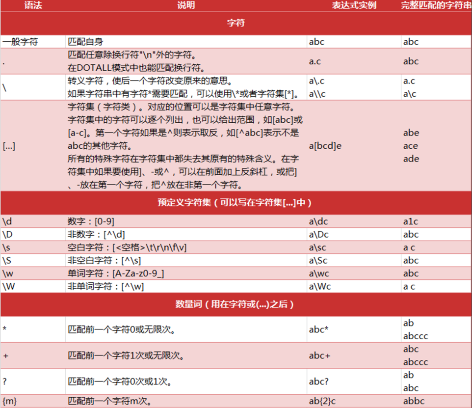
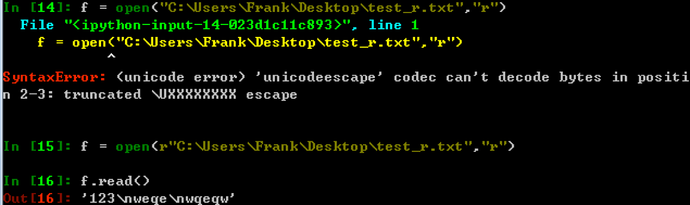
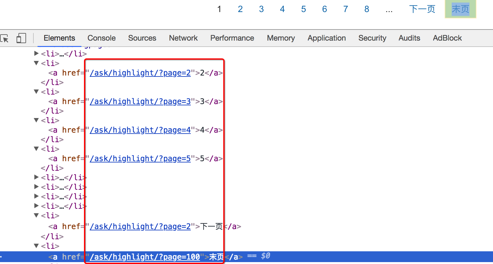
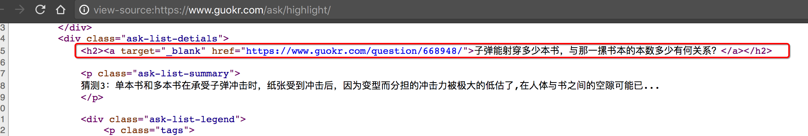

## 数据提取之正则

##### 学习目标
1. 掌握 正则表达式的常见语法
2. 掌握 re模块的常见用法
3. 掌握 原始字符串`r`的用法

_________________

### 1 什么是正则表达式
用事先定义好的一些特定字符、及这些特定字符的组合，组成一个**规则字符串**，这个**规则字符串**用来表达对字符串的一种**过滤**逻辑。

 
### 2 正则表达式的常见语法
知识点
- 正则中的字符
- 正则中的预定义字符集
- 正则中的数量词





练习：
下面的输出是什么？

```
import re
string_a = '<meta http-equiv="X-UA-Compatible" content="IE=edge,chrome=1">\n\t\t<meta http-equiv="content-type" content="text/html;charset=utf-8">\n\t\t<meta content="always" name="referrer">\n        <meta name="theme-color" content="#2932e1">'
ret = re.findall("<.*>",string_a)
print(ret)
```

输出内容如下：

```['<meta http-equiv="X-UA-Compatible" content="IE=edge,chrome=1">', ...]```


### 3 re模块的常见方法
 - re.match（从头找一个）
 - re.search（找一个）
 - **re.findall（找所有）**
     - 返回一个列表，没有就是空列表
     - `re.findall("\d","chuan1zhi2") >> ["1","2"]`
 - re.sub（替换）
     - `re.sub("\d","_","chuan1zhi2") >> ["chuan_zhi_"]`
     
 - re.compile（编译，提升匹配速度）
     - 返回一个模型P，具有和re一样的方法，但是传递的参数不同
     - 匹配模式需要传到compile中
     
     ```python
     p = re.compile("\d",re.S)
     p.findall("chuan1zhi2")
     ```

### 4 python中原始字符串r的用法

原始字符串定义(raw string)：所有的字符串都是直接按照字面的意思来使用，没有转义特殊或不能打印的字符，原始字符串往往针对特殊字符而言。例如`"\n"`的原始字符串就是`"\\n"`

- 原始字符串的长度

    ```python
    In [19]: len("\n")
    Out[19]: 1
    
    In [20]: len(r"\n")
    Out[20]: 2
    
    In [21]: r"\n"[0]
    Out[21]: '\\'
    ```

- 正则中原始字符串的使用

    ```python
    In [13]: r"a\nb" == "a\\nb"
    Out[13]: True
    
    In [14]: re.findall("a\nb","a\nb")
    Out[14]: ['a\nb']
    
    In [15]: re.findall(r"a\nb","a\nb")
    Out[15]: ['a\nb']
    
    In [16]: re.findall("a\\nb","a\nb")
    Out[16]: ['a\nb']
    
    In [17]: re.findall("a\\nb","a\\nb")
    Out[17]: []
    
    In [18]: re.findall(r"a\\nb","a\\nb")
    Out[18]: ['a\\nb']
    ```
##### 上面的现象说明什么？

-   正则中使用原始字符串`r`能够忽略转义符号带来的影响，加上原始字符串`r`之后，待匹配的字符串中有多少个`\`，正则中就添加多少个`\`即可


- windows中原始字符串r的使用

    

### 5 匹配中文
> 在某些情况下，我们想匹配文本中的汉字，有一点需要注意的是，中文的 unicode 编码范围 主要在 [u4e00-u9fa5]，这里说主要是因为这个范围并不完整，比如没有包括全角（中文）标点，不过，在大部分情况下，应该是够用的。

假设现在想把字符串 title = u'你好，hello，世界' 中的中文提取出来，可以这么做：

```
import re

title = u'你好，hello，世界'
pattern = re.compile(ur'[\u4e00-\u9fa5]+')
result = pattern.findall(title)

print result

# 注意点: 中文匹配 需要设置unicode字符才可以匹配

```


### 6 练习
- 如何非贪婪的去匹配内容？

```
import re

s = '123xxxxxx456'

result_1 = re.findall('\d+', s)
result_2 = re.findall('\d+?', s)

print(result_1)
print(result_2)
```

### 7 动手
> 通过正则匹配果壳问答上面的精彩回答的地址和标题https://www.guokr.com/ask/highlight/?page=1

> 思路：

    1. 寻找url地址的规律
        
        
        
    2. 寻找数据的位置
    
        
    


_________________

### 小结

1. re模块的常见方法:match,search,find,findall)
2. 原始字符串`r`的用法(保持原先字符串中所有的字符)

