## lxml模块的学习

##### 学习目标
1. 应用 lxml库提取数据方法
2. 了解 lxml对数据处理和提取之后的数据类型
3. 了解 lxml把element转化为字符串的方法

_________________

> 在前面学习了xpath的语法，那么在python爬虫代码中我们如何使用xpath呢? 对应的我们需要lxml

### 1 lxml的安装

安装方式：`pip install lxml`

### 2 lxml的使用

##### 2.1 lxml模块的入门使用
1. 导入lxml 的 etree 库 (导入没有提示不代表不能用)
    ```
    from lxml import etree
    ```
    	
2. 利用etree.HTML，将字符串转化为Element对象,Element对象具有xpath的方法,返回结果的列表，能够接受bytes类型的数据和str类型的数据

   ```python
   html = etree.HTML(text) 
   ret_list = html.xpath("xpath字符串")
   ```
   
3. 把转化后的element对象转化为字符串，返回bytes类型结果
    `etree.tostring(element)`
	   

假设我们现有如下的html字符换，尝试对他进行操作

```html
<div> <ul> 
<li class="item-1"><a href="link1.html">first item</a></li> 
<li class="item-1"><a href="link2.html">second item</a></li> 
<li class="item-inactive"><a href="link3.html">third item</a></li> 
<li class="item-1"><a href="link4.html">fourth item</a></li> 
<li class="item-0"><a href="link5.html">fifth item</a> # 注意，此处缺少一个 </li> 闭合标签 
</ul> </div> 
```

```python
from lxml import etree
text = ''' <div> <ul> 
        <li class="item-1"><a href="link1.html">first item</a></li> 
        <li class="item-1"><a href="link2.html">second item</a></li> 
        <li class="item-inactive"><a href="link3.html">third item</a></li> 
        <li class="item-1"><a href="link4.html">fourth item</a></li> 
        <li class="item-0"><a href="link5.html">fifth item</a> 
        </ul> </div> '''

html = etree.HTML(text)
print(type(html)) 

handeled_html_str = etree.tostring(html).decode()
print(handeled_html_str)
```

输出为

```
<class 'lxml.etree._Element'>
<html><body><div> <ul> 
        <li class="item-1"><a href="link1.html">first item</a></li> 
        <li class="item-1"><a href="link2.html">second item</a></li> 
        <li class="item-inactive"><a href="link3.html">third item</a></li> 
        <li class="item-1"><a href="link4.html">fourth item</a></li> 
        <li class="item-0"><a href="link5.html">fifth item</a> 
        </li></ul> </div> </body></html>
```

可以发现，lxml确实能够把确实的标签补充完成，但是请注意**lxml是人写的，很多时候由于网页不够规范，或者是lxml的bug，即使参考url地址对应的响应去提取数据，任然获取不到，这个时候我们需要使用etree.tostring的方法，观察etree到底把html转化成了什么样子，即根据转化后的html字符串去进行数据的提取**。

##### 2.2 lxml的深入练习

> 接下来我们继续操作，假设每个class为item-1的li标签是1条新闻数据，如何把这条新闻数据组成一个字典

```python
from lxml import etree
text = ''' <div> <ul> 
        <li class="item-1"><a href="link1.html">first item</a></li> 
        <li class="item-1"><a href="link2.html">second item</a></li> 
        <li class="item-inactive"><a href="link3.html">third item</a></li> 
        <li class="item-1"><a href="link4.html">fourth item</a></li> 
        <li class="item-0"><a href="link5.html">fifth item</a> 
        </ul> </div> '''

html = etree.HTML(text)

#获取href的列表和title的列表
href_list = html.xpath("//li[@class='item-1']/a/@href")
title_list = html.xpath("//li[@class='item-1']/a/text()")

#组装成字典
for href in href_list:
    item = {}
    item["href"] = href
    item["title"] = title_list[href_list.index(href)]
    print(item)
```

输出为

```python
{'href': 'link1.html', 'title': 'first item'}
{'href': 'link2.html', 'title': 'second item'}
{'href': 'link4.html', 'title': 'fourth item'}
```

> 假设在某种情况下，某个新闻的href没有，那么会怎样呢？

```python
from lxml import etree
text = ''' <div> <ul> 
        <li class="item-1"><a>first item</a></li> 
        <li class="item-1"><a href="link2.html">second item</a></li> 
        <li class="item-inactive"><a href="link3.html">third item</a></li> 
        <li class="item-1"><a href="link4.html">fourth item</a></li> 
        <li class="item-0"><a href="link5.html">fifth item</a> 
        </ul> </div> '''
```

结果是

```
{'href': 'link2.html', 'title': 'first item'}
{'href': 'link4.html', 'title': 'second item'}
```
数据的对应全部错了，这不是我们想要的，接下来通过2.3小节的学习来解决这个问题


##### 2.3 lxml模块的进阶使用
>前面我们取到属性，或者是文本的时候，返回字符串
>但是如果我们取到的是**一个节点**，返回什么呢?

**返回的是element对象，可以继续使用xpath方法**，对此我们可以在后面的数据提取过程中：**先根据某个标签进行分组，分组之后再进行数据的提取**

示例如下：

```python
from lxml import etree
text = ''' <div> <ul> 
        <li class="item-1"><a>first item</a></li> 
        <li class="item-1"><a href="link2.html">second item</a></li> 
        <li class="item-inactive"><a href="link3.html">third item</a></li> 
        <li class="item-1"><a href="link4.html">fourth item</a></li> 
        <li class="item-0"><a href="link5.html">fifth item</a> 
        </ul> </div> '''

html = etree.HTML(text)

li_list = html.xpath("//li[@class='item-1']")
print(li_list)
```

结果为：

```
[<Element li at 0x11106cb48>, <Element li at 0x11106cb88>, <Element li at 0x11106cbc8>]
```

可以发现结果是一个element对象，这个对象能够继续使用xpath方法

先根据li标签进行分组，之后再进行数据的提取

```python
from lxml import etree
text = ''' <div> <ul> 
        <li class="item-1"><a>first item</a></li> 
        <li class="item-1"><a href="link2.html">second item</a></li> 
        <li class="item-inactive"><a href="link3.html">third item</a></li> 
        <li class="item-1"><a href="link4.html">fourth item</a></li> 
        <li class="item-0"><a href="link5.html">fifth item</a> 
        </ul> </div> '''

#根据li标签进行分组
html = etree.HTML(text)
li_list = html.xpath("//li[@class='item-1']")

#在每一组中继续进行数据的提取
for li in li_list:
    item = {}
    item["href"] = li.xpath("./a/@href")[0] if len(li.xpath("./a/@href"))>0 else None
    item["title"] = li.xpath("./a/text()")[0] if len(li.xpath("./a/text()"))>0 else None
    print(item)
```
结果是：

```
{'href': None, 'title': 'first item'}
{'href': 'link2.html', 'title': 'second item'}
{'href': 'link4.html', 'title': 'fourth item'}
```

前面的代码中，进行数据提取需要判断，可能某些一面不存在数据的情况，对应的可以使用三元运算符来解决

以上提取数据的方式：先分组再提取，都会是我们进行数据的提取的主要方法


### 3 动手练习
> 用XPath来做一个简单的爬虫，爬取某个贴吧里的所有帖子，获取每个帖子的标题，连接和帖子中图片的链接

##### 3.1 进入贴吧极速版：
1. 第一步

    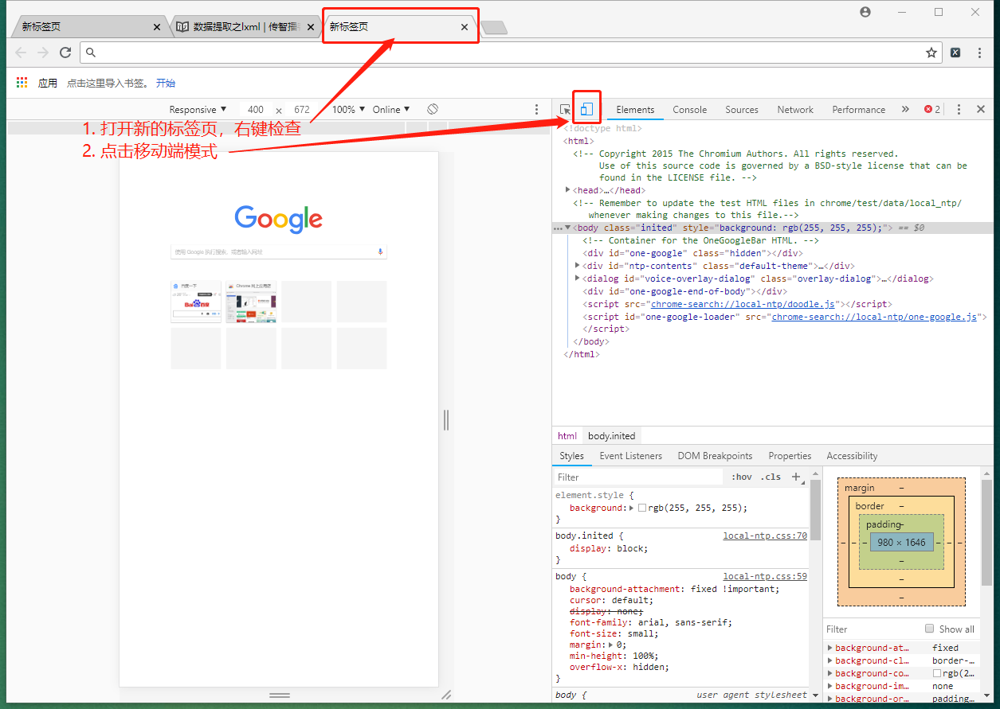

2. 第二步--如果不能进入移动版baidu首页，则输入m.baidu.com

    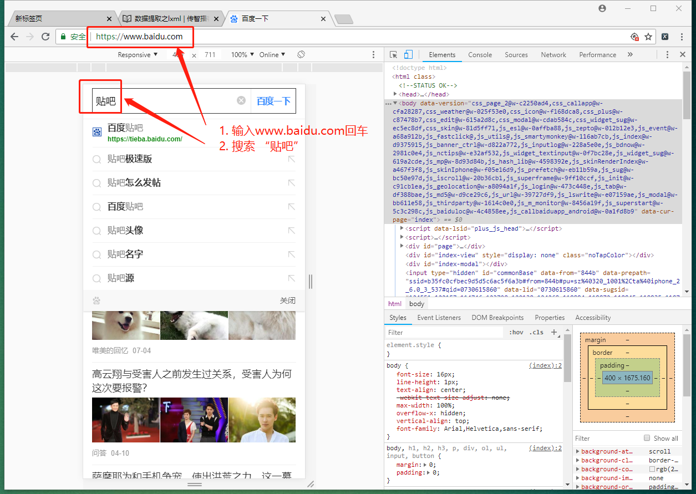

3. 第三步

    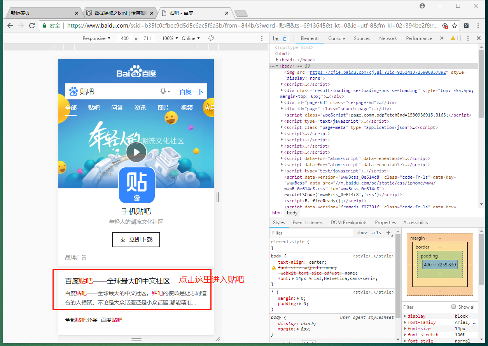

4. 第四步

    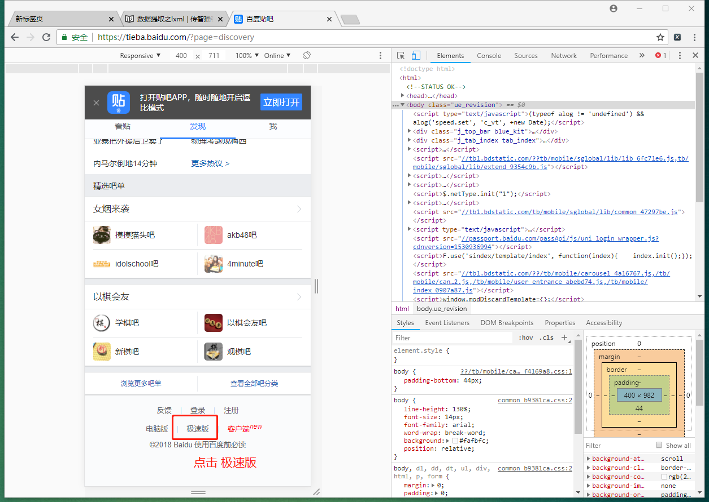

5. 第五步

    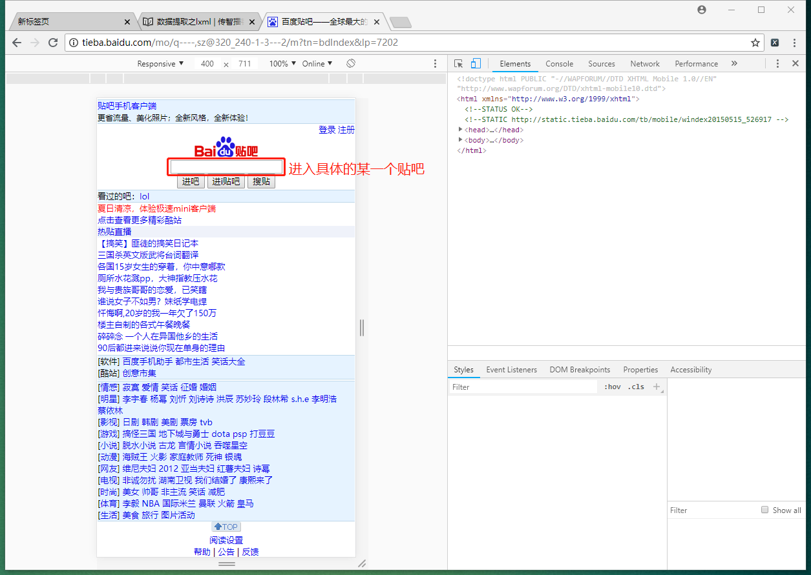

##### 3.2 思路分析：

1. 推荐使用极速版的页面，响应不包含js，elements和url地址对应的响应一样

    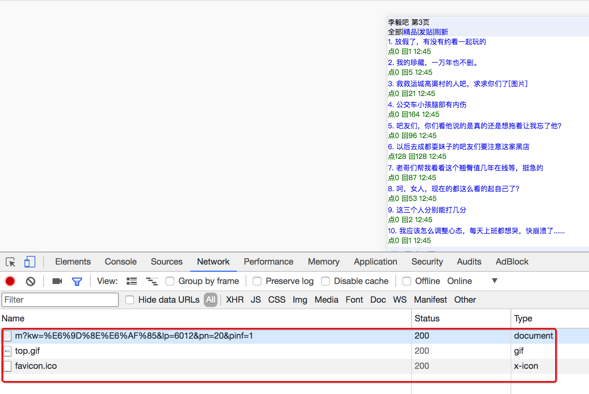
    
2. 获取所有的**列表页**的数据即连接和标题

    2.1. 确定url地址，确定程序停止的条件
    
    url地址的数量不固定，不能够去构造url列表，需要手动获取下一页的url地址进行翻页
        
    有下一页的情况:
        
    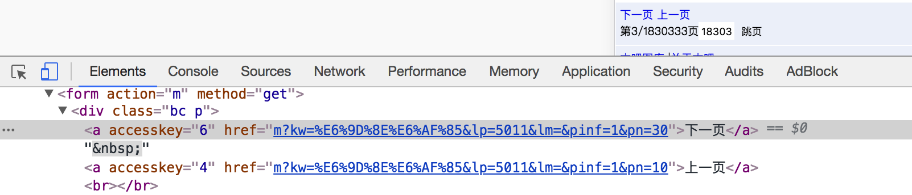
        
    没有下一页的情况：

    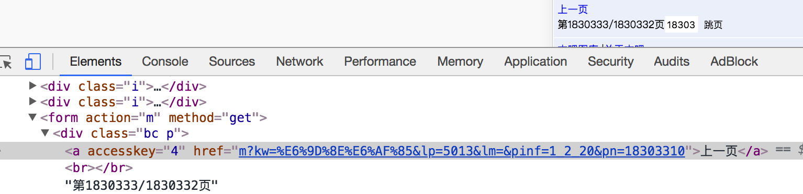
                   
    2.2. 确定列表页数据的位置
    
    由于没有js，可以直接从elements中进行数据的提取
    
    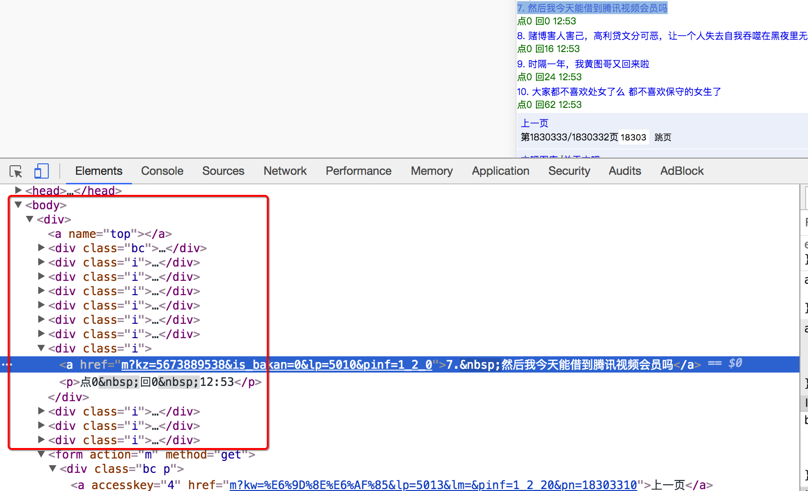

3. 获取帖子中的所有数据
    
    3.1 确定url地址
    
    url详情页的规律和列表页相似

    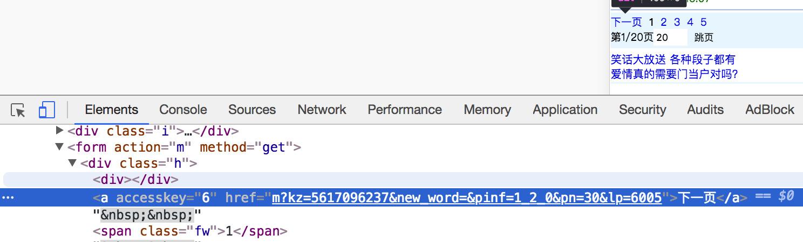
    
    3.2 确定数据的位置

    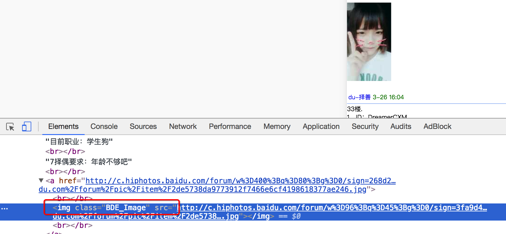
    
    

##### 3.3 参考代码

```
import requests
from lxml import etree


class TieBaSpider:
    def __init__(self, tieba_name):
        #1. start_url
        self.start_url= "http://tieba.baidu.com/mo/q---C9E0BC1BC80AA0A7CE472600CDE9E9E3%3AFG%3D1-sz%40320_240%2C-1-3-0--2--wapp_1525330549279_782/m?kw={}&lp=6024".format(tieba_name)
        self.headers = {"User-Agent": "Mozilla/5.0 (Linux; Android 8.0; Pixel 2 Build/OPD3.170816.012) AppleWebKit/537.36 (KHTML, like Gecko) Chrome/66.0.3359.139 Mobile Safari/537.36"}
        self.part_url = "http://tieba.baidu.com/mo/q---C9E0BC1BC80AA0A7CE472600CDE9E9E3%3AFG%3D1-sz%40320_240%2C-1-3-0--2--wapp_1525330549279_782"

    def parse_url(self,url): #发送请求，获取响应
        # print(url)
        response = requests.get(url,headers=self.headers)
        return response.content

    def get_content_list(self,html_str): #3. 提取数据
        html = etree.HTML(html_str)
        div_list = html.xpath("//body/div/div[contains(@class,'i')]")
        content_list = []
        for div in div_list:
            item = {}
            item["href"] = self.part_url+div.xpath("./a/@href")[0]
            item["title"] = div.xpath("./a/text()")[0]
            item["img_list"] = self.get_img_list(item["href"], [])
            content_list.append(item)

        #提取下一页的url地址
        next_url = html.xpath("//a[text()='下一页']/@href")
        next_url = self.part_url + next_url[0] if len(next_url)>0 else None
        return content_list, next_url

    def get_img_list(self,detail_url, img_list):
        #1. 发送请求，获取响应
        detail_html_str = self.parse_url(detail_url)
        #2. 提取数据
        detail_html = etree.HTML(detail_html_str)
        img_list += detail_html.xpath("//img[@class='BDE_Image']/@src")

        #详情页下一页的url地址
        next_url = detail_html.xpath("//a[text()='下一页']/@href")
        next_url = self.part_url + next_url[0] if len(next_url)>0 else None
        if next_url is not None: #当存在详情页的下一页，请求
            return self.get_img_list(next_url, img_list)

        #else不用写
        img_list = [requests.utils.unquote(i).split("src=")[-1] for i in img_list]
        return img_list

    def save_content_list(self,content_list):#保存数据
        for content in content_list:
            print(content)

    def run(self): #实现主要逻辑
        next_url = self.start_url
        while next_url is not None:
            #1. start_url
            #2. 发送请求，获取响应
            html_str = self.parse_url(next_url)
            #3. 提取数据
            content_list, next_url = self.get_content_list(html_str)
            #4. 保存
            self.save_content_list(content_list)
            #5. 获取next_url，循环2-5


if __name__ == '__main__':

    tieba = TieBaSpider("传智播客")
    tieba.run()
```

_________________

### 小结
1. lxml库的安装: `pip install lxml`
2. lxml的导包:`from lxml import etree`; 
3. lxml转换解析类型的方法:`etree.HTML(text) `
4. lxml解析数据的方法:`data.xpath("//div/text()")`
5. 需要注意lxml提取完毕数据的数据类型都是列表类型
6. 如果数据比较复杂:先提取大节点, 在遍历小节点操作，即先分组再提取数据


