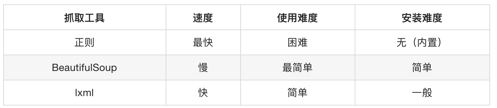
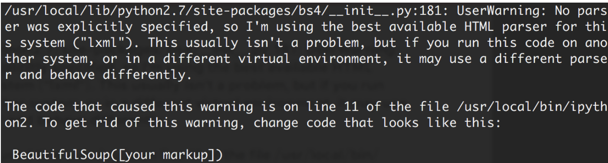

## BeautifulSoup4的学习（了解）
##### 学习目标
1. 能够知道bs4警告的原因
2. 了解 BS4的使用流程
3. 了解 BS4的find_all,find,select方法解析数据

_________________

> 由于xpath解析数据需要对html结构有深刻的理解,可能对部分同学产生了学习压力, 那么是不是还有其他的解析方法呢?接下来我们学习使用css选择器解析数据的操作库是 BeautifulSoup4

### 1  CSS 选择器：BeautifulSoup4的介绍和安装
和 lxml 一样，Beautiful Soup 也是一个HTML/XML的解析器，主要的功能也是如何解析和提取 HTML/XML 数据。

lxml 只会局部遍历，而Beautiful Soup 是基于HTML DOM的，会载入整个文档，解析整个DOM树，因此时间和内存开销都会大很多，所以性能要低于lxml。

BeautifulSoup 用来解析 HTML 比较简单，API非常人性化，支持CSS选择器、Python标准库中的HTML解析器，也支持 lxml 的 XML解析器。

Beautiful Soup 3 目前已经停止开发，推荐现在的项目使用Beautiful Soup 4。使用 pip 安装即可：
`pip install beautifulsoup4`

官方文档：<http://beautifulsoup.readthedocs.io/zh_CN/v4.4.0>




##### 1.1 bs4的基本使用示例：
首先必须要导入 bs4 库

```
from bs4 import BeautifulSoup

html = """
<html><head><title>The Dormouse's story</title></head>
<body>
<p class="title" name="dromouse"><b>The Dormouse's story</b></p>
<p class="story">Once upon a time there were three little sisters; and their names were
<a href="http://example.com/elsie" class="sister" id="link1"><!-- Elsie --></a>,
<a href="http://example.com/lacie" class="sister" id="link2">Lacie</a> and
<a href="http://example.com/tillie" class="sister" id="link3">Tillie</a>;
and they lived at the bottom of a well.</p>
<p class="story">...</p>
"""

#创建 Beautiful Soup 对象
soup = BeautifulSoup(html)
# soup = BeautifulSoup(html, 'lxml')

#打开本地 HTML 文件的方式来创建对象
#soup = BeautifulSoup(open('index.html'))

#格式化输出 soup 对象的内容
print(soup.prettify())

```

运行结果：

```
<html>
 <head>
  <title>
   The Dormouse's story
  </title>
 </head>
 <body>
  <p class="title" name="dromouse">
   <b>
    The Dormouse's story
   </b>
  </p>
  <p class="story">
   Once upon a time there were three little sisters; and their names were
   <a class="sister" href="http://example.com/elsie" id="link1">
    <!-- Elsie -->
   </a>
   ,
   <a class="sister" href="http://example.com/lacie" id="link2">
    Lacie
   </a>
   and
   <a class="sister" href="http://example.com/tillie" id="link3">
    Tillie
   </a>
   ;
and they lived at the bottom of a well.
  </p>
  <p class="story">
   ...
  </p>
 </body>
</html>
```

##### 注意：
如果我们在 Python 下执行，会看到这样一段警告：



> 意思是，如果我们没有显式地指定解析器，所以默认使用这个系统的最佳可用HTML解析器(“lxml”)。

> 如果你在另一个系统中运行这段代码，或者在不同的虚拟环境中，使用不同的解析器造成行为不同。

> 但是我们可以通过soup = BeautifulSoup(html, 'lxml')方式指定lxml解析器。


### 2 搜索文档树

##### 2.1 find_all(name, attrs, recursive, text, **kwargs)


##### 1) name 参数
name 参数可以查找所有名字为 name 的tag
###### A 传字符串
最简单的过滤器是字符串.在搜索方法中传入一个字符串参数,Beautiful Soup会查找与字符串完整匹配的内容,下面的例子用于查找文档中所有的<b>标签:

```
print(soup.find_all('b'))
# [<b>The Dormouse's story</b>]

print(soup.find_all('a'))
#[<a class="sister" href="http://example.com/elsie" id="link1"><!-- Elsie --></a>, <a class="sister" href="http://example.com/lacie" id="link2">Lacie</a>, <a class="sister" href="http://example.com/tillie" id="link3">Tillie</a>]
```
###### B 传正则表达式
如果传入正则表达式作为参数,Beautiful Soup会通过正则表达式的 match() 来匹配内容.下面例子中找出所有以b开头的标签,这表示<body>和<b>标签都应该被找到

```
import re
for tag in soup.find_all(re.compile("^b")):
    print(tag.name)
# body
# b
```
###### C 传列表
如果传入列表参数,Beautiful Soup会将与列表中任一元素匹配的内容返回.下面代码找到文档中所有<a>标签和<b>标签:

```
print(soup.find_all(["a", "b"]))
# [<b>The Dormouse's story</b>,
#  <a class="sister" href="http://example.com/elsie" id="link1">Elsie</a>,
#  <a class="sister" href="http://example.com/lacie" id="link2">Lacie</a>,
#  <a class="sister" href="http://example.com/tillie" id="link3">Tillie</a>]
```

##### 2）keyword 参数

```
print(soup.find_all(class_="sister")) # 注意 这里是class_ 最后有个下划线！
#[<a class="sister" href="http://example.com/elsie" id="link1"><!-- Elsie --></a>, <a class="sister" href="http://example.com/lacie" id="link2">Lacie</a>, <a class="sister" href="http://example.com/tillie" id="link3">Tillie</a>]

print(soup.find_all(id='link2'))
# [<a class="sister" href="http://example.com/lacie" id="link2">Lacie</a>]
```
##### 3）text 参数
通过 text 参数可以搜索文档中的字符串内容，与 name 参数的可选值一样, text 参数接受 字符串 , 正则表达式 , 列表

```
import re

print(soup.find_all(text=" Elsie ")) # 注释内容不能少了空格！
# [' Elsie ']

print(soup.find_all(text=["Tillie", "Elsie", "Lacie"])) # 这就找不到注释内容！
# ['Lacie', 'Tillie']

print(soup.find_all(text=re.compile("Dormouse")))
["The Dormouse's story", "The Dormouse's story"]
```

##### 2.2 find

find的用法与find_all一样，区别在于find返回 第一个符合匹配结果，find_all则返回 所有匹配结果的列表

##### 2.3 CSS选择器

这就是另一种与 find_all 方法有异曲同工之妙的查找方法，也是返回所有匹配结果的列表。

-   写 CSS 时，标签名不加任何修饰，类名前加.，id名前加#

-   在这里我们也可以利用类似的方法来筛选元素，用到的方法是 soup.select()，返回类型是 list

##### （1）通过标签选择器查找

```
print(soup.select('title'))
#[<title>The Dormouse's story</title>]

print(soup.select('a'))
#[<a class="sister" href="http://example.com/elsie" id="link1"><!-- Elsie --></a>, <a class="sister" href="http://example.com/lacie" id="link2">Lacie</a>, <a class="sister" href="http://example.com/tillie" id="link3">Tillie</a>]

print(soup.select('b'))
#[<b>The Dormouse's story</b>]
```

##### （2）通过类选择器查找

```
print(soup.select('.sister'))
#[<a class="sister" href="http://example.com/elsie" id="link1"><!-- Elsie --></a>, <a class="sister" href="http://example.com/lacie" id="link2">Lacie</a>, <a class="sister" href="http://example.com/tillie" id="link3">Tillie</a>]
```

##### （3）通过 id 选择器查找

```
print(soup.select('#link1'))
#[<a class="sister" href="http://example.com/elsie" id="link1"><!-- Elsie --></a>]
```

##### （4）层级选择器 查找

```
print(soup.select('p #link1'))
#[<a class="sister" href="http://example.com/elsie" id="link1"><!-- Elsie --></a>]
```
##### （5）通过属性选择器查找

```
print(soup.select('a[class="sister"]'))
#[<a class="sister" href="http://example.com/elsie" id="link1"><!-- Elsie --></a>, <a class="sister" href="http://example.com/lacie" id="link2">Lacie</a>, <a class="sister" href="http://example.com/tillie" id="link3">Tillie</a>]

print(soup.select('a[href="http://example.com/elsie"]'))
#[<a class="sister" href="http://example.com/elsie" id="link1"><!-- Elsie --></a>]
```
##### (6) 获取文本内容 get_text()
以上的 select 方法返回的结果都是列表形式，可以遍历形式输出，然后用 get_text() 方法来获取它的内容。

```
soup = BeautifulSoup(html, 'lxml')
print(type(soup.select('title')))
print(soup.select('title')[0].get_text())

for title in soup.select('title'):
    print(title.get_text())
```

##### (7) 获取属性 get('属性的名字')

```
soup = BeautifulSoup(html, 'lxml')
print(type(soup.select('a')))
print(soup.select('a')[0].get('href'))
```

### 3 动手练习
> 用bs4来做一个简单的爬虫，爬取某个贴吧里的所有帖子，获取每个帖子的标题，链接和帖子中图片的链接

##### 3.1 思路分析：

  参考前一小节中动手练习的思路分析    

##### 3.2 本练习中会用到bs4的其他方法

 1. bs4获取标签的某个属性

  ```
  soup.select('a')[0]['href'] # bs4 获取a标签的href属性
  ```

 2. bs4根据文本内容定位元素

  ```
  soup.find_all('a', text='下一页') # bs4 根据a标签的文本内容获取a标签
  ```

 3. bs4根据标签名和标签的class属性来获取标签

  ```
  soup.find_all('img', class_='BDE_Image') # 注意这里又是class_ 后边有个下划线
  ```

##### 3.3 参考代码

```
import requests
# from lxml import etree
from bs4 import BeautifulSoup


class TieBaSpider:
    def __init__(self, tieba_name):
        #1. start_url
        self.start_url= "http://tieba.baidu.com/mo/q---C9E0BC1BC80AA0A7CE472600CDE9E9E3%3AFG%3D1-sz%40320_240%2C-1-3-0--2--wapp_1525330549279_782/m?kw={}&lp=6024".format(tieba_name)
        self.headers = {"User-Agent": "Mozilla/5.0 (Linux; Android 8.0; Pixel 2 Build/OPD3.170816.012) AppleWebKit/537.36 (KHTML, like Gecko) Chrome/66.0.3359.139 Mobile Safari/537.36"}
        self.part_url = "http://tieba.baidu.com/mo/q---C9E0BC1BC80AA0A7CE472600CDE9E9E3%3AFG%3D1-sz%40320_240%2C-1-3-0--2--wapp_1525330549279_782"

    def parse_url(self,url): #发送请求，获取响应
        # print(url)
        response = requests.get(url,headers=self.headers)
        return response.content

    def get_content_list(self,html_str): #3. 提取数据
        # html = etree.HTML(html_str)
        html = BeautifulSoup(html_str, 'lxml')
        # div_list = html.xpath("//body/div/div[contains(@class,'i')]")
        div_list = html.select('div[class="i"]')
        content_list = []
        for div in div_list:
            item = {}
            # item["href"] = self.part_url+div.xpath("./a/@href")[0]
            item["href"] = self.part_url + div.select('a')[0]['href'] # bs4 获取标签的某个属性
            # item["title"] = div.xpath("./a/text()")[0]
            item["title"] = div.select('a')[0].get_text() # bs4 获取标签的文本内容
            item["img_list"] = self.get_img_list(item["href"], [])
            content_list.append(item)

        #提取下一页的url地址
        # next_url = html.xpath("//a[text()='下一页']/@href")
        next_url = html.find_all('a', text='下一页') # bs4 根据文本内容定位元素
        next_url = self.part_url + next_url[0]['href'] if len(next_url)>0 else None
        return content_list, next_url

    def get_img_list(self,detail_url, img_list):
        #1. 发送请求，获取响应
        detail_html_str = self.parse_url(detail_url)
        #2. 提取数据
        # detail_html = etree.HTML(detail_html_str)
        detail_html = BeautifulSoup(detail_html_str, 'lxml')
        # img_list += detail_html.xpath("//img[@class='BDE_Image']/@src")
        for img in detail_html.find_all('img', class_='BDE_Image'): # bs4
            img_list.append(img['src'])

        #详情页下一页的url地址
        # next_url = detail_html.xpath("//a[text()='下一页']/@href")
        next_url = detail_html.find_all('a', text='下一页') # bs4 根据文本内容定位元素
        # next_url = self.part_url + next_url[0] if len(next_url)>0 else None
        next_url = self.part_url + next_url[0]['href'] if len(next_url) > 0 else None
        if next_url is not None: #当存在详情页的下一页，请求
            return self.get_img_list(next_url, img_list)

        #else不用写
        img_list = [requests.utils.unquote(i).split("src=")[-1] for i in img_list]
        return img_list

    def save_content_list(self,content_list):#保存数据
        for content in content_list:
            print(content)

    def run(self): #实现主要逻辑
        next_url = self.start_url
        while next_url is not None:
            #1. start_url
            #2. 发送请求，获取响应
            html_str = self.parse_url(next_url)
            #3. 提取数据
            content_list, next_url = self.get_content_list(html_str)
            #4. 保存
            self.save_content_list(content_list)
            #5. 获取next_url，循环2-5


if __name__ == '__main__':

    tieba = TieBaSpider("传智播客")
    tieba.run()
```
_________________

### 小结
1. 安装beautifulsoup4:`pip install beautifulsoup4`
2. beautifulsoup导包: `from bs4 import BeautifulSoup`
3. beautifulsoup转换类型: `BeautifulSoup(html)`
4. find 方法返回一个解析完毕的对象
5. findall 方法返回的是解析列表list
6. select 方法返回的是解析列表list
7. 获取属性的方法: `get('属性名字')`
8. 和获取文本的方法: `get_text()`
