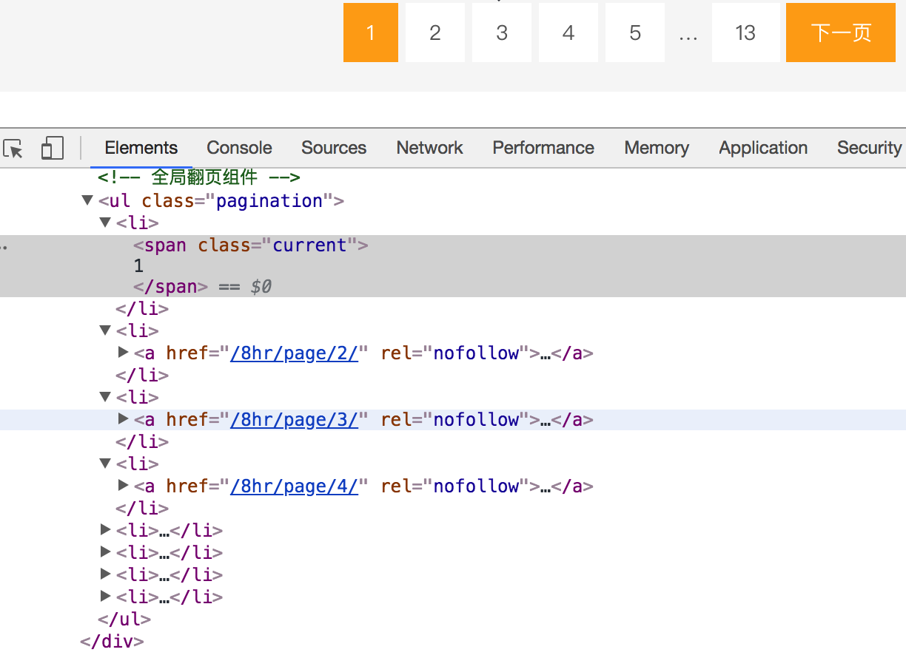
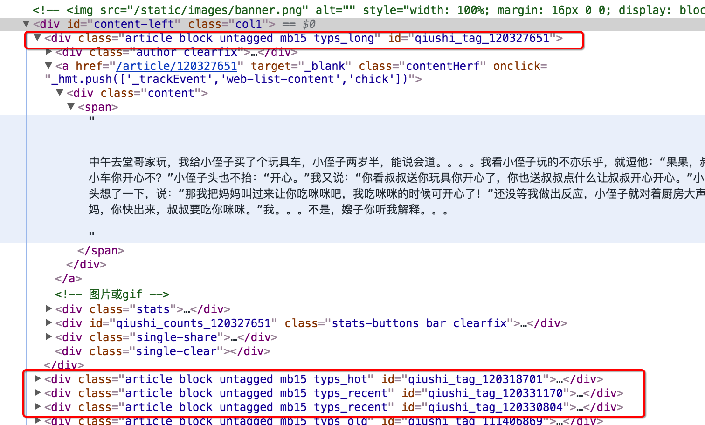

## 单线程爬虫实现

##### 学习目标
1. 完成爬虫案例的实现

---------------

### 1 爬取糗事百科段子
页面的URL是：http://www.qiushibaike.com/8hr/page/1

思路分析：

1. 确定url地址

    url地址的规律非常明显，一共只有13页url地址
    
    

2. 确定数据的位置

    数据都在`id='content-left'`的div下的div中，在这个区域，url地址对应的响应和elements相同
    
    

### 2 糗事百科代码实现

```python
# coding=utf-8
import requests
from lxml import etree
import time

class QiuBai:
    def __init__(self):
        self.temp_url = "http://www.qiushibaike.com/8hr/page/{}"
        self.headers = {"User-Agent": "Mozilla/5.0 (Macintosh; Intel Mac OS X 10_13_4) AppleWebKit/537.36 (KHTML, like Gecko) Chrome/66.0.3359.139 Safari/537.36"}

    def get_url_list(self):
        '''准备url地址的刘表'''
        return [self.temp_url.format(i) for i in range(1,14)]

    def parse_url(self,url):
        '''发送请求，获取响应'''
        response = requests.get(url,headers=self.headers)
        return response.content.decode()

    def get_content_list(self,html_str):
        '''提取数据'''
        html = etree.HTML(html_str)
        div_list = html.xpath("//div[@id='content-left']/div")
        content_list = []
        for div in div_list:
            item = {}
            item["user_name"] = div.xpath(".//h2/text()")[0].strip()
            item["content"] = [i.strip() for i in div.xpath(".//div[@class='content']/span/text()")]
            content_list.append(item)
        return content_list

    def save_content_list(self,content_list): 
        '''保存'''
        for content in content_list:
            print(content)

    def run(self):#实现做主要逻辑
        #1. 准备url列表
        url_list = self.get_url_list()
        #2. 遍历发送请求，获取响应
        for url in url_list:
            html_str = self.parse_url(url)
            #3. 提取数据
            content_list = self.get_content_list(html_str)
            #4. 保存
            self.save_content_list(content_list)


if __name__ == '__main__':
    t1 = time.time()
    qiubai = QiuBai()
    qiubai.run()
    print("total cost:",time.time()-t1)
```

---------------

### 小结
1. 完成单线程爬虫案例为多线程做准备
2. 爬取糗事百科首页数据
3. 解析糗事百科页面数据
4. 爬取糗事百科所有数据
5. 保存数据


