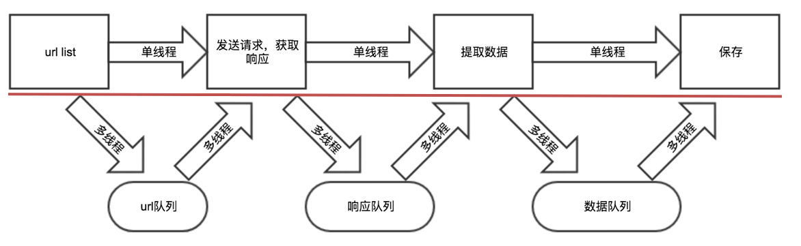

### 2 多线程爬虫

##### 学习目标
1. 掌握 threading模块的使用
2. 掌握 Queue模块的使用

---------------

> 在前面爬虫基础知识案例中我们发现请求回来的总数据不是太多,时间性对来说还是比较快的,那么如果该网站有大量数据等待爬虫爬取,我们是不是需要使用多线程并发来操作爬虫的网络请求呢?

### 1 回顾多线程的方法使用
在python3中，主线程主进程结束，子线程，子进程不会结束

为了能够让主线程回收子线程，可以把子线程设置为守护线程，即该线程不重要，主线程结束，子线程结束

```python
t1 = threading.Thread(targe=func,args=(,))
t1.setDaemon(True) # 设置为守护线程
t1.start() #此时线程才会启动
```

### 2 回顾队列模块的使用

```python
from queue import Queue
q = Queue(maxsize=100) # maxsize为队列长度
item = {}
q.put_nowait(item) #不等待直接放，队列满的时候会报错
q.put(item) #放入数据，队列满的时候会阻塞等待
q.get_nowait() #不等待直接取，队列空的时候会报错
q.get() #取出数据，队列为空的时候会阻塞等待
q.qsize() #获取队列中现存数据的个数 
q.join() # 队列中维持了一个计数(初始为0)，计数不为0时候让主线程阻塞等待，队列计数为0的时候才会继续往后执行
         # q.join()实际作用就是阻塞主线程，与task_done()配合使用
         # put()操作会让计数+1，task_done()会让计数-1
         # 计数为0，才停止阻塞，让主线程继续执行
q.task_done() # put的时候计数+1，get不会-1，get需要和task_done 一起使用才会-1
```

### 3 多线程实现思路剖析
1. 把爬虫中的每个步骤封装成函数，分别用线程去执行
2. 不同的函数通过队列相互通信，函数间解耦


### 4 具体代码实现

```python
import requests
from lxml import etree
from queue import Queue
import threading


class Qiubai:
    def __init__(self):
        self.temp_url = "https://www.qiushibaike.com/8hr/page/{}/"
        self.headers= {"User-Agent":"Mozilla/5.0 (Macintosh; Intel Mac OS X \
        10_13_3) AppleWebKit/537.36 (KHTML, like Gecko) Chrome/64.0.3282.186 Safari/537.36"}
        self.url_queue = Queue()
        self.html_queue = Queue()
        self.content_list_queue = Queue()

    def get_url_list(self):#获取url列表
        for i in range(1,14):
            self.url_queue.put(self.temp_url.format(i))

    def parse_url(self):
        while True: #在这里使用，子线程不会结束，把子线程设置为守护线程
            url = self.url_queue.get()
            # print(url)
            response = requests.get(url,headers=self.headers)
            self.html_queue.put(response.content.decode())
            self.url_queue.task_done()


    def get_content_list(self):  #提取数据
        while True:
            html_str = self.html_queue.get()
            html = etree.HTML(html_str)
            div_list = html.xpath("//div[@id='content-left']/div")
            content_list = []
            for div in div_list:
                content = {}
                content["content"] = div.xpath(".//div[@class='content']/span/text()")
                content_list.append(content)
            self.content_list_queue.put(content_list)
            self.html_queue.task_done()

    def save_content_list(self):
        while True:
            content_list = self.content_list_queue.get()
            for content in content_list:
                print(content) # 此处对数据进行保存操作
            self.content_list_queue.task_done()


    def run(self):
        thread_list = []
        #1.url_list
        t_url = threading.Thread(target=self.get_url_list)
        thread_list.append(t_url)
        #2.遍历，发送请求，
        for i in range(3):  #三个线程发送请求
            t_parse = threading.Thread(target=self.parse_url)
            thread_list.append(t_parse)
        #3.提取数据
        t_content = threading.Thread(target=self.get_content_list)
        thread_list.append(t_content)
        #4.保存
        t_save = threading.Thread(target=self.save_content_list)
        thread_list.append(t_save)

        for t in thread_list:
            t.setDaemon(True)  #把子线程设置为守护线程，当前这个线程不重要，主线程结束，子线程技术
            t.start()

        for q in [self.url_queue,self.html_queue,self.content_list_queue]:
            q.join()  #让主线程阻塞，等待队列的计数为0，

        print("主线程结束")

if __name__ == '__main__':

    qiubai = Qiubai()
    qiubai.run()
```

##### 注意点：
- put会让队列的计数+1，但是单纯的使用get不会让其-1，需要和task_done同时使用才能够-1
- task_done不能放在另一个队列的put之前，否则可能会出现数据没有处理完成，程序结束的情况

---------------

### 小结
1. theading多线程实现爬虫案例
2. queue中put,get,task_done,join等方法的使用


