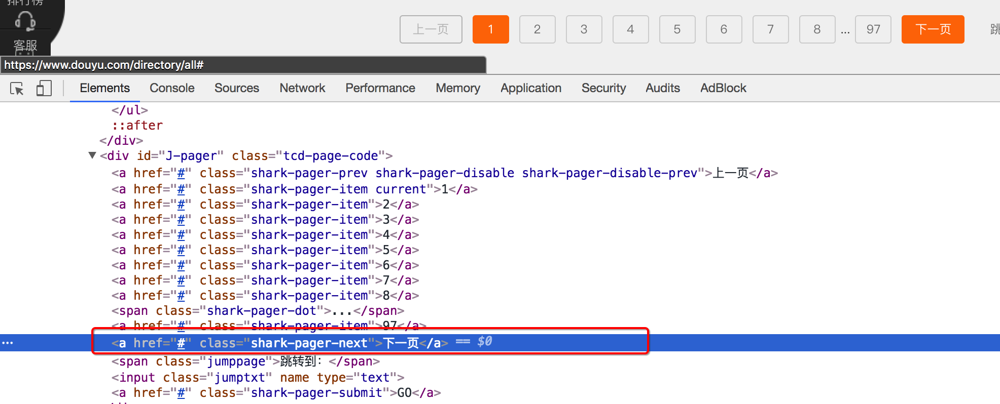
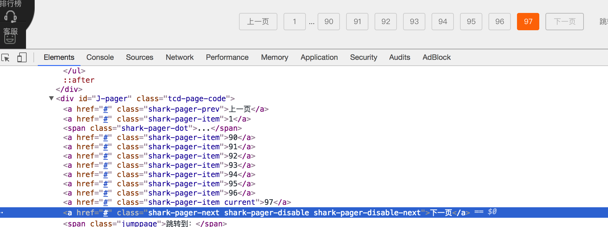

## 1. 斗鱼爬虫

> 爬取斗鱼直播平台的所有房间信息：https://www.douyu.com/directory/all

### 1.1 思路分析：

1. 数据的位置

    每个房间的数据都在`id=live-list-contentbox`的ul中
    
    

2. 实现翻页和控制程序结束

    selenium中通过点击就可以实现翻页，观察存在下一页和不存在下一页时候标签的变化
    
    存在下一页时：
    
    
    
    不存在下一页时：
    
    

### 1.2 参考代码

```
from selenium import webdriver
import time


class DouYu:
    def __init__(self):
        self.start_url = "https://www.douyu.com/directory/all"
        self.driver = webdriver.Chrome(executable_path='/home/worker/Desktop/driver/chromedriver')

    def get_content_list(self): #提取数据
        li_list = self.driver.find_elements_by_xpath("//ul[@id='live-list-contentbox']/li")
        content_list = []
        for li in li_list:
            item = {}
            item["title"] = li.find_element_by_xpath("./a").get_attribute("title")
            item["anchor"] = li.find_element_by_xpath(".//span[@class='dy-name ellipsis fl']").text
            item["watch_num"] = li.find_element_by_xpath(".//span[@class='dy-num fr']").text
            # print(item)
            content_list.append(item)

        #提取下一页的元素
        next_url = self.driver.find_elements_by_xpath("//a[@class='shark-pager-next']")
        next_url = next_url[0] if len(next_url)>0 else None
        return content_list,next_url

    def save_content_list(self,content_lsit):#保存
        for content in content_lsit:
            print(content)

    def run(self): #实现主要逻辑
        #1. start_url
        #2. 发送请求，获取响应
        self.driver.get(self.start_url)
        #3. 提取数据
        content_list,next_url = self.get_content_list()
        #4.保存
        self.save_content_list(content_list)
        # 5. 下一页数据的提取
        while next_url is not None:
            next_url.click() #页面没有完全加载完，会报错
            time.sleep(3)
            content_list,next_url = self.get_content_list()
            self.save_content_list(content_list)


if __name__ == '__main__':
    douyu = DouYu()
    douyu.run()
```


## 2. 网易云音乐爬虫

> 完成网易云音乐的所有列表的名字和url地址
> 地址：http://music.163.com/#/discover/playlist

### 2.1 思路分析：

1. 确定程序入口的位置

2. 确定首页数据的位置和url地址
    
3. 实现翻页和程序停止的判断

### 2.2 参考代码

```
from selenium import webdriver
import time


class CloudMuisc():

    def __init__(self):
        self.start_url = 'http://music.163.com/#/discover/playlist'
        self.driver = webdriver.Chrome(executable_path='/home/worker/Desktop/driver/chromedriver')

    def get_content_list(self): #提取数据
        # 切入frame标签
        login_frame = self.driver.find_element_by_id('g_iframe')  # 根据id定位 frame元素
        self.driver.switch_to.frame(login_frame)  # 转向到该frame中

        li_list = self.driver.find_elements_by_xpath('//*[@id="m-pl-container"]/li')
        print(len(li_list))
        content_list = []
        for li in li_list:
            item = {}
            item["title"] = li.find_element_by_class_name('msk').get_attribute("title")
            item["href"] = li.find_element_by_xpath('.//a').get_attribute("href")
            # print(item)
            content_list.append(item)

        #提取下一页的元素
        page_url_list = self.driver.find_elements_by_xpath('.//div[@class="u-page"]/a')
        next_url = page_url_list[-1] if len(page_url_list)>0 else None
        return content_list, next_url

    def save_content_list(self,content_lsit):#保存
        for content in content_lsit:
            print(content)

    def run(self): #实现主要逻辑
        #1. start_url
        #2. 发送请求，获取响应
        self.driver.get(self.start_url)
        time.sleep(3)
        #3. 提取数据
        content_list, next_url = self.get_content_list()
        #4.保存
        self.save_content_list(content_list)
        # 5. 下一页数据的提取
        while next_url is not None:
            js = 'window.scrollTo(0,document.body.scrollHeight)'  # js语句：滚动到页面最底部
            self.driver.execute_script(js)  # 执行js的方法
            print(next_url.get_attribute('href'))
            next_url.click() #页面没有完全加载完，会报错
            time.sleep(3)
            
            # 此时在iframe标签中 代码逻辑需要我们先切出
            windows = self.driver.window_handles
            self.driver.switch_to.window(windows[0])

            content_list, next_url = self.get_content_list()
            self.save_content_list(content_list)

        # 6. 退出driver
        self.driver.quit()


if __name__ == '__main__':

    spider = CloudMuisc()
    spider.run()
```

