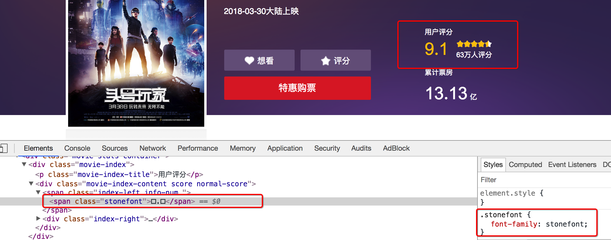

## 常见的反爬手段和解决思路

##### 学习目标
1. 了解 通过headers反爬以及对应的解决方法
2. 了解 通过js反爬以及对应的解决方法
3. 了解 通过验证码反爬以及对应的解决方法
4. 了解 通过IP反爬以及对应的解决方法
5. 了解 通过用户行为反爬以及对应的解决方法

-----

### 1  明确反反爬的主要思路
反反爬的主要思路就是：**尽可能的去模拟浏览器，浏览器在如何操作，代码中就如何去实现**。

>例如：浏览器先请求了地址url1，保留了cookie在本地，之后请求地址url2，带上了之前的cookie，代码中也可以这样去实现。


### 2 通过headers字段来反爬
> headers中有很多字段，这些字段都有可能会被对方服务器拿过来进行判断是否为爬虫

##### 2.1 通过headers中的User-Agent字段来反爬
- 反爬原理：爬虫默认情况下没有User-Agent
- 解决方法：请求之前添加User-Agent即可；更好的方式是使用User-Agent池来解决（收集一堆User-Agent的方式，或者是随机生成User-Agent）

```python
import random

def get_ua():
    first_num = random.randint(55, 62)
    third_num = random.randint(0, 3200)
    fourth_num = random.randint(0, 140)
    os_type = [
        '(Windows NT 6.1; WOW64)', '(Windows NT 10.0; WOW64)', '(X11; Linux x86_64)',
        '(Macintosh; Intel Mac OS X 10_12_6)'
    ]
    chrome_version = 'Chrome/{}.0.{}.{}'.format(first_num, third_num, fourth_num)

    ua = ' '.join(['Mozilla/5.0', random.choice(os_type), 'AppleWebKit/537.36',
                   '(KHTML, like Gecko)', chrome_version, 'Safari/537.36']
                  )
    return ua
```

##### 2.2 通过referer字段或者是其他字段来反爬
- 反爬原理：爬虫默认情况下不会带上referer字段
- 解决方法：添加referer字段（例如豆瓣美剧爬虫，详见课程1.3.2小节）


##### 2.3 通过cookie来反爬
- 如果目标网站不需要登录
    每次请求带上前一次返回的cookie，比如requests模块的session
    
- 如果目标网站需要登录
    准备多个账号，通过一个程序获取账号对应的cookie，组成cookie池，其他程序使用这些cookie
    

### 3 通过js来反爬
> 普通的爬虫默认情况下无法执行js，获取js执行之后的结果，所以很多时候对方服务器会通过js的技术实现反爬

##### 3.1 通过js实现跳转来反爬
- 反爬原理：js实现页面跳转，肉眼不可见
- 解决方法: 在chrome中点击perserve log按钮实现观察页面跳转情况

在这些请求中，如果请求数量很多，一般来讲，只有那些response中带cookie字段的请求是有用的，意味着通过这个请求，对方服务器有设置cookie到本地

##### 3.2 通过js生成了请求参数
- 反爬原理：js生成了请求参数
- 解决方法：分析js，观察加密的实现过程，通过js2py获取js的执行结果，或者使用selenium来实现


##### 3.3 通过js实现了数据的加密
- 反爬原理：js实现了数据的加密
- 解决方法：分析js，观察加密的实现过程，通过js2py获取js的执行结果，或者使用selenium来实现


### 4 通过验证码来反爬
- 反爬原理：对方服务器通过弹出验证码强制验证用户浏览行为
- 解决方法：打码平台或者是机器学习的方法识别验证码，其中打码平台廉价易用，更值得推荐

### 5 通过ip地址来反爬
- 反爬原理：正常浏览器请求网站，速度不会太快，同一个ip大量请求了对方服务器，有更大的可能性会被识别为爬虫
- 解决方法：对应的通过购买高质量的ip的方式能够解决问题

### 6 通过用户行为来反爬
- 反爬原理：通过浏览器请求数据，很多用户行为会在浏览器中是很容易实现或者无法实现.比如浏览器请求额外的图片地址，服务端进行记录，出现意味着不是爬虫(爬虫中不会主动请求图片)
- 解决方法：通过获取数据的情况来观察请求，寻找异常出现的可能请求

### 7 其他的反爬方式

##### 7.1 通过自定义字体来反爬
下图来自猫眼电影电脑版



解决思路：切换到手机版


##### 7.2 通过css来反爬
 下图来自猫眼去哪儿电脑版
 
 

解决思路：计算css的偏移

-----

### 小结
- 反爬的手段非常多，但是一般而言，完全的模仿浏览器的行为即可


