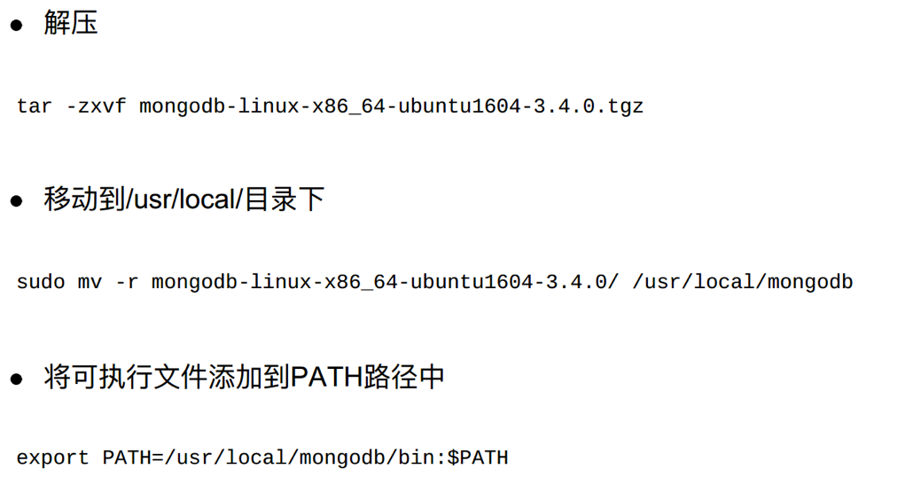

## Mongodb的介绍和安装

##### 学习目标
1. 了解 非关系型数据库和关系型数据库的区别
2. 了解 mongodb的优势
3. 掌握 mongodb的安装

-----

### 1 nosql的介绍

- “NoSQL”⼀词最早于1998年被⽤于⼀个轻量级的关系数据库的名字
- 随着web2.0的快速发展， NoSQL概念在2009年被提了出来
- NoSQL在2010年⻛⽣⽔起， 现在国内外众多⼤⼩⽹站， 如facebook、 google、 淘宝、 京东、 百度等， 都在使⽤nosql开发⾼性能的产品
- 对于⼀名程序员来讲， 使⽤nosql已经成为⼀条必备技能
- NoSQL最常⻅的解释是“non-relational”， “Not Only SQL”也被很多⼈接受， 指的是⾮关系型的数据库

### 2 关系型和非关系型的介绍


对于关系型数据库，存储数据的时候需要提前建表建库，随着数据的复杂度越来越高，所建的表的数量也越来越多；但是非关系型却不需要


### 3 mongodb的优势
- 易扩展： NoSQL数据库种类繁多， 但是⼀个共同的特点都是去掉关系数据库的关系型特性。 数据之间⽆关系， 这样就⾮常容易扩展
- ⼤数据量， ⾼性能： NoSQL数据库都具有⾮常⾼的读写性能， 尤其在⼤数据量下， 同样表现优秀。 这得益于它的⽆关系性， 数据库的结构简单
- 灵活的数据模型： NoSQL⽆需事先为要存储的数据建⽴字段， 随时可以存储⾃定义的数据格式。 ⽽在关系数据库⾥， 增删字段是⼀件⾮常麻烦的事情。 如果是⾮常⼤数据量的表， 增加字段简直就是⼀个噩梦

### 4 mongodb的安装
##### 4.1 命令安装

```
sudo apt-get install -y mongodb

https://docs.mongodb.com/manual/tutorial/install-mongodb-on-ubuntu/
```

##### 4.2 源码安装



### 5 mongodb的启动

##### 5.1 服务端mongodb的启动

启动方式1:
- 启动: sudo service mongod start
- 停止: sudo service mongod stop
- 重启: sudo service mongod restart
- 配置文件的位置：/etc/mongod.conf
- 日志的位置：/var/log/mongodb/mongod.log
- 默认端⼝：27017

启动方式2:
- 启动: `sudo mongod [--dbpath=dbpath --logpath=logpath --append -fork] [–f logfile
]`
- 只以 `sudo mongod` 命令启动时，默认将数据存放在了 /data/db 目录下，需要手动创建
- `--dbpath`: 指定数据库的存放路径
- `--logpath`: 指定日志的存放路径
- `--logappend`: 设置日志的写入形式为追加模式
- `-fork`: 开启新的进程运行mongodb服务
- `f`: 配置文件(可以将上述配置信息写入文件然后通过本参数进行加载启动)

##### 5.2 客户端mongo
- 启动本地客户端:mongo
- 查看帮助：mongo –help
- 退出：exit或者ctrl+c


##### 5.3 mongodb的官方文档
位置：https://docs.mongodb.com/manual/introduction/

-----

### 小结

1. 掌握mongodb的安装和启动
2. 能够说出mongdb的优势


