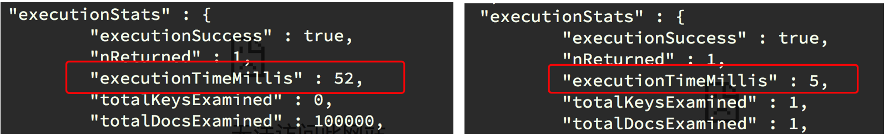

## Mongodb的索引

##### 学习目标
1. 掌握 mongodb索引的创建，删除操作
2. 掌握 mongodb查看索引的方法
3. 掌握 mongodb创建联合索引的方法
4. 掌握 mongodb创建唯一索引的方法

-----

### 1 为什么mongdb需要创建索引
- 加快查询速度
- 进行数据的去重

### 2 mongodb创建简单的索引方法
- 语法：
    - `db.集合.ensureIndex({属性:1})`，1表示升序， -1表示降序
    - `db.集合.createIndex({属性:1})`
    - 上面两个命令效果等价

- 具体操作：db.db_name.ensureIndex({name:1})

### 3 创建索引前后查询速度对比
测试：插入10万条数据到数据库中
插入数据：

```js
for(i=0;i<100000;i++){db.t255.insert({name:'test'+i,age:i})}
```
创建索引前：

```
db.t1.find({name:'test10000'})
db.t1.find({name:'test10000'}).explain('executionStats')
```

创建索引后：

```js
db.t255.ensureIndex({name:1})
db.t1.find({name:'test10000'}).explain('executionStats')
```
前后速度对比

    

### 4 索引的查看
默认情况下_id是集合的索引

查看方式：`db.collection_name.getIndexes()`

添加索引前：

```js
> db.test2000.insert({"name":"hello",age:20})
WriteResult({ "nInserted" : 1 })
> db.test2000.find()
{ "_id" : ObjectId("5ae0232f625b9ddd91a0e7ae"), "name" : "hello", "age" : 20 }
> db.test2000.getIndexes()
[
	{
		"v" : 2,
		"key" : {
			"_id" : 1
		},
		"name" : "_id_",
		"ns" : "test2000.test2000"
	}
]
```
添加name为索引后:

```js
> db.test2000.ensureIndex({name:1})
{
	"createdCollectionAutomatically" : false,
	"numIndexesBefore" : 1,
	"numIndexesAfter" : 2,
	"ok" : 1
}
> db.test2000.getIndexes()
[
	{
		"v" : 2,
		"key" : {
			"_id" : 1
		},
		"name" : "_id_",
		"ns" : "test2000.test2000"
	},
	{
		"v" : 2,
		"key" : {
			"name" : 1
		},
		"name" : "name_1",
		"ns" : "test2000.test2000"
	}
]
```


### 5 mongodb创建唯一索引
在默认情况下mongdb的索引域的值是可以相同的,创建唯一索引之后，数据库会在插入数据的时候检查创建索引域的值是否存在，如果存在则不会插入该条数据，但是创建索引仅仅能够提高查询速度,同时降低数据库的插入速度。

添加唯一索引的语法：

```js
db.collection_name.ensureIndex({"name":1},{"unique":true})
```

使用普通索引的效果如下：

```js
> db.test2000.getIndexes()
[
	{
		"v" : 2,
		"key" : {
			"_id" : 1
		},
		"name" : "_id_",
		"ns" : "test2000.test2000"
	},
	{
		"v" : 2,
		"key" : {
			"name" : 1
		},
		"name" : "name_1",
		"ns" : "test2000.test2000"
	}
]
> db.test2000.insert({name:"hello",age:40})
WriteResult({ "nInserted" : 1 })
> db.test2000.find()
{ "_id" : ObjectId("5ae0232f625b9ddd91a0e7ae"), "name" : "hello", "age" : 20 }
{ "_id" : ObjectId("5ae02421625b9ddd91a0e7af"), "name" : "hello", "age" : 30 }
{ "_id" : ObjectId("5ae02432625b9ddd91a0e7b0"), "name" : "hello", "age" : 40 }
```

添加age为唯一索引之后：

```js
> db.test2000.createIndex({age:1},{unique:true})
{
	"createdCollectionAutomatically" : false,
	"numIndexesBefore" : 2,
	"numIndexesAfter" : 3,
	"ok" : 1
}
> db.test2000.getIndexes()
[
	{
		"v" : 2,
		"key" : {
			"_id" : 1
		},
		"name" : "_id_",
		"ns" : "test2000.test2000"
	},
	{
		"v" : 2,
		"key" : {
			"name" : 1
		},
		"name" : "name_1",
		"ns" : "test2000.test2000"
	},
	{
		"v" : 2,
		"unique" : true,
		"key" : {
			"age" : 1
		},
		"name" : "age_1",
		"ns" : "test2000.test2000"
	}
]
> db.test2000.insert({"name":"world",age:20})
WriteResult({
	"nInserted" : 0,
	"writeError" : {
		"code" : 11000,
		"errmsg" : "E11000 duplicate key error collection: test2000.test2000 index: age_1 dup key: { : 20.0 }"
	}
})

```

### 6 删除索引
语法：`db.t1.dropIndex({'索引名称':1})`

```js
> db.test2000.getIndexes()
[
	{
		"v" : 2,
		"key" : {
			"_id" : 1
		},
		"name" : "_id_",
		"ns" : "test2000.test2000"
	},
	{
		"v" : 2,
		"key" : {
			"name" : 1
		},
		"name" : "name_1",
		"ns" : "test2000.test2000"
	},
	{
		"v" : 2,
		"unique" : true,
		"key" : {
			"age" : 1
		},
		"name" : "age_1",
		"ns" : "test2000.test2000"
	}
]
> db.test2000.dropIndex({age:1})
{ "nIndexesWas" : 3, "ok" : 1 }
> db.test2000.dropIndex({name:1})
{ "nIndexesWas" : 2, "ok" : 1 }
> db.test2000.getIndexes()
[
	{
		"v" : 2,
		"key" : {
			"_id" : 1
		},
		"name" : "_id_",
		"ns" : "test2000.test2000"
	}
]

```

### 7 建立复合索引
在进行数据去重的时候，可能用一个域来保证数据的唯一性，这个时候可以考虑建立复合索引来实现。

例如：抓全贴吧信息，如果把帖子的名字作为唯一索引对数据进行去重是不可取的，因为可能有很多帖子名字相同

建立复合索引的语法：`db.collection_name.ensureIndex({字段1:1,字段2:1})`

```js
> db.test2000.getIndexes()
[
	{
		"v" : 2,
		"key" : {
			"_id" : 1
		},
		"name" : "_id_",
		"ns" : "test2000.test2000"
	}
]
> db.test2000.createIndex({name:1,age:1})
{
	"createdCollectionAutomatically" : false,
	"numIndexesBefore" : 1,
	"numIndexesAfter" : 2,
	"ok" : 1
}
> db.test2000.getIndexes()
[
	{
		"v" : 2,
		"key" : {
			"_id" : 1
		},
		"name" : "_id_",
		"ns" : "test2000.test2000"
	},
	{
		"v" : 2,
		"key" : {
			"name" : 1,
			"age" : 1
		},
		"name" : "name_1_age_1",
		"ns" : "test2000.test2000"
	}
]

```

##### 建立索引注意点
- 根据需要选择是否需要建立唯一索引
- 索引字段是升序还是降序在单个索引的情况下不影响查询效率，但是带复合索引的条件下会有影响
- 数据量巨大并且数据库的读出操作非常频繁的时候才需要创建索引，如果写入操作非常频繁，创建索引会影响写入速度

  > 例如：在进行查询的时候如果字段1需要升序的方式排序输出，字段2需要降序的方式排序输出，那么此时复合索引的建立需要把字段1设置为1，字段2设置为-1


### 8 动手
1. 完成上述操作后完成以下问题：

     2.1.获取每条数据中的title，count(所有评分人数),rate(评分),country(国家)的这些字段

     2.2.获取上述结果中的不同国家电视剧的数据量

     2.3.获取上述结果中分数大于8分的不同国家电视剧的数据量

-----

### 小结
  1. 掌握mongodb索引的创建，删除操作
  2. 掌握mongodb查看索引的方法
  3. 掌握mongodb创建联合索引的方法
  4. 掌握mongodb创建唯一索引的方法


