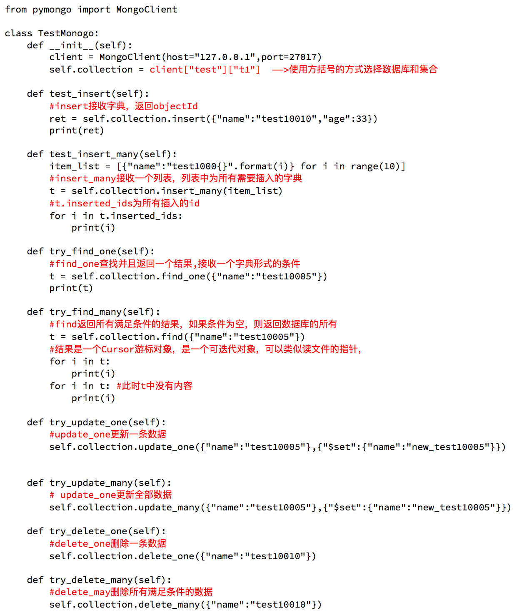
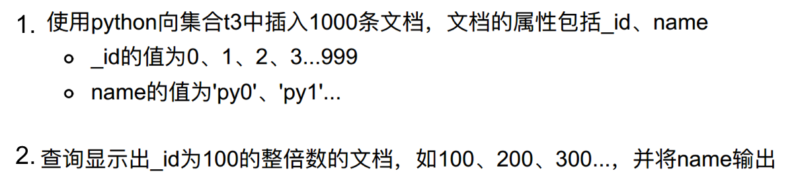

## mongodb和python交互

##### 学习目标
掌握 mongdb和python交互的增删改查的方法

-----

### 1 mongdb和python交互的模块
`pymongo` 提供了mongdb和python交互的所有方法
安装方式: `pip install pymongo`

### 2 使用pymongo

#### 2.1 导入pymongo并选择要操作的集合
数据库和集合会自动创建

```
from pymongo import MongoClient
client = MongoClient(host,port)
collection = client[db名][集合名]
```

#### 2.2 添加数据

insert可以批量的插入数据列表，也可以插入一条数据
```
collection.insert([{"name":"test10010","age":33},{"name":"test10011","age":34}]/{"name":"test10010","age":33})
```

#### 2.3 添加一条数据

```
ret = collection.insert_one({"name":"test10010","age":33})
print(ret)
```

#### 2.4 添加多条数据

```
item_list = [{"name":"test1000{}".format(i)} for i in range(10)]
#insert_many接收一个列表，列表中为所有需要插入的字典
t = collection.insert_many(item_list)
```

#### 2.5 查找一条数据

```
#find_one查找并且返回一个结果,接收一个字典形式的条件
t = collection.find_one({"name":"test10005"})
print(t)
```

#### 2.6 查找全部数据

结果是一个Cursor游标对象，是一个可迭代对象，可以类似读文件的指针，但是只能够进行一次读取

```
#find返回所有满足条件的结果，如果条件为空，则返回数据库的所有
t = collection.find({"name":"test10005"})
#结果是一个Cursor游标对象，是一个可迭代对象，可以类似读文件的指针，
for i in t:
    print(i)
for i in t: #此时t中没有内容
    print(i)
```

#### 2.7 更新一条数据(全文档覆盖更新一条或多条)

```
#update_one更新一条数据
collection.update({"name":"test10005"},{"name":"new_test10005"},multi=True/False)
```

#### 2.8 更新一条数据(指定键值更新一条或多条)
注意使用`$set`命令

```
#update_one更新一条数据
collection.update({"name":"test10005"},{"$set":{"name":"new_test10005"}},multi=True/False)
```

#### 2.9 更新一条数据
注意使用`$set`命令

```
#update_one更新一条数据
collection.update_one({"name":"test10005"},{"$set":{"name":"new_test10005"}})
```

#### 2.10 更行全部数据

```
# update_one更新全部数据
collection.update_many({"name":"test10005"},{"$set":{"name":"new_test10005"}})
```

#### 2.11 插入更新数据

```
#update_one更新一条数据
collection.update({"name":"test10005"},{"$set":{"name":"new_test10005"}},upsert=True)
```

先查询数据库中是否含有{"name":"test10005"}的数据，如果存在则{"name":"new_test10005"}进行修改，如果不存在则将{"name":"new_test10005"}插入到数据库

#### 2.12 删除一条数据

```
#delete_one删除一条数据
collection.delete_one({"name":"test10010"})
```

#### 2.13 删除全部数据

```
#delete_may删除所有满足条件的数据
collection.delete_many({"name":"test10010"})
```

pymongo模块使用截图（动手写一下！）



###  3 动手练习



##### 参考代码

```
from pymongo import MongoClient

client = MongoClient() # 本机，参数可以不用写
collection = client['test1000']['t3']

temp_list = [{'_id':i, 'name':'py{}'.format(i)} for i in range(1000)]
ret = collection.insert_many(temp_list)
print(ret)

ret_list = list(collection.find())
ret = [i['name'] for i in ret_list if i['_id']%100 == 0 and i['_id'] != 0]
print(ret)
```
-----

### 小结
掌握pymongo的增删改查的使用


