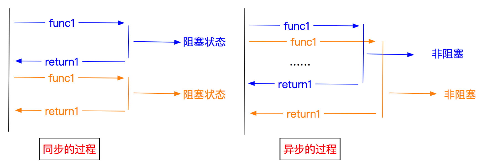
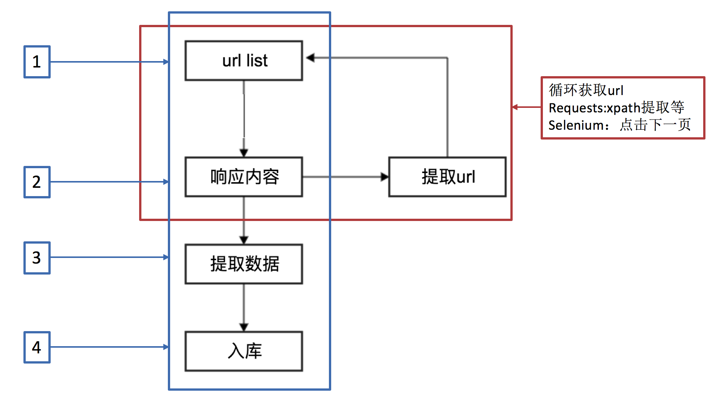

## scrapy的概念和流程 
##### 学习目标：
1. 了解 scrapy的概念
2. 掌握 scrapy框架的运行流程
3. 掌握 scrapy框架的作用

----

### 1 为什么学习scrapy？
1. scrapy不能解决剩下的10%的爬虫需求
2. 能够让开发过程方便、快速
3. scrapy框架能够让我们的爬虫效率更高

### 2 什么是scrapy？
文档地址：http://scrapy-chs.readthedocs.io/zh_CN/1.0/intro/overview.html

Scrapy 使用了Twisted['twɪstɪd]异步网络框架，可以加快我们的下载速度。

**Scrapy是一个为了爬取网站数据，提取结构性数据而编写的应用框架**，我们只需要实现少量的代码，就能够快速的抓取。

### 3 异步和非阻塞的区别
前面我们说Twisted是一个异步的网络框架，经常我们也听到一个词语叫做非阻塞，那么他们有什么区别呢？

 

**异步**：调用在发出之后，这个调用就直接返回，不管有无结果；异步是过程。
**非阻塞**：关注的是程序在等待调用结果（消息，返回值）时的状态，指在不能立刻得到结果之前，该调用不会阻塞当前线程。

### 4 scrapy的工作流程

##### 4.1 回顾之前的爬虫流程
 

##### 4.2 上面的流程可以改写为
 

##### 4.3 scrapy的流程
 

##### 其流程可以描述如下：

1. 调度器把requests-->引擎-->下载中间件--->下载器
2. 下载器发送请求，获取响应---->下载中间件---->引擎--->爬虫中间件--->爬虫
3. 爬虫提取url地址，组装成request对象---->爬虫中间件--->引擎--->调度器
4. 爬虫提取数据--->引擎--->管道
5. 管道进行数据的处理和保存

##### 注意：
- 图中绿色线条的表示数据的传递
- 注意图中中间件的位置，决定了其作用
- 注意其中引擎的位置，所有的模块之前相互独立，只和引擎进行交互

##### 4.4 scrapy中每个模块的具体作用
 

----

### 小结
1. scrapy的概念：Scrapy是一个为了爬取网站数据，提取结构性数据而编写的应用框架
2. scrapy框架的运行流程以及数据传递过程：
  1. 调度器把requests-->引擎-->下载中间件--->下载器
  2. 下载器发送请求，获取响应---->下载中间件---->引擎--->爬虫中间件--->爬虫
  3. 爬虫提取url地址，组装成request对象---->爬虫中间件--->引擎--->调度器
  4. 爬虫提取数据--->引擎--->管道
  5. 管道进行数据的处理和保存
3. scrapy框架的作用：通过少量代码实现快速抓取
4. 掌握scrapy中每个模块的作用：
	引擎(engine)：负责数据和信号在不腰痛模块间的传递
	调度器(scheduler)：实现一个队列，存放引擎发过来的request请求对象
	下载器(downloader)：发送引擎发过来的request请求，获取响应，并将响应交给引擎
	爬虫(spider)：处理引擎发过来的response，提取数据，提取url，并交给引擎
	管道(pipeline)：处理引擎传递过来的数据，比如存储
	下载中间件(downloader middleware)：可以自定义的下载扩展，比如设置代理ip
	爬虫中间件(spider middleware)：可以自定义request请求和进行response过滤
5. 理解异步和非阻塞的区别：异步是过程，非阻塞是状态

