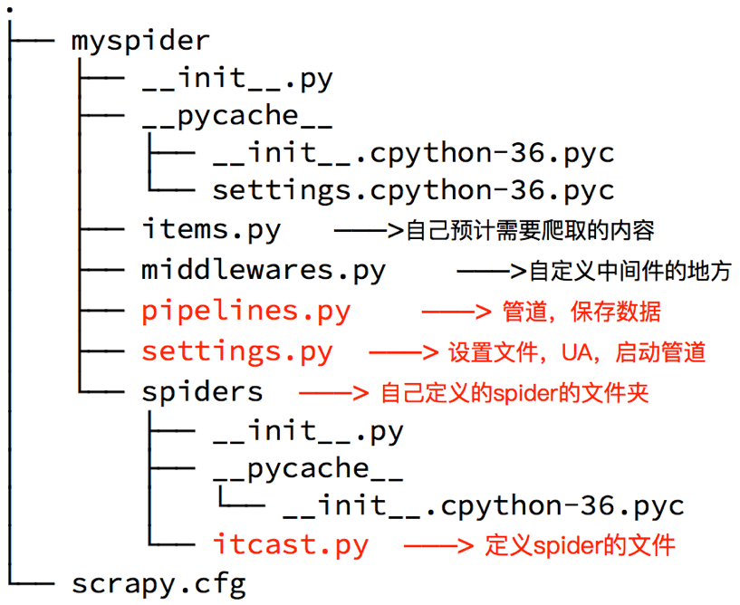

## scrapy的入门使用
##### 学习目标：
1. 掌握 scrapy的安装
2. 应用 创建scrapy的项目
3. 应用 创建scrapy爬虫
4. 应用 运行scrapy爬虫
5. 应用 解析并获取scrapy爬虫中的数据
6. 应用 scrapy管道的基本使用

-----

### 1 scrapy项目实现流程
1. 创建一个scrapy项目:scrapy startproject mySpider
2. 生成一个爬虫:scrapy genspider itcast "itcast.cn
3. 提取数据:完善spider，使用xpath等方法
4. 保存数据:pipeline中保存数据

### 2 创建scrapy项目
> 下面以抓取传智师资库来学习scrapy的入门使用：http://www.itcast.cn/channel/teacher.shtml

安装scrapy命令：sudo apt-get install scrapy
或者：pip install scrapy

创建scrapy项目的命令：scrapy startproject +<项目名字>

示例：scrapy startproject myspider

生成的目录和文件结果如下：

 

### 3 创建爬虫

命令：**在项目路径下执行**:scrapy genspider +<爬虫名字> + <允许爬取的域名>

示例：
```
cd myspider
scrapy genspider itcast itcast.cn
```

生成的目录和文件结果如下：



### 4 完善spider
完善spider即通过方法进行数据的提取等操作

在/myspider/myspider/spiders/itcast.py中修改内容如下:

```python
import scrapy

# 自定义spider类，继承scrapy.spider
class ItcastSpider(scrapy.Spider):  
	# 爬虫名字 
    name = 'itcast' 
    # 允许爬取的范围，防止爬虫爬到别的网站
    allowed_domains = ['itcast.cn'] 
    # 开始爬取的url地址
    start_urls = ['http://www.itcast.cn/channel/teacher.shtml']
    
    # 数据提取的方法，接受下载中间件传过来的response
    def parse(self, response): 
    	# scrapy的response对象可以直接进行xpath
    	names = response.xpath('//div[@class="tea_con"]//li/div/h3/text()') 
    	print(names)

    	# 获取具体数据文本的方式如下
        # 分组
    	li_list = response.xpath('//div[@class="tea_con"]//li') 
        for li in li_list:
        	# 创建一个数据字典
            item = {}
            # 利用scrapy封装好的xpath选择器定位元素，并通过extract()或extract_first()来获取结果
            item['name'] = li.xpath('.//h3/text()').extract_first() # 老师的名字
            item['level'] = li.xpath('.//h4/text()').extract_first() # 老师的级别
            item['text'] = li.xpath('.//p/text()').extract_first() # 老师的介绍
            print(item)
```

##### 注意：

1. response.xpath方法的返回结果是一个类似list的类型，其中包含的是selector对象，操作和列表一样，但是有一些额外的方法
2. extract() 返回一个包含有字符串的列表
3. extract_first() 返回列表中的第一个字符串，列表为空没有返回None
4. spider中的parse方法必须有
5. 需要抓取的url地址必须属于allowed_domains,但是start_urls中的url地址没有这个限制
6. 启动爬虫的时候注意启动的位置，是在项目路径下启动


### 5 利用管道pipeline来处理(保存)数据

##### 5.1 对itcast爬虫进行修改完善

在爬虫文件itcast.py中parse()函数中最后添加

```
yield item
```

##### 思考：为什么要使用yield？

1. 让整个函数变成一个生成器，有什么好处呢？
2. 遍历这个函数的返回值的时候，挨个把数据读到内存，不会造成内存的瞬间占用过高
3. python3中的range和python2中的xrange同理

**注意：yield能够传递的对象只能是：BaseItem,Request,dict,None**

##### 5.2 修改pipelines.py文件

```python
import json

class ItcastPipeline(object):
    # 爬虫文件中提取数据的方法每yield一次item，就会运行一次
    # 该方法为固定名称函数
    def process_item(self, item, spider):
        print(item) 
```

##### 5.3 在settings.py设置开启pipeline

```python
ITEM_PIPELINES = {
    'myspider.pipelines.ItcastPipeline': 400
}
```

### 6 运行scrapy
命令：在项目目录下执行scrapy crawl +<爬虫名字>

示例：scrapy crawl itcast

----

### 总结
1. rapy的安装：pip install scrapy
2. 创建scrapy的项目: scrapy startproject myspider
3. 创建scrapy爬虫：在项目目录下执行 scrapy genspider itcast itcast.cn
4. 运行scrapy爬虫：在项目目录下执行 scrapy crawl itcast
5. 解析并获取scrapy爬虫中的数据：
  1. response.xpath方法的返回结果是一个类似list的类型，其中包含的是selector对象，操作和列表一样，但是有一些额外的方法
  2. extract() 返回一个包含有字符串的列表
  3. extract_first() 返回列表中的第一个字符串，列表为空没有返回None
6. scrapy管道的基本使用:
  1. 完善pipelines.py中的process_item函数
  2. 在settings.py中设置开启pipeline

