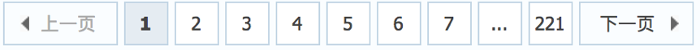

## scrapy发送翻页请求
##### 学习目标：
1. 应用 完善并使用Item数据类
2. 应用 构造Request对象，并发送请求
3. 应用 利用meta参数在不同的解析函数中传递数据

-----

### 1. 翻页请求的思路
对于要提取如下图中所有页面上的数据该怎么办？

 

回顾requests模块是如何实现翻页请求的：

1. 找到下一页的URL地址
2. 调用requests.get(url)


scrapy实现翻页的思路：

1. 找到下一页的url地址
2. 构造url地址的请求，传递给引擎

### 2 scrapy实现翻页请求

#### 2.1 实现方法
1. 确定url地址
2. 构造请求，scrapy.Request(url,callback)
    - callback：指定解析函数名称，表示该请求返回的响应使用哪一个函数进行解析
3. 把请求交给引擎：yield scrapy.Request(url,callback)


#### 2.2 腾讯招聘爬虫
> 通过爬取腾讯招聘的页面的招聘信息,学习如何实现翻页请求

> 地址：http://hr.tencent.com/position.php

##### 思路分析：

1. 获取首页的数据
2. 寻找下一页的地址，进行翻页，获取数据

##### 注意：
1. 可以在settings中设置ROBOTS协议
```
# False表示忽略网站的robots.txt协议，默认为True
ROBOTSTXT_OBEY = False
```
2. 可以在settings中设置User-Agent：
```
# scrapy发送的每一个请求的默认UA都是设置的这个User-Agent
USER_AGENT = 'Mozilla/5.0 (Macintosh; Intel Mac OS X 10_12_5) AppleWebKit/537.36 (KHTML, like Gecko) Chrome/59.0.3071.115 Safari/537.36'
```

#### 2.3 代码实现
在爬虫文件的parse方法中：

```python
......
	# 提取下一页的href并拼接url
	next_url = 'https://hr.tencent.com/' + response.xpath('//a[text()="下一页"]/@href').extract_first()
	# 判断是否是最后一页
	if response.xpath('//a[text()="下一页"]/@href').extract_first() != 'javascript:;':
		# 构造scrapy.Request对象，并yield给引擎
		# 利用callback参数指定该Request对象之后获取的响应用哪个函数进行解析
		# 利用meta参数将本函数中提取的数据传递给callback指定的函数
		# 注意这里是yield
    	yield scrapy.Request(next_url, callback=self.parse)
......
```
    

#### 2.4 scrapy.Request的更多参数

```python
scrapy.Request(url[,callback,method="GET",headers,body,cookies,\
meta,dont_filter=False])
```

##### 参数解释
1. 中括号中的参数为可选参数
2. callback：表示当前的url的响应交给哪个函数去处理
3. meta：实现数据在不同的解析函数中传递，meta默认带有部分数据，比如下载延迟，请求深度等
4. dont_filter:默认为False，会过滤请求的url地址，即请求过的url地址不会继续被请求，对需要重复请求的url地址可以把它设置为Ture，比如贴吧的翻页请求，页面的数据总是在变化;start_urls中的地址会被反复请求，否则程序不会启动
5. method：指定POST或GET请求
6. headers：接收一个字典，其中不包括cookies
7. cookies：接收一个字典，专门放置cookies
8. body：接收一个字典，为POST的数据

### 3 meta参数的使用
##### meta的形式:字典
##### meta的作用：meta可以实现数据在不同的解析函数中的传递

在爬虫文件的parse方法中，提取详情页增加之前callback指定的parse_detail函数：

```python
def parse(self,response):
    ...
    yield scrapy.Request(detail_url, callback=self.parse_detail,meta={"item":item})
...

def parse_detail(self,response):
    #获取之前传入的item
    item = resposne.meta["item"]
```
##### 特别注意
1. meta参数是一个字典
2. meta字典中有一个固定的键`proxy`，表示代理ip，关于代理ip的使用我们将在scrapy的下载中间件的学习中进行介绍


### 4. item的使用

#### 4.1 Item能够做什么

1. 定义item即提前规划好哪些字段需要抓取，scrapy.Field()仅仅是提前占坑，通过item.py能够让别人清楚自己的爬虫是在抓取什么，同时定义好哪些字段是需要抓取的，没有定义的字段不能使用，防止手误

2. 在python大多数框架中，大多数框架都会自定义自己的数据类型(在python自带的数据结构基础上进行封装)，目的是增加功能，增加自定义异常

#### 4.2 定义Item
在items.py文件中定义要提取的字段：

```python
class TencentItem(scrapy.Item): 
    name = scrapy.Field() # 招聘标题
    address = scrapy.Field() # 工作地址
    time = scrapy.Field() # 发布时间
    job_content = scrapy.Field() # 工作职责
```

#### 4.3 使用Item

Item使用之前需要先导入并且实例化，之后的使用方法和使用字典相同

修改爬虫文件itcast.py：

```python
from Tencent.items import TencentItem # 导入Item，注意路径
...
    def parse_detail(self, response):
        meta_dict = response.meta # 获取传入的meta

        item = ItcastItem() # 实例化后可直接使用
        item['name'] = meta_dict['name']
        item['address'] = meta_dict['address]
        item['time'] = meta_dict['time']

        # 加入岗位职责数据
        item['job_content'] = response.xpath('//ul[@class="squareli"]/li/text()').extract() 
        
        print(item)
```

##### 注意：
1. from myspider.items import ItcastItem这一行代码中 注意item的正确导入路径，忽略pycharm标记的错误
2. python中的导入路径要诀：从哪里开始运行，就从哪里开始导入

----

### 总结
1. 完善并使用Item数据类：
  1. 在items.py中完善要爬取的字段
  2. 在爬虫文件中先导入Item
  3. 实力化Item对象后，像字典一样直接使用
2. 构造Request对象，并发送请求：
  1. 导入scrapy.Request类
  2. 在解析函数中提取url
  3. yield scrapy.Request(url, callback=self.parse_detail, meta={})
3. 利用meta参数在不同的解析函数中传递数据:
  1. 通过前一个解析函数 yield scrapy.Request(url, callback=self.xxx, meta={}) 来传递meta
  2. 在self.xxx函数中 response.meta.get('key', '') 或 response.meta['key'] 的方式取出传递的数据

