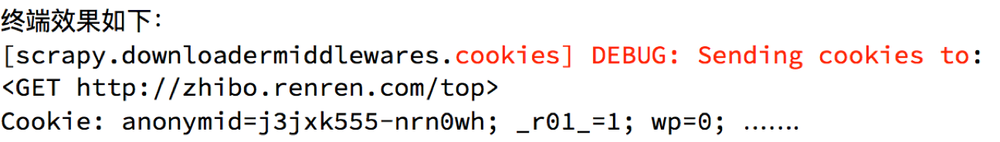

## scrapy模拟登陆
##### 学习目标：
1. 应用 scrapy直接携带cookie模拟登陆的方法
2. 应用 scrapy.FormRequest()发送post请求进行登陆
3. 应用 scrapy.FormRequest.from_response()发送表单请求

----

### 1  回顾之前的模拟登陆的方法

##### 1.1 requests模块是如何实现模拟登陆的？
1. 直接携带cookies请求页面
2. 找url地址，发送post请求存储cookie

##### 1.2 selenium是如何模拟登陆的？
1. 找到对应的input标签，输入文本点击登陆

##### 1.3 scrapy有三种方法模拟登陆
1. 直接携带cookies
2. 找url地址，发送post请求存储cookie
3. 找到对应的form表单，自动解析input标签，自动解析post请求的url地址，自动带上数据，自动发送请求

### 2 scrapy携带cookies直接获取需要登陆后的页面

##### 2.1 应用场景
1. cookie过期时间很长，常见于一些不规范的网站
2. 能在cookie过期之前把搜有的数据拿到
3. 配合其他程序使用，比如其使用selenium把登陆之后的cookie获取到保存到本地，scrapy发送请求之前先读取本地cookie
 
##### 2.2 实现：重构scrapy的starte_rquests方法
scrapy中start_url是通过start_requests来进行处理的，其实现代码如下

```python
def start_requests(self):
    cls = self.__class__
    if method_is_overridden(cls, Spider, 'make_requests_from_url'):
        warnings.warn(
            "Spider.make_requests_from_url method is deprecated; it "
            "won't be called in future Scrapy releases. Please "
            "override Spider.start_requests method instead (see %s.%s)." % (
                cls.__module__, cls.__name__
            ),
        )
        for url in self.start_urls:
            yield self.make_requests_from_url(url)
    else:
        for url in self.start_urls:
            yield Request(url, dont_filter=True)
```

**所以对应的，如果start_url地址中的url是需要登录后才能访问的url地址，则需要重写start_request方法并在其中手动添加上cookie**
 
##### 2.3 携带cookies登陆github

```python
import scrapy
import re

class Login1Spider(scrapy.Spider):
    name = 'login1'
    allowed_domains = ['github.com']
    start_urls = ['https://github.com/NoobPythoner'] # 这是一个需要登陆以后才能访问的页面

    def start_requests(self): # 重构start_requests方法
        # 这个cookies_str是抓包获取的
        cookies_str = '...' # 抓包获取
        # 将cookies_str转换为cookies_dict
        cookies_dict = {i.split('=')[0]:i.split('=')[1] for i in cookies_str.split('; ')}
        yield scrapy.Request(
            self.start_urls[0],
            callback=self.parse,
            cookies=cookies_dict
        )

    def parse(self, response): # 通过正则表达式匹配用户名来验证是否登陆成功
        result_list = re.findall(r'noobpythoner|NoobPythoner', response.body.decode())
        print(result_list)
        pass
```

##### 注意：
1. scrapy中cookie不能够放在headers中，在构造请求的时候有专门的cookies参数，能够接受字典形式的coookie
2. 在setting中设置ROBOTS协议、USER_AGENT

### 3. scrapy.FormRequest发送post请求

>我们知道可以通过scrapy.Request()指定method、body参数来发送post请求；那么也可以使用scrapy.FormRequest()来发送post请求
 
##### 3.1 scrapy.FormRequest()的使用
通过scrapy.FormRequest能够发送post请求，同时需要添加fromdata参数作为请求体，以及callback

```python
yield scrapy.FormRequest(
    "https://github.com/session",
    formdata={
        "authenticity_token":authenticity_token,
        "utf8":utf8,
        "commit":commit,
        "login":"noobpythoner",
        "password":"zhoudawei123"
    },
    callback=self.parse_login
)
```
 
#### 3.2 使用scrapy.FormRequest()登陆github
 
##### 3.2.1 思路分析
1. 找到post的url地址：点击登录按钮进行抓包，然后定位url地址为https://github.com/session

2. 找到请求体的规律：分析post请求的请求体，其中包含的参数均在前一次的响应中

3. 否登录成功：通过请求个人主页，观察是否包含用户名

##### 3.2.2 代码实现如下：

```python
import scrapy
import re

class Login2Spider(scrapy.Spider):
   name = 'login2'
   allowed_domains = ['github.com']
   start_urls = ['https://github.com/login']

   def parse(self, response):
       authenticity_token = response.xpath("//input[@name='authenticity_token']/@value").extract_first()
       utf8 = response.xpath("//input[@name='utf8']/@value").extract_first()
       commit = response.xpath("//input[@name='commit']/@value").extract_first()
        
        #构造POST请求，传递给引擎
       yield scrapy.FormRequest(
           "https://github.com/session",
           formdata={
               "authenticity_token":authenticity_token,
               "utf8":utf8,
               "commit":commit,
               "login":"noobpythoner",
               "password":"***"
           },
           callback=self.parse_login
       )

   def parse_login(self,response):
       ret = re.findall(r"noobpythoner|NoobPythoner",response.text)
       print(ret)
```

### 4. scrapy自动提交表单
##### 4.1 scrapy.Formrequest.from_response
它能够自动的从响应中寻找form表单，然后把formdata中的数据提交到action对应的url地址中

```python
yield scrapy.FormRequest.from_response(
    response, # 传入response对象,自动解析
    # 可以通过xpath来定位form表单,当前页只有一个form表单时,将会自动定位
    formxpath='//*[@id="login"]/form',  # 可以不写
    formdata={'login': 'noobpythoner', 'password': '***'},
    callback=self.parse_login
)
```
 
##### 4.2 使用scrapy.Formrequest.from_response登陆github

```python
import scrapy
import re

class Login3Spider(scrapy.Spider):
    name = 'login3'
    allowed_domains = ['github.com']
    start_urls = ['https://github.com/login']

    def parse(self, response):
        yield scrapy.FormRequest.from_response(
            response, # 传入response对象,自动解析
            # 可以通过xpath来定位form表单,当前页只有一个form表单时,将会自动定位
            formxpath='//*[@id="login"]/form', 
            formdata={'login': 'noobpythoner', 'password': 'zhoudawei123'},
            callback=self.parse_login
        )
        
    def parse_login(self,response):
        ret = re.findall(r"noobpythoner|NoobPythoner", response.text)
        print(ret)
```

### 5. 小技巧
在settings.py中通过设置COOKIES_DEBUG=TRUE 能够在终端看到cookie的传递传递过程
 

----

### 总结
1. start_urls中的url地址是交给start_request处理的，如有必要，可以重写start_request函数
1. 直接携带cookie登陆：cookie只能传递给cookies参数接收
2. scrapy.FormRequest()发送post请求
3. scrapy.FormRequest.from_response()发送表单请求，接收的是response

