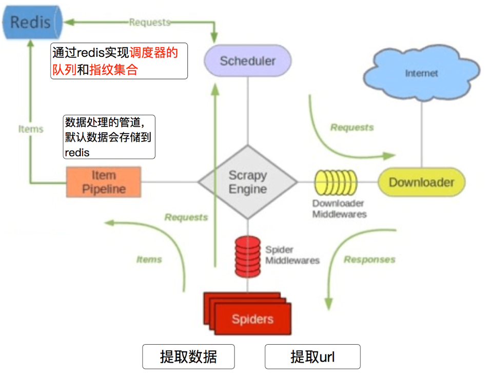
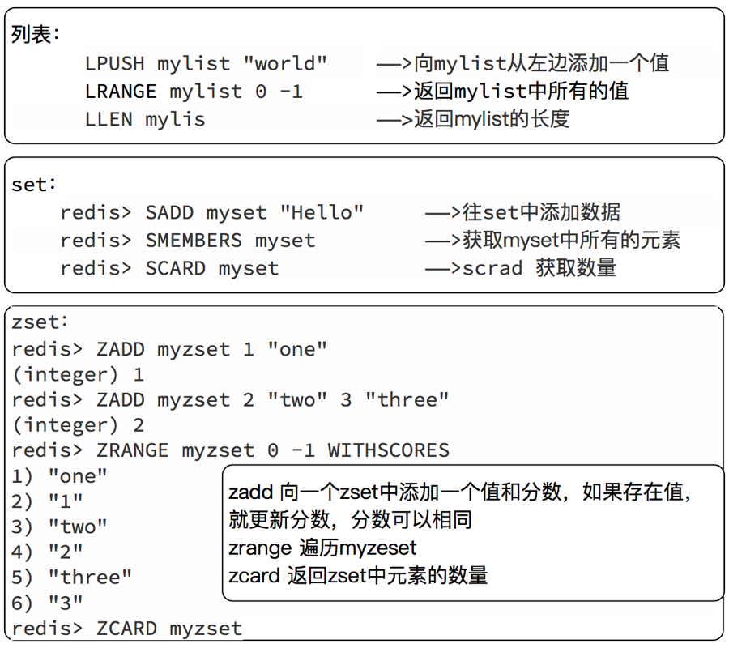

## scrapy_redis分布式原理

##### 学习目标
1. 了解 scarpy_redis的概念和功能
2. 了解 scrapy_redis的原理
3. 了解 redis数据库操作命令

--------------------

> 在前面scrapy框架中我们已经能够使用框架实现爬虫爬取网站数据,如果当前网站的数据比较庞大, 我们就需要使用分布式来更快的爬取数据

### 1 scrapy_redis是什么

  Scrapy_redis ： Redis-based components for Scrapy.

  Github地址：https://github.com/rmax/scrapy-redis

  在这个地址中存在三个demo，后续我们对scrapy_redis的学习会通过这三个demo展开

### 2 为什么要学习scrapy_redis
  Scrapy_redis在scrapy的基础上实现了更多，更强大的功能，具体体现在：
  - 请求对象的持久化
  - 去重的持久化
  - 和实现分布式

### 3 scrapy_redis的原理分析
##### 3.1 回顾scrapy的流程
 

那么，在这个基础上，如果需要实现分布式，即多台服务器同时完成一个爬虫，需要怎么做呢？

##### 3.2 scrapy_redis的流程
- 在scrapy_redis中，所有的带抓取的对象和去重的指纹都存在所有的服务器公用的redis中

- 所有的服务器公用一个redis中的request对象

- 所有的request对象存入redis前，都会在同一个redis中进行判断，之前是否已经存入过

- 在默认情况下所有的数据会保存在redis中

具体流程如下：

 

### 4 对于redis的复习
> 由于时间关系,大家对redis的命令遗忘的差不多了, 但是在scrapy_redis中需要使用redis的操作命令,所有需要回顾下redis的命令操作

##### 4.1 redis是什么
redis是一个开源的内存型数据库，支持多种数据类型和结构，比如列表、集合、有序集合等,同时可以使用redis-manger-desktop等客户端软件查看redis中的数据，关于redis-manger-desktop的使用可以参考扩展阅读

##### 4.2 redis服务端和客户端的启动
- `/etc/init.d/redis-server start` 启动服务端
- `redis-cli -h <hostname> -p <端口号>` 客户端启动

##### 4.3 redis中的常见命令
1. `select 1` 切换db
2. `keys *` 查看所有的键
3. `tyep 键` 查看键的类型
4. `flushdb` 清空db
5. `flushall` 清空数据库

##### 4.4 redis命令的复习
redis的命令很多，这里我们简单复习后续会使用的命令

 

--------------------

### 小结
1. scarpy_redis的分布式工作原理
    - 在scrapy_redis中，所有的带抓取的对象和去重的指纹都存在所有的服务器公用的redis中
    - 所有的服务器公用一个redis中的request对象
    - 所有的request对象存入redis前，都会在同一个redis中进行判断，之前是否已经存入过

