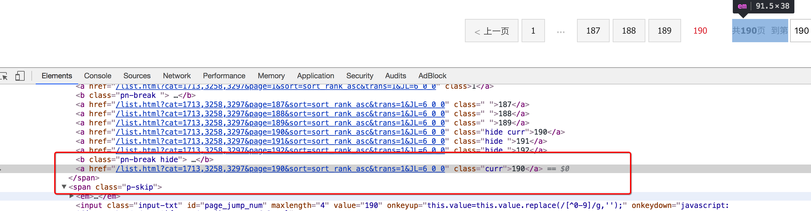
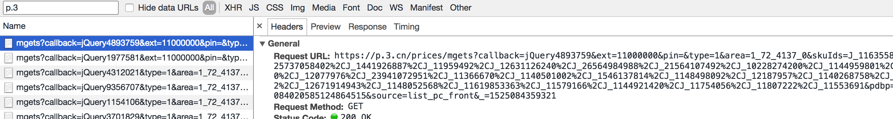

##  scrapy_redis domz爬虫 分析

##### 学习目标
1. 了解 scrapy_redis实现去重的原理
2. 了解 scrapy中请求入队的条件
2. 能够应用 scrapy_redis完成基于url地址的增量式爬虫

---------------

### 1 拷贝源码中的demo文件

  1、clone github scrapy-redis源码文件 
  	`git clone https://github.com/rolando/scrapy-redis.git `
  2、研究项目自带的三个demo
  	`mv scrapy-redis/example-project ~/scrapyredis-project`
  	
  	
### 2 观察dmoz文件
在domz爬虫文件中，实现方式就是之前的`crawlspider`类型的爬虫

```python
from scrapy.linkextractors import LinkExtractor
from scrapy.spiders import CrawlSpider, Rule


class DmozSpider(CrawlSpider):
    """Follow categories and extract links."""
    name = 'dmoz'
    allowed_domains = ['dmoztools.net']
    start_urls = ['http://dmoztools.net/']
    
    # 定义数据提取规则，使用了css选择器
    rules = [
        Rule(LinkExtractor(
            restrict_css=('.top-cat', '.sub-cat', '.cat-item')
        ), callback='parse_directory', follow=True),
    ]

    def parse_directory(self, response):
        for div in response.css('.title-and-desc'):
            yield {
                'name': div.css('.site-title::text').extract_first(),
                'description': div.css('.site-descr::text').extract_first().strip(),
                'link': div.css('a::attr(href)').extract_first(),
            }

```

但是在settings.py中多了一下几行,这几行表示`scrapy_redis`中重新实现的了去重的类，以及调度器，并且使用的`RedisPipeline`

```python
DUPEFILTER_CLASS = "scrapy_redis.dupefilter.RFPDupeFilter"
SCHEDULER = "scrapy_redis.scheduler.Scheduler"
SCHEDULER_PERSIST = True

ITEM_PIPELINES = {
    'example.pipelines.ExamplePipeline': 300,
    'scrapy_redis.pipelines.RedisPipeline': 400,
}
```

### 3 运行dmoz爬虫，观察现象

1. 首先我们需要添加redis的地址，程序才能够使用redis

    ```
    REDIS_URL = "redis://127.0.0.1:6379"
    #或者使用下面的方式
    # REDIS_HOST = "127.0.0.1"
    # REDIS_PORT = 6379
    ```
    
2. 我们执行domz的爬虫，会发现redis中多了一下三个键：
  
     
    
3. 继续执行程序

    继续执行程序，会发现程序在前一次的基础之上继续往后执行，**所以domz爬虫是一个基于url地址的增量式的爬虫**
    
### 4. scrapy_redis的原理分析
我们从settings.py中的三个配置来进行分析
分别是：
- RedisPipeline
- RFPDupeFilter
- Scheduler

##### 4.1 Scrapy_redis之RedisPipeline
RedisPipeline中观察process_item，进行数据的保存，存入了redis中

  

##### 4.2 Scrapy_redis之RFPDupeFilter

RFPDupeFilter 实现了对request对象的加密

  

##### 4.3  Scrapy_redis之Scheduler
scrapy_redis调度器的实现了决定什么时候把request对象加入带抓取的队列，同时把请求过的request对象过滤掉

 

由此可以总结出request对象入队的条件
- request之前没有见过
- request的dont_filter为True，即不过滤
-  start_urls中的url地址会入队，因为他们默认是不过滤


### 7. 动手
需求：抓取京东图书的信息

目标：抓取京东图书包含图书的名字、封面图片地址、图书url地址、作者、出版社、出版时间、价格、图书所属大分类、图书所属小的分类、分类的url地址

url：https://book.jd.com/booksort.html

##### 思路分析：

1. 确定数据抓取的入口

    数据都在dl下的dt和dd中，其中dt是大分类的标签，dd是小分类的标签
    
    对应的思路可以使选择所有的大分类后，选择他下一个兄弟节点即可
    
    xpath中下一个兄弟节点的语法是`following-sibling::*[1]`
    
     
    
2. 确定列表页的url地址和程序终止的条件
  
    有下一页
    
     
    
    没有下一页
    
     
    
3. 确定数据的位置
  
    数据大部分都在url地址的响应中，但是价格不在

     

    通过`search all file`的方法，找到价格的地址，
    
     
    
    对url地址进行删除无用的参数和url解码之后，获取到价格的url为
    
    `https://p.3.cn/prices/mgets?skuIds=J_11635586613`
    
    其中skuId为商品的id，能够在网页中获取

4. 使用scrapy的思路完成爬虫，在settings中添加上scrapy_redis的配置

--------------------

### 小结

1. 知道什么是scrapy_redis
2. 掌握scarpy_redis实现分布式的原理
3. 掌握scrapy_进行url地址加密的方法
4. 掌握request对象入队的条件
5. 能够通过scrapy_redis完成基于url地址的增量式爬虫
    


