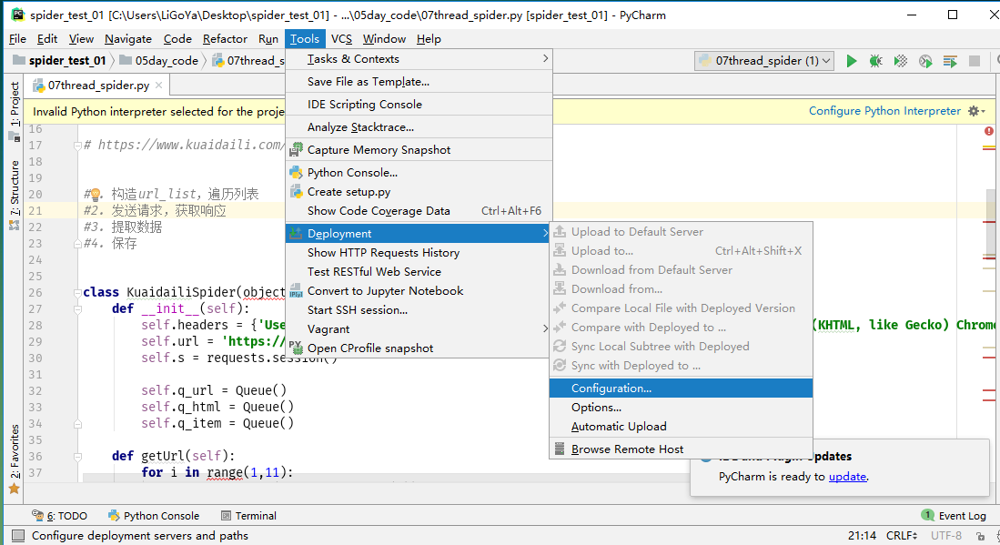
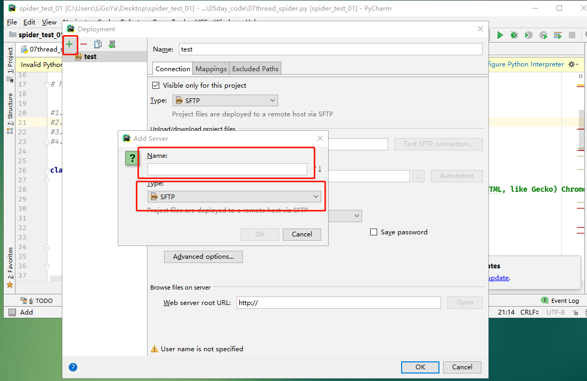
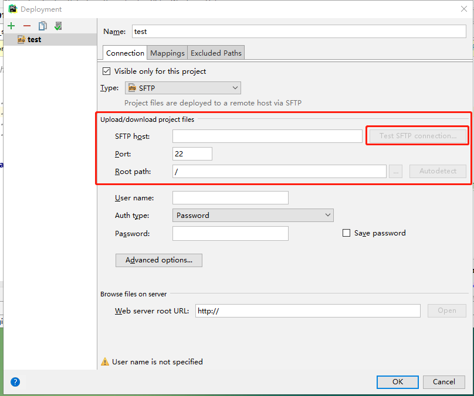
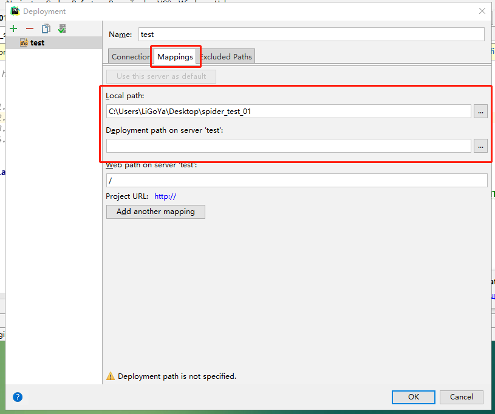
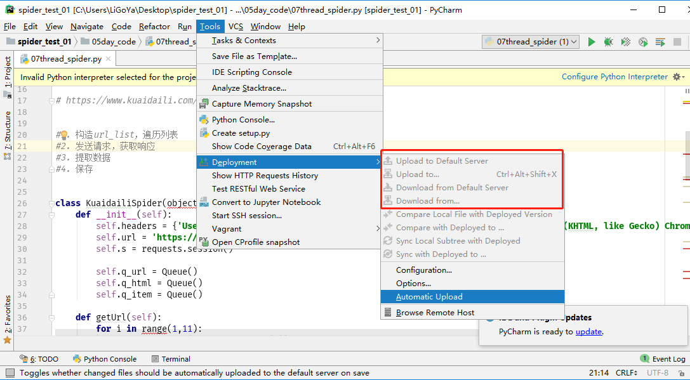

## pycharm通过sftp发布代码
##### 学习目标：
了解 pycharm通过sftp发布代码的方法
_________________

> 我们可以通过pycharm自带的功能向目标服务器上传代码和下载代码

### 1. 点击Tools/Deployment/Configuration
 

### 2. 点击+号起个名字，并选择SFTP
 

### 3. 在SFTP host中写入服务器的ip，并点击Test SFTP connection 进行测试连接；再在Root path中选择服务器中代码部署的路径
**注意**：
* 该服务器必须开启ssh服务
* 在红框下边可以输出ssh的账号密码
 

### 4. 点击Mappings选项，分别选择本地项目代码的路径和目标服务器代码的具体路径后点击OK
 

### 5. 最后红框部分的按钮就可以使用了，功能分别为上传和下载 
 

_________________

### 小结
了解pycharm通过sftp发布代码

