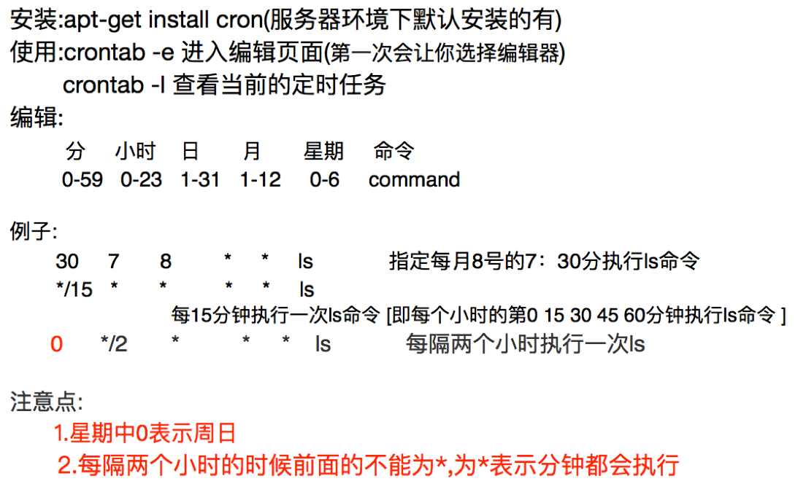

## crontab定时任务
##### 学习目标：
了解 crontab定时任务 
_________________

### 1. crontab的安装和介绍

 

### 2. crontab在爬虫中的使用

#### 2.1 使用流程
1. 把爬虫启动命令写入sh文件
2. 给sh脚本添加可执行权限
3. 编辑crontab的配置文件

#### 2.2 myspier.sh例子
**先把要执行的命令写入脚本**

```sh
cd `dirname $0` || exit 1
python ./main.py >> run.log 2>&1
```

其中>>表示重定向，把print等信息导入log中

```
cd `dirname $0` || exit 1
```
固定写法，表示先进入当前目录，如果失败则退出该sh脚本
`2>&1`表示把标准错误作为标准输出，输入用0表示，标准输出用1表示，标准错误用2标识，通过该命令能够把错误一起输出到log中

**添加可执行权限**

```
sudo chmod +x myspder.sh
```

**写入crontab中**

```
crontab -e
```

**进入编辑页面并添加:**

```
 0 6 * * * /home/ubuntu/..../myspider.sh >> /home/ubuntu/.../run2.log 2>&1
```
sh脚本文件也可能会报错，对应的可以把其输出和错误重定向到run2.log中

_________________

### 小结
了解crontab的使用

