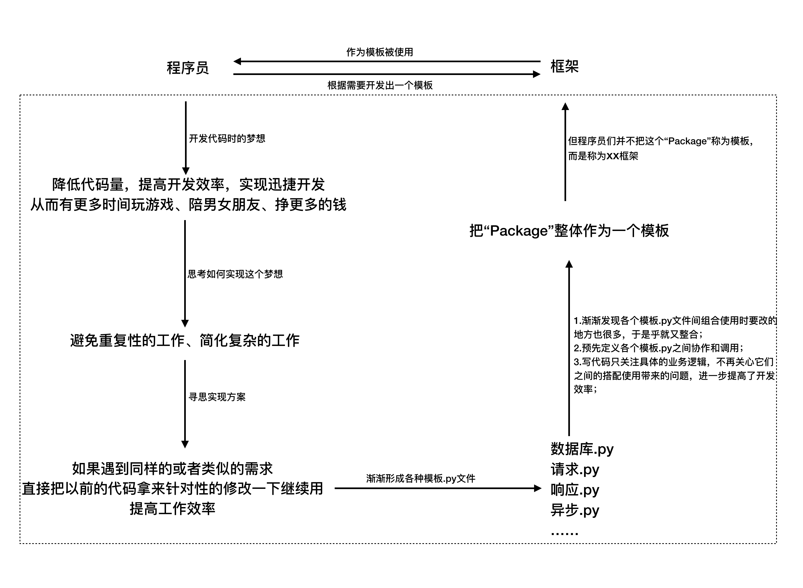

## 了解框架
##### 学习目标：
1. 明确什么是框架
2. 了解实现框架的好处
3. 了解框架思路的来源

----

### 1 什么是框架

框架是为了为解决一类问题而开发的程序，框架两个字可以分开理解，框：表示指定解决问题的边界，明确要解决的问题；架：表达的是能够提供一定的支撑性和可扩展性；从而实现解决这类问题达到快速开发的目的。

程序员从零开发框架的心路历程

### 2 为什么要实现一个框架
现在网络上现成的开源第三方框架非常多，为什么还需要自己实现一个框架？

1. 现成开源第三方框架的局限性：

    现成开源第三方框架是为了尽可能满足大部分的需求，不可能做到面面俱到，以及第三方框架的调试相对复杂
2. 解决特定的工作需求：

    工作中会有很多特殊的需求，会经常使用某种套路去实现这些需求，那么为了提高效率可以专门把这种套路封装成一个框架

    比如专门针对电商网站、新闻资讯写一个爬虫框架；再比如针对断点续爬、增量抓取等需求写一个框架
3. 提高自己的技术能力：

    不一定需要亲自造轮子，但是应该知道如何造轮子

### 3 如何完成一个框架
现在我们明确了框架是什么以及为什么要实现一个框架，那么到底应该如何实现一个框架呢，我们的idea从哪里来呢？

1. 经验丰富的程序员：

    直接根据以往经验和业务的需求进行框架原型设计，并用语言去实现
2. 经验一般的程序员：

    通常应该是先学习别人的框架如何实现的，先学习别人优秀的比较好的实现思路和方案

那么同样的，对于我们：  
我们可以结合目前学习过的爬虫知识和爬虫框架，了解他们的设计思路，在这个基础上进行模仿和改进，从而实现一个框架

----

### 小结
1. 理解框架是什么，能够解决什么问题
2. 理解为什么要实现一个框架

