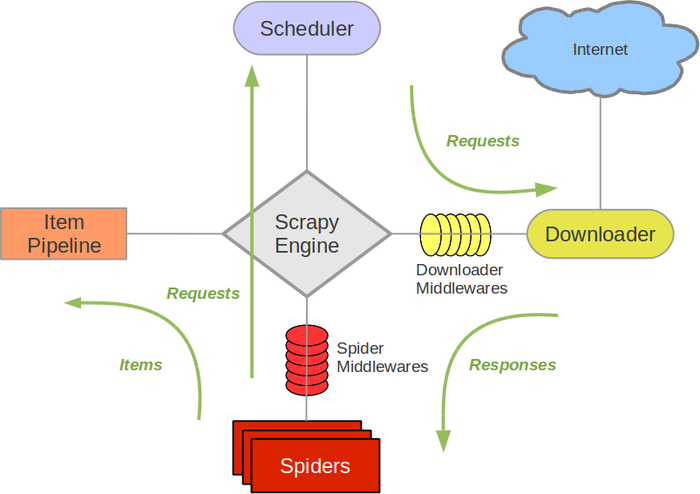
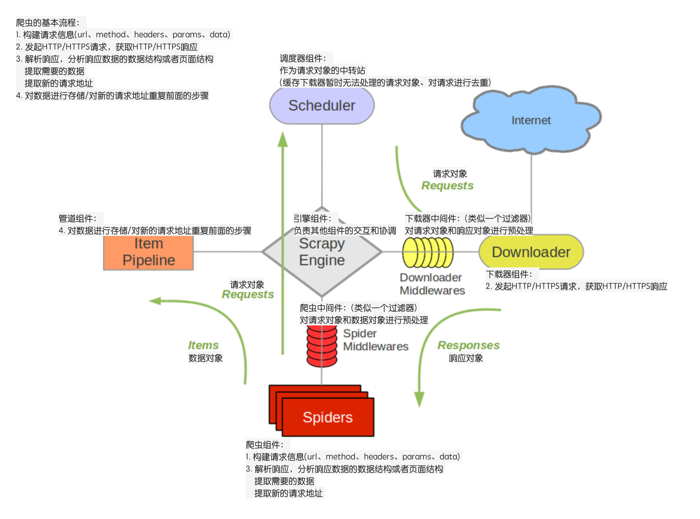

## 框架设计思路分析

##### 目标
1. 回顾并掌握scrapy的模块的作用
2. 回顾并掌握scrapy的数据的传递过程
3. 能够说出自己要实现的框架包含的模块和模块的作用

----

### 1.学习Scrapy，提取它的设计思想(idea)

##### 1.1 爬虫的流程
爬虫框架解决的问题是爬虫问题，先来看看爬虫的基本流程：
1. 构建请求信息(url、method、headers、params、data)
2. 发起HTTP/HTTPS请求，获取HTTP/HTTPS响应
3. 解析响应，分析响应数据的数据结构或者页面结构
    - 提取数据
    - 提取请求的地址
4. 对数据进行存储/对新的请求地址重复前面的步骤

无论什么爬虫框架，其核心都离不开上面几个步骤

##### 1.2 分析scrapy爬虫流程

分析目标：

    a. 分析各个组件的功能和作用
    b. 分析各个组件之间的协作关系
    c. 对组件进行大致的分类(核心和次要)



### 2.scrapy爬虫流程分析结果

Scrapy流程分析图


1. 三个内置对象：
    
    ```
    请求对象(Request)
    响应对象(Response)
    数据对象(Item)
    ```

2. 五个核心组件：

    ```
    爬虫组件
        构建请求信息(初始的)，也就是生成请求对象(Request)
        解析响应对象，返回数据对象(Item)或者新的请求对象(Request)
    调度器组件
        缓存请求对象(Request)，并为下载器提供请求对象，实现请求的调度
        对请求对象进行去重判断
    下载器组件
        根据请求对象(Request)，发起HTTP、HTTPS网络请求，拿到HTTP、HTTPS响应，构建响应对象(Response)并返回
    管道组件
        负责处理数据对象(Item)
    引擎组件
        负责驱动各大组件，通过调用各自对外提供的API接口，实现它们之间的交互和协作
        提供整个框架的启动入口
    ```

3. 两个中间件：
    
    ```
    爬虫中间件
        对请求对象和数据对象进行预处理

    下载器中间件
        对请求对象和响应对象进行预处理
    ```

那么对应的，我们也可以在自己的框架是实现这样几个模块和对象

----

### 小结
1. 掌握scrapy的模块的作用
2. 掌握scrapy的数据的传递过程
  


