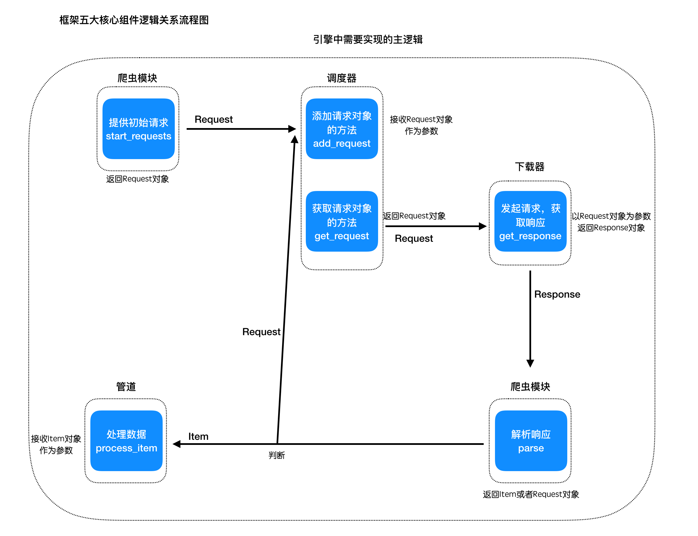

## 代码实现分析

##### 目标
1. 掌握模块之间的关系
2. 实现自己框架的代码结构

----

### 1 明确模块之间的逻辑关系
五个核心模块和三个内置的对象是关键模块，需要优先实现

先抛开中间件，分析下它们之间的逻辑关系是：
1. 构造spider中start_urls中的请求
2. 传递给调取器进行保存，之后从中取出
3. 取出的request对象交给下载的进行下载，返回response
4. response交给爬虫模块进行解析，提取结果
5. 如果结果是request对象，重新交给调度器，如果结果是item对象，交给管道处理

以上的逻辑是在引擎中完成的

对应的他们在引擎中的逻辑如下图：

### 2 设计代码结构
1. 首先给框架起一个名称，如：

        scrapy_plus

2. 继续分类以及解耦的设计思想：
    - 把核心模块放置在一起
    - 请求对象模块和响应对象模块统一作为http模块
    - 数据对象单独作为一个分类

    代码结构如下：

          -- scrapy_plus
            -- __init__.py
            -- core
              -- __init__.py
              -- spider.py
              -- scheduler.py
              -- downloader.py
              -- pipeline.py
              -- engine.py
            -- http
              -- __init__.py
              -- request.py
              -- response.py
            -- item.py

到这里，我们完成了框架的大致结构是设计，那么接下来我们就需要实现模块中的具体内容了

----

### 小结
1. 掌握模块之间的逻辑关系

