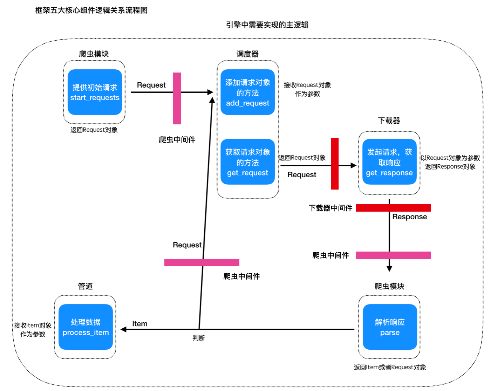

## 框架雏形 -- 实现中间件模块

##### 目标
1. 理解中间件的用途
2. 熟悉中间件在框架逻辑中的位置
3. 能够编写中间件模块

----

### 1 为什么需要中间件
中间件相当于一个钩子，能够在其中对request对象和response响应根据特定的需求进行一些特定的处理
例如：对于所有的request对象，我们需要在其中对他添加代理或者是随机的User-Agent都可以在中间件中完成

### 2 中间件实现的逻辑
框架中的中间件逻辑关系如下图中红色和粉色方块的位置：



内置中间件的代码结构：

```
- scrapy_plus
  -- __init__.py
  -- core
    -- __init__.py
    -- spider.py
    -- scheduler.py
    -- downloader.py
    -- pipeline.py
    -- engine.py
  -- http
    -- __init__.py
    -- request.py
    -- response.py
  -- middlewares
    -- __init__.py
    -- spider_middlewares.py
    -- downloader_middlewares.py
  -- item.py
```

### 2 完成爬虫中间件spider_middlewares

```Python
# scrapy_plus/middlewares/spider_middlewares.py
class SpiderMiddleware(object):
    '''爬虫中间件基类'''

    def process_request(self, request):
        '''预处理请求对象'''
        print("这是爬虫中间件：process_request方法")
        return request

    def process_response(self, response):
        '''预处理数据对象'''
        print("这是爬虫中间件：process_response方法")
        return response
```

### 3 完成下载downloader_middlewares

```Python
# scrapy_plus/middlewares/downloader_middlewares.py
class DownloaderMiddleware(object):
    '''下载器中间件基类'''

    def process_request(self, request):
        '''预处理请求对象'''
        print("这是下载器中间件：process_request方法")
        return request

    def process_response(self, response):
        '''预处理响应对象'''
        print("这是下载器中间件：process_response方法")
        return response
```

### 3 修改`engine.py`
加入中间件模块

```Python
# scrapy_plus/core/engine.py
'''引擎
a. 对外提供整个的程序的入口
b. 依次调用其他组件对外提供的接口，实现整个框架的运作(驱动)
'''

......
from scrapy_plus.middlewares.spider_middlewares import SpiderMiddleware
from scrapy_plus.middlewares.downloader_middlewares import DownloaderMiddleware
......

class Engine(object):

    def __init__(self):

        ......

        self.spider_mid = SpiderMiddleware()    # 初始化爬虫中间件对象
        self.downloader_mid = DownloaderMiddleware()    # 初始化下载器中间件对象

    ......

    def _start_engine(self):
        '''依次调用其他组件对外提供的接口，实现整个框架的运作(驱动)'''
        # 1. 爬虫模块发出初始请求
        start_request = self.spider.start_requests()

        # 2. 把初始请求添加给调度器
        # 利用爬虫中间件预处理请求对象
        start_request = self.spider_mid.process_request(start_request)
        self.scheduler.add_request(start_request)
        # 3. 从调度器获取请求对象，交给下载器发起请求，获取一个响应对象
        request = self.scheduler.get_request()
        # 利用下载器中间件预处理请求对象
        request = self.downloader_mid.process_request(request)
        # 4. 利用下载器发起请求
        response = self.downloader.get_response(request)
        # 利用下载器中间件预处理响应对象
        response = self.downloader_mid.process_response(response)

        # 5. 利用爬虫的解析响应的方法，处理响应，得到结果
        result = self.spider.parse(response)
        # 6. 判断结果对象
        # 6.1 如果是请求对象，那么就再交给调度器
        if isinstance(result, Request):
            # 利用爬虫中间件预处理请求对象
            result = self.spider_mid.process_request(result)
            self.scheduler.add_request(result)
        # 6.2 否则，就交给管道处理
        else:
            self.pipeline.process_item(result)
```

## 4.观察结果
运行main.py文件，查看结果

运行结果：
```shell
这是爬虫中间件：process_request方法
这是下载器中间件：process_request方法
这是下载器中间件：process_request方法
item对象: <scrapy_plus.item.Item object at 0x10759eef0>
```

----

### 小结
1. 理解中间件的用途
2. 完成中间件的编写
3. 完成对引擎逻辑的修改

----

### 本小结涉及修改的完整代码

scrapy_plus/core/engine.py
```
# coding:utf-8

'''引擎组件'''
from scrapy_plus.http.request import Request    # 导入Request对象

from .scheduler import Scheduler
from .downloader import Downloader
from .pipeline import Pipeline
from .spider import Spider

from scrapy_plus.middlewares.spider_middlewares import SpiderMiddleware
from scrapy_plus.middlewares.downloader_middlewares import DownloaderMiddleware


class Engine(object):
    '''
    a. 对外提供整个的程序的入口
    b. 依次调用其他组件对外提供的接口，实现整个框架的运作(驱动)
    '''

    def __init__(self):
        self.spider = Spider()    # 接收爬虫对象
        self.scheduler = Scheduler()    # 初始化调度器对象
        self.downloader = Downloader()    # 初始化下载器对象
        self.pipeline = Pipeline()    # 初始化管道对象

        self.spider_mid = SpiderMiddleware()    # 初始化爬虫中间件对象
        self.downloader_mid = DownloaderMiddleware()    # 初始化下载器中间件对象

    def start(self):
        '''启动整个引擎'''
        self._start_engine()

    def _start_engine(self):
        '''依次调用其他组件对外提供的接口，实现整个框架的运作(驱动)'''
        # 1. 爬虫模块发出初始请求
        start_request = self.spider.start_requests()

        # 此处新增
        # 利用爬虫中间件预处理请求对象
        start_request = self.spider_mid.process_request(start_request)

        # 2. 把初始请求添加给调度器
        self.scheduler.add_request(start_request)
        # 3. 从调度器获取请求对象，交给下载器发起请求，获取一个响应对象
        request = self.scheduler.get_request()

        # 此处新增
        # 利用下载器中间件预处理请求对象
        request = self.downloader_mid.process_request(request)

        # 4. 利用下载器发起请求
        response = self.downloader.get_response(request)

        # 此处新增
        # 利用下载器中间件预处理响应对象
        response = self.downloader_mid.process_response(response)

        # 5. 利用爬虫的解析响应的方法，处理响应，得到结果
        result = self.spider.parse(response)
        # 6. 判断结果对象
        # 6.1 如果是请求对象，那么就再交给调度器
        if isinstance(result, Request):

            # 此处新增
            # 利用爬虫中间件预处理请求对象
            result = self.spider_mid.process_request(result)

            self.scheduler.add_request(result)
        # 6.2 否则，就交给管道处理
        else:
            self.pipeline.process_item(result)
```

