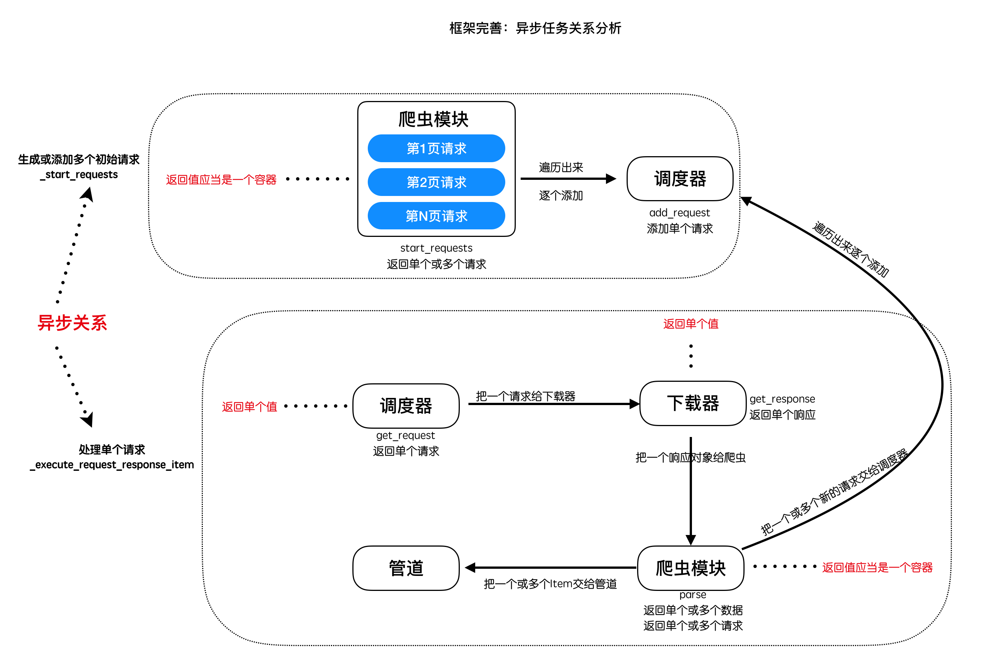

## 利用线程池实现异步

##### 目标
1. 掌握线程池的使用
2. 使用多线程重构代码

-----

### 1 异步任务分析：
##### 1.1 在引擎中，实现的主要功能如下图，
  - 上面的框架中是关于start_urls中的请求处理
  - 下面的框架中是一个请求从调度器取出请求，进行下载之后交给爬虫解析再交给管道的过程
  在以上两个过程中，他们之间没有直接的联系，都可以通过异步多线程的方式分别实现，加快程序执行的速度


#### 1.2 那么具体该如何实现该逻辑
  - multiprocessing.dummy 提供的Pool 类具有apply_async的方法，能够异步的执行让他运行的函数
  - apply_async方法能够接收一个callback，即其中的函数执行完成之后继续会做的事情，在这里，我们可以定义一个callback，其中让他继续执行上图中下方框的任务，同时给他一个停止条件，

### 2 利用回调实现循环
利用回调实现递归，可以达到循环的目的
并添加is_running程序是否需要结束的判断标志

```python
# scrapy_plus/core/engine.py
# coding:utf-8
......
from multiprocessing.dummy import Pool # 导入线程池对象 # 此处新增


class Engine():
    def __init__(self):
        ......
        # 此处新增
        self.pool = Pool()
        self.is_running = False # 判断程序是否需要结束的标志

    def start_engin(self):
        """启动引擎"""
        ......
        # 此处新增
        logger.info("重复的请求数量:{}".format(self.scheduler.repeate_request_num))


    ......
    # 此处新增
    def _call_back(self, temp): # 这是异步线程池的callback参数指向的函数,temp参数为固定写法
        if self.is_running: 
            self.pool.apply_async(self._execute_request_response_item, callback=self._call_back)

    # 此处修改
    def _start_engine(self):
        """具体实现引擎的逻辑"""

        self.is_running = True  # 启动引擎，设置状态为True
        self.pool.apply_async(self._start_request)  # 使用异步线程池中的线程执行指定的函数
        
        # 不断的处理解析过程中产生的request
        self.pool.apply_async(self._execute_request_response_item, callback=self._call_back)

        while True:
            time.sleep(0.001)
            # self._execute_request_response_item()

            #成功的响应数+重复的数量>=总的请求数量 程序结束
            if self.total_response_nums + self.scheduler.repeat_request_num >= self.total_request_nums:
                self.is_running = False  # 此时引擎状态为False
                break
```

### 3 实现异步并发控制

在默认配置文件中设置最大并发数，如果爬虫项目的配置文件中也设置最大并发数MAX_ASYNC_THREAD_NUMBER的话，将覆盖掉scrapy_plus包中的default_settings中的原有值

```python
# scrapy_plus/cfg/default_settings.py
......
# 默认异步线程最大并发数，此参数可以在项目的settings.py中重新设置自动覆盖
MAX_ASYNC_THREAD_NUMBER = 5
```

在引擎中使用

```Python
# scrapy_plus/core/engine.py
......

from scrapy_plus.cfg.settings import SPIDERS, PIPELINES, SPIDER_MIDDLEWARES, DOWNLOADER_MIDDLEWARES, MAX_ASYNC_THREAD_NUMBER

......

class Engine(object):

    ......

    def _start_engine(self):
        """具体实现引擎的逻辑"""
        self.is_running = True  # 启动引擎，设置状态为True
        # 处理strat_urls产生的request
        # self._start_request()
        self.pool.apply_async(self._start_request)  # 使用异步线程池中的线程执行指定的函数

        # 此处修改
        # 不断的处理解析过程中产生的request
        for i in range(MAX_ASYNC_THREAD_NUMBER): # 控制最大并发数
            self.pool.apply_async(self._execute_request_response_item, callback=self._call_back)

        # 控制判断程序何时中止
        while True:
            time.sleep(0.001) # 避免cpu空转,避免性能消耗
            # self._execute_request_response_item()

            # 此处修改
            if self.total_response_nums != 0: # 因为异步，需要增加判断，响应数不能为0
                # 成功的响应数+重复的数量>=总的请求数量 程序结束
                if self.total_response_nums + self.scheduler.repeat_request_num >= self.total_request_nums:
                    self.is_running = False
                    break
```

### 4. 对异步任务进行异常控制，增加异常回调函数error_callback

```
# scrapy_plus/core/engine.py
......
class Engine(object):
    ......
    # 此处修改
    def _call_back(self, temp): # 这是异步线程池的callback参数指向的函数,temp参数为固定写法
        if self.is_running:
            self.pool.apply_async(self._execute_request_response_item, callback=self._call_back, error_callback=self._error_callback)

    # 此处新增
    def _error_callback(self, exception):
        """异常回调函数"""
        try:
            raise exception    # 抛出异常后，才能被日志进行完整记录下来
        except Exception as e:
            logger.exception(e)

    def _start_engine(self):
        '''
        具体的实现引擎的细节
        :return:
        '''
        self.is_running = True  # 启动引擎，设置状态为True
        # 处理strat_urls产生的request
        # 此处修改
        self.pool.apply_async(self._start_request, error_callback=self._error_callback)  # 使用异步线程池中的线程执行指定的函数

        # 不断的处理解析过程中产生的request
        for i in range(MAX_ASYNC_THREAD_NUMBER): # 控制最大并发数
            self.pool.apply_async(self._execute_request_response_item, callback=self._call_back, error_callback=self._error_callback) # 此处修改


        # 控制判断程序何时中止
        while True:
            time.sleep(0.001) # 避免cpu空转,避免性能消耗
            # self._execute_request_response_item()
            if self.total_response_nums != 0: # 因为异步，需要增加判断，响应数不能为0
                # 成功的响应数+重复的数量>=总的请求数量 程序结束
                if self.total_response_nums + self.scheduler.repeat_request_num >= self.total_request_nums:
                    self.is_running = False
                    break
```

-----

### 小结
1. 掌握线程池模块及其方法的使用
2. 完成代码的重构，提高框架的整体效率

-----

### 本小结涉及修改的完整代码

scrapy_plus/core/engine.py

```
'''引擎组件'''
from scrapy_plus.http.request import Request    # 导入Request对象

from .scheduler import Scheduler
from .downloader import Downloader
from .pipeline import Pipeline
from .spider import Spider

from scrapy_plus.middlewares.spider_middlewares import SpiderMiddleware
from scrapy_plus.middlewares.downloader_middlewares import DownloaderMiddleware

import time
from datetime import datetime
from scrapy_plus.utils.log import logger    # 导入logger

import importlib
from scrapy_plus.conf.settings import SPIDERS, PIPELINES, SPIDER_MIDDLEWARES, DOWNLOADER_MIDDLEWARES, MAX_ASYNC_THREAD_NUMBER

from multiprocessing.dummy import Pool # 导入线程池对象


class Engine(object):
    '''
    a. 对外提供整个的程序的入口
    b. 依次调用其他组件对外提供的接口，实现整个框架的运作(驱动)
    '''

    def __init__(self):
        self.spiders = self._auto_import_instances(SPIDERS,isspider=True)   # 接收爬虫字典
        self.scheduler = Scheduler()    # 初始化调度器对象
        self.downloader = Downloader()    # 初始化下载器对象

        self.pipelines = self._auto_import_instances(PIPELINES) # 管道
        self.spider_mids = self._auto_import_instances(SPIDER_MIDDLEWARES) # 爬虫中间件
        self.downloader_mids = self._auto_import_instances(DOWNLOADER_MIDDLEWARES) # 下载中间件

        self.total_request_nums = 0
        self.total_response_nums = 0

        self.pool = Pool()
        self.is_running = False # 判断程序是否需要结束的标志

    def _auto_import_instances(self, path=[], isspider=False):
        '''通过配置文件，动态导入类并实例化
        path: 表示配置文件中配置的导入类的路径
        isspider: 由于爬虫需要返回的是一个字典，因此对其做对应的判断和处理
        '''
        instances = {} if isspider else []
        for p in path:
            module_name = p.rsplit(".", 1)[0]  # 取出模块名称
            cls_name = p.rsplit(".", 1)[1]  # 取出类名称
            ret = importlib.import_module(module_name)  # 动态导入爬虫模块
            cls = getattr(ret, cls_name)  # 根据类名称获取类对象

            if isspider:
                instances[cls.name] = cls()  # 组装成爬虫字典{spider_name:spider(),}
            else:
                instances.append(cls())  # 实例化类对象
                # 把管道中间件分别组装成 管道列表=[管道类1(),管道类2()] / 中间件列表 = [中间件类1(),中间件类2()]
        return instances  # 返回类对象字典或列表

    def start(self):
        '''启动整个引擎'''
        start_time = datetime.now()  # 起始时间
        logger.info("开始运行时间：%s" % start_time)  # 使用日志记录起始运行时间
        self._start_engine()
        end_time = datetime.now()
        logger.info("爬虫结束：{}".format(end_time))
        logger.info("爬虫一共运行：{}秒".format((end_time-start_time).total_seconds()))
        logger.info("总的请求数量:{}".format(self.total_request_nums))
        logger.info("总的响应数量:{}".format(self.total_response_nums))
        logger.info("重复的请求数量:{}".format(self.scheduler.repeat_request_num))

    def _start_request(self):
        """单独处理爬虫模块中start_requests()产生的request对象"""
        for spider_name, spider in self.spiders.items():
            for start_request in spider.start_requests():
                #1. 对start_request进过爬虫中间件进行处理
                for spider_mid in self.spider_mids:
                    start_request = spider_mid.process_request(start_request)

                # 为请求对象绑定它所属的爬虫的名称
                start_request.spider_name = spider_name

                #2. 调用调度器的add_request方法，添加request对象到调度器中
                self.scheduler.add_request(start_request)
                #请求数+1
                self.total_request_nums += 1

    def _execute_request_response_item(self):
        '''根据请求、发起请求获取响应、解析响应、处理响应结果'''
        #3. 调用调度器的get_request方法，获取request对象
        request = self.scheduler.get_request()
        if request is None: #如果没有获取到请求对象，直接返回
            return

        #request对象经过下载器中间件的process_request进行处理
        for downloader_mid in self.downloader_mids:
            request = downloader_mid.process_request(request)

        #4. 调用下载器的get_response方法，获取响应
        response = self.downloader.get_response(request)

        response.meta = request.meta

        #response对象经过下载器中间件的process_response进行处理
        for downloader_mid in self.downloader_mids:
            response = downloader_mid.process_response(response)

        #response对象经过下爬虫中间件的process_response进行处理
        for spider_mid in self.spider_mids:
            response = spider_mid.process_response(response)

        # 根据request的spider_name属性，获取对应的爬虫对象
        spider = self.spiders[request.spider_name]
        # parse方法
        parse = getattr(spider, request.parse)  # getattr(类, 类中方法名的字符串) = 类方法对象

        #5. 调用爬虫的parse方法，处理响应
        results = parse(response)
        # 增加一个判断！
        if results is not None: # 如果项目中爬虫的解析函数不返回可迭代对象就会报错
            for result in results:

                #6.判断结果的类型，如果是request，重新调用调度器的add_request方法
                if isinstance(result,Request):
                    #在解析函数得到request对象之后，使用process_request进行处理

                    for spider_mid in self.spider_mids:
                        result = spider_mid.process_request(result)

                    # 给request对象增加一个spider_name属性
                    result.spider_name = request.spider_name

                    self.scheduler.add_request(result)
                    self.total_request_nums += 1
                #7如果不是，调用pipeline的process_item方法处理结果
                else:
                    # 就通过process_item()传递数据给管道
                    for pipeline in self.pipelines:
                        pipeline.process_item(result, spider)

        self.total_response_nums += 1

    def _call_back(self, temp): # 这是异步线程池的callback参数指向的函数,temp参数为固定写法
        if self.is_running:
            self.pool.apply_async(self._execute_request_response_item, callback=self._call_back, error_callback=self._error_callback)

    def _error_callback(self, exception):
        """异常回调函数"""
        try:
            raise exception    # 抛出异常后，才能被日志进行完整记录下来
        except Exception as e:
            logger.exception(e)

    def _start_engine(self):
        '''
        具体的实现引擎的细节
        :return:
        '''
        self.is_running = True  # 启动引擎，设置状态为True
        # 处理strat_urls产生的request
        # self._start_request()
        self.pool.apply_async(self._start_request, error_callback=self._error_callback)  # 使用异步线程池中的线程执行指定的函数

        # 不断的处理解析过程中产生的request
        for i in range(MAX_ASYNC_THREAD_NUMBER): # 控制最大并发数
            self.pool.apply_async(self._execute_request_response_item, callback=self._call_back, error_callback=self._error_callback)


        # 控制判断程序何时中止
        while True:
            time.sleep(0.001) # 避免cpu空转,避免性能消耗
            # self._execute_request_response_item()
            if self.total_response_nums != 0: # 因为异步，需要增加判断，响应数不能为0
                # 成功的响应数+重复的数量>=总的请求数量 程序结束
                if self.total_response_nums + self.scheduler.repeat_request_num >= self.total_request_nums:
                    self.is_running = False
                    break
```

scrapy_plus/conf/default_settings.py

```
import logging

# 默认的日志配置
DEFAULT_LOG_LEVEL = logging.INFO    # 默认等级
DEFAULT_LOG_FMT = '%(asctime)s %(filename)s[line:%(lineno)d] \
                  %(levelname)s: %(message)s'   # 默认日志格式
DEFUALT_LOG_DATEFMT = '%Y-%m-%d %H:%M:%S'  # 默认时间格式
DEFAULT_LOG_FILENAME = 'log.log'    # 默认日志文件名称

# 启用的默认管道类
PIPELINES = []

# 启用的默认爬虫中间件类
SPIDER_MIDDLEWARES = []

# 启用的默认下载器中间件类
DOWNLOADER_MIDDLEWARES = []

# 默认异步线程最大并发数，此参数可以在项目的settings.py中重新设置自动覆盖
MAX_ASYNC_THREAD_NUMBER = 5
```

