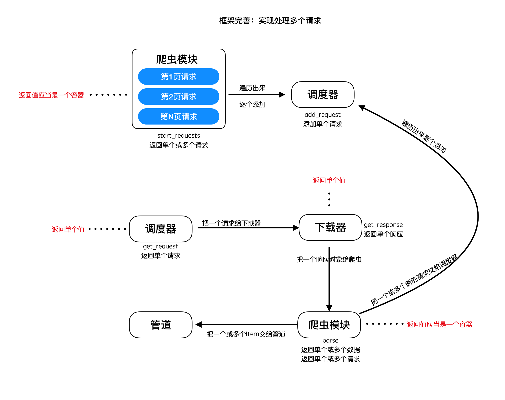
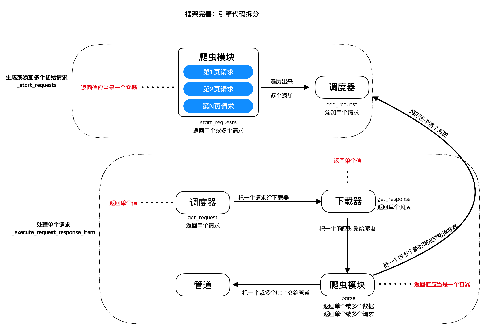

## 多爬虫实现之一  --  多请求实现

##### 学习目标
1. 实现在框架中能够发送多个start_url的请求
2. 实现对_start_engine方法功能的拆分重构
3. 掌握yield和生成器的使用方法

-----

### 1 需求分析
在发送关于start_url中的请求的时候，往往我们的请求并不是只有一个，而且在解析了响应之后，可能需要继续构造请求并且发送，那么对应的需要在引擎中进行修改。

多请求实现分析：


### 2 项目中实现爬虫文件

##### 在main.py同级目录下建立`spiders.py`，存放定义的爬虫类

    ```python
    # project_dir/spiders.py
    from scrapy_plus.core.spider import Spider
    
    # 继承框架的爬虫基类
    class BaiduSpider(Spider):
    
        start_url = 'http://www.baidu.com'    # 设置初始请求url
    ```

##### 修改`main.py`

    ```python
    # project_dir/main.py
    from scrapy_plus.core.engine import Engine    # 导入引擎
    
    from spiders import BaiduSpider
    
    if __name__ == '__main__':
        spider = BaiduSpider()    # 实例化爬虫对象
        engine = Engine(spider)    # 传入爬虫对象
        engine.start()    # 启动引擎
    ```

##### 修改`engine.py`，设置为接收外部传入的爬虫对象

    ```python
    # scrapy_plus/core/engine.py
    ...
    class Engine(object):
    
        def __init__(self, spider):    # 接收外部传入的爬虫对象
            self.spider = spider    # 爬虫对象
    ...
    ```

### 3 实现发起多个请求
##### 3.1 修改框架的爬虫组件文件 `spider.py`:
- 设置为初始请求url为多个
- 修改start_requests方法，将返回多个请求对象
- 利用生成器方式实现start_requests，提高程序的资源消耗

```python
# scrapy_plus/core/spider.py
'''爬虫组件封装'''
from scrapy_plus.item import Item    # 导入Item对象
from scrapy_plus.http.request import Request    # 导入Request对象


class Spider(object):
    '''
    1. 构建请求信息(初始的)，也就是生成请求对象(Request)
    2. 解析响应对象，返回数据对象(Item)或者新的请求对象(Request)
    '''

    start_urls = []    # 默认初始请求地址

    # def start_requests(self):
    #     '''构建初始请求对象并返回'''
    #     request_list = []
    #     for url in self.start_urls:
    #         request_list.append(Request(url))
    #     return request_list

    # 利用生成器方式实现，提高程序的资源消耗
    def start_requests(self):
        '''构建初始请求对象并返回'''
        for url in self.start_urls:
            yield Request(url)

    def parse(self, response):
        '''解析请求
        并返回新的请求对象、或者数据对象
        返回值应当是一个容器，如start_requests返回值方法一样，改为生成器即可
        '''
        yield Item(response.body)   # 返回item对象 改为生成器即可
```

##### 3.2 修改引擎 `engine.py`:



- 将代码拆分为两个方法，便于维护，提高代码可读性
- 统计总共完成的响应数
- 设置程序退出条件：当总响应数等于总请求数时，退出
- 实现处理start_requests方法返回多个请求的功能
- 实现处理parse解析函数返回多个对象的功能

```python
# scheduler/core/engine.py
'''引擎
a. 对外提供整个的程序的入口
b. 依次调用其他组件对外提供的接口，实现整个框架的运作(驱动)
'''
import time # 此处新增 
from datetime import datetime

from .downloader import Downloader
from .pipeline import  Pipeline
from .scheduler import  Scheduler
from .spider import Spider

from scrapy_plus.http.request import Request
from scrapy_plus.middlewares.downloader_middlewares import DownloaderMiddleware
from scrapy_plus.middlewares.spider_middlewares import SpiderMiddleware
from scrapy_plus.utils.log import logger

class Engine:
    '''完成对引擎模块的封装'''

    def __init__(self,spider):
        '''
        实例化其他的组件，在引起中能够通过调用组件的方法实现功能
        '''
        # self.spider = Spider()
        self.spider = spider
        self.downloader = Downloader()
        self.pipeline = Pipeline()
        self.scheduler = Scheduler()
        self.spider_mid = SpiderMiddleware()
        self.downloader_mid = DownloaderMiddleware()

        # 此处新增
        self.total_request_nums = 0
        self.total_response_nums = 0


    def start(self):
        '''
        提供引擎启动的入口
        :return:
        '''
        # 此处新增+修改
        start_time = datetime.now()  # 起始时间
        logger.info("开始运行时间：%s" % start_time)  # 使用日志记录起始运行时间
        self._start_engine()
        stop = datetime.now()  # 结束时间
        end_time = datetime.now()
        logger.info("爬虫结束：{}".format(end_time))
        logger.info("爬虫一共运行：{}秒".format((end_time-start_time).total_seconds()))
        logger.info("总的请求数量:{}".format(self.total_request_nums))
        logger.info("总的响应数量:{}".format(self.total_response_nums))

    # 此处新增
    def _start_request(self):
        for start_request in self.spider.start_requests():
            #1. 对start_request进过爬虫中间件进行处理
            start_request = self.spider_mid.process_request(start_request)

            #2. 调用调度器的add_request方法，添加request对象到调度器中
            self.scheduler.add_request(start_request)
            #请求数+1
            self.total_request_nums += 1

    # 此处新增
    def _execute_request_response_item(self):
        #3. 调用调度器的get_request方法，获取request对象
        request = self.scheduler.get_request()
        if request is None: #如果没有获取到请求对象，直接返回
            return

        #request对象经过下载器中间件的process_request进行处理
        request = self.downloader_mid.process_request(request)

        #4. 调用下载器的get_response方法，获取响应
        response = self.downloader.get_response(request)
        #response对象经过下载器中间件的process_response进行处理
        response = self.downloader_mid.process_response(response)
        #response对象经过下爬虫中间件的process_response进行处理
        response = self.spider_mid.process_response(response)

        #5. 调用爬虫的parse方法，处理响应
        for result in self.spider.parse(response):
            #6.判断结果的类型，如果是request，重新调用调度器的add_request方法
            if isinstance(result,Request):
                #在解析函数得到request对象之后，使用process_request进行处理
                result = self.spider_mid.process_request(result)
                self.scheduler.add_request(result)
                self.total_request_nums += 1
            #7如果不是，调用pipeline的process_item方法处理结果
            else:
                self.pipeline.process_item(result)

        self.total_response_nums += 1

    # 此处修改
    def _start_engine(self):
        '''
        具体的实现引擎的细节
        :return:
        '''

        self._start_request()

        while True:
            time.sleep(0.001)
            self._execute_request_response_item()

            # 程序退出条件
            if self.total_response_nums>= self.total_request_nums:
                break
```

##### 3.3 修改调度器 `scheduler.py`：
- 将从队列获取请求对象设置为非阻塞，否则会造成程序无法退出
- 统计请求总数，用于判断程序退出

```python
# scrapy_plus/core/scheduler.py
'''调度器模块封装'''
# 利用six模块实现py2和py3兼容
from six.moves.queue import Queue


class Scheduler(object):
    '''
    1. 缓存请求对象(Request)，并为下载器提供请求对象，实现请求的调度
    2. 对请求对象进行去重判断
    '''
    def __init__(self):
        self.queue = Queue()
        # 记录总共的请求数
        self.total_request_number = 0 # 此处新增

    def add_request(self, request):
        '''添加请求对象'''
        self.queue.put(request)
        # 统计请求总数
        self.total_request_number += 1  # 此处新增

    # 此处修改
    def get_request(self):
        '''获取一个请求对象并返回'''
        try:
            # 设置为非阻塞
            request = self.queue.get(False)
        except:
            return None
        else:
            return request

    def _filter_request(self):
        '''请求去重'''
        pass
```

-----

### 小结
1. 掌握生成器的使用
2. 完成核心代码的修改

-----

### 本小结涉及修改的完整代码

scrapy_plus/core/engine.py
```
from scrapy_plus.http.request import Request    # 导入Request对象

from .scheduler import Scheduler
from .downloader import Downloader
from .pipeline import Pipeline
from .spider import Spider

from scrapy_plus.middlewares.spider_middlewares import SpiderMiddleware
from scrapy_plus.middlewares.downloader_middlewares import DownloaderMiddleware

from datetime import datetime
from scrapy_plus.utils.log import logger    # 导入logger

import time


class Engine(object):
    '''
    a. 对外提供整个的程序的入口
    b. 依次调用其他组件对外提供的接口，实现整个框架的运作(驱动)
    '''

    def __init__(self, spider):
        self.spider = spider   # 接收爬虫对象
        self.scheduler = Scheduler()    # 初始化调度器对象
        self.downloader = Downloader()    # 初始化下载器对象
        self.pipeline = Pipeline()    # 初始化管道对象

        self.spider_mid = SpiderMiddleware()    # 初始化爬虫中间件对象
        self.downloader_mid = DownloaderMiddleware()    # 初始化下载器中间件对象

        self.total_request_nums = 0
        self.total_response_nums = 0

    def start(self):
        '''启动整个引擎'''
        start_time = datetime.now()  # 起始时间
        logger.info("开始运行时间：%s" % start_time)  # 使用日志记录起始运行时间
        self._start_engine()
        stop = datetime.now()  # 结束时间
        end_time = datetime.now()
        logger.info("爬虫结束：{}".format(end_time))
        logger.info("爬虫一共运行：{}秒".format((end_time-start_time).total_seconds()))
        logger.info("总的请求数量:{}".format(self.total_request_nums))
        logger.info("总的响应数量:{}".format(self.total_response_nums))

    def _start_request(self):
        for start_request in self.spider.start_requests():
            #1. 对start_request进过爬虫中间件进行处理
            start_request = self.spider_mid.process_request(start_request)
            #2. 调用调度器的add_request方法，添加request对象到调度器中
            self.scheduler.add_request(start_request)
            #请求数+1
            self.total_request_nums += 1

    def _execute_request_response_item(self):
        #3. 调用调度器的get_request方法，获取request对象
        request = self.scheduler.get_request()
        if request is None: #如果没有获取到请求对象，直接返回
            return

        #request对象经过下载器中间件的process_request进行处理
        request = self.downloader_mid.process_request(request)

        #4. 调用下载器的get_response方法，获取响应
        response = self.downloader.get_response(request)
        #response对象经过下载器中间件的process_response进行处理
        response = self.downloader_mid.process_response(response)
        #response对象经过下爬虫中间件的process_response进行处理
        response = self.spider_mid.process_response(response)

        #5. 调用爬虫的parse方法，处理响应
        for result in self.spider.parse(response):
            #6.判断结果的类型，如果是request，重新调用调度器的add_request方法
            if isinstance(result,Request):
                #在解析函数得到request对象之后，使用process_request进行处理
                result = self.spider_mid.process_request(result)
                self.scheduler.add_request(result)
                self.total_request_nums += 1
            #7如果不是，调用pipeline的process_item方法处理结果
            else:
                self.pipeline.process_item(result)

        self.total_response_nums += 1

    def _start_engine(self):
        '''
        具体的实现引擎的细节
        :return:
        '''
        self._start_request()
        while True:
            time.sleep(0.001)
            self._execute_request_response_item()
            if self.total_response_nums>= self.total_request_nums:
                break
```    


scrapy_plus/core/spider.py

```
'''爬虫组件封装'''
from scrapy_plus.item import Item    # 导入Item对象
from scrapy_plus.http.request import Request    # 导入Request对象


class Spider(object):
    '''
    1. 构建请求信息(初始的)，也就是生成请求对象(Request)
    2. 解析响应对象，返回数据对象(Item)或者新的请求对象(Request)
    '''

    start_urls = []

    # 利用生成器方式实现，提高程序的资源消耗
    def start_requests(self):
        '''构建初始请求对象并返回'''
        for url in self.start_urls:
            yield Request(url)

    def parse(self, response):
        '''解析请求
        并返回新的请求对象、或者数据对象
        返回值应当是一个容器，如start_requests返回值方法一样，改为生成器即可
        '''
        yield Item(response.body)   # 返回item对象 改为生成器即可
```

scrapy_plus/core/scheduler.py
```

'''调度器模块封住'''
# 利用six模块实现py2和py3兼容
from six.moves.queue import Queue


class Scheduler(object):
    '''
    1. 缓存请求对象(Request)，并为下载器提供请求对象，实现请求的调度
    2. 对请求对象进行去重判断
    '''
    def __init__(self):
        self.queue = Queue()
        # 记录总共的请求数
        self.total_request_number = 0

    def add_request(self, request):
        '''添加请求对象'''
        self.queue.put(request)
        self.total_request_number += 1    # 统计请求总数

    def get_request(self):
        '''获取一个请求对象并返回'''
        try:
            # 设置为非阻塞
            request = self.queue.get(False)
        except:
            return None
        else:
            return request

    def _filter_request(self):
        '''请求去重'''
        # 暂时不实现
        pass
```


项目文件夹/main.py
```
from scrapy_plus.core.engine import Engine    # 导入引擎

from spiders import BaiduSpider

if __name__ == '__main__':
    spider = BaiduSpider()    # 实例化爬虫对象
    engine = Engine(spider)    # 传入爬虫对象
    engine.start()    # 启动引擎
```

