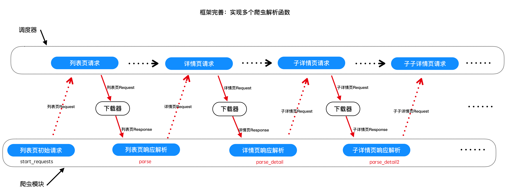

## 多爬虫实现之二  --  爬虫实现多个解析函数

##### 学习目标
1. 完成spider中如果解析函数调用的封装
2. 掌握getattr的方法
3. 完成通过meta在不通过的解析函数中传递数据的方法

-----

### 1 爬虫实现多个解析函数的意义



### 2 响应对象的解析方法封装

为response对象封装xpath、正则、json、等方法和属性，以支持对数据的解析和提取

```Python
# scrapy_plus/http/response.py
import re # 此处新增
import json # 此处新增

from lxml import etree # 此处修改requirments.txt文件 # 此处新增


class Response(object):
    '''框架内置Response对象'''
    def __init__(self, url, status_code, headers, body):
        self.url = url    # 响应url
        self.status_code = status_code    # 响应状态码
        self.headers = headers    # 响应头
        self.body = body    # 响应体

    # 此处新增
    def xpath(self, rule):
        '''提供xpath方法'''
        html = etree.HTML(self.body)
        return html.xpath(rule)

    # 此处新增
    @property
    def json(self):
        '''提供json解析
        如果content是json字符串，是才有效
        '''
        return json.loads(self.body)

    # 此处新增
    def re_findall(self, rule, data=None):
        '''封装正则的findall方法'''
        if data is None:
            data = self.body
        return re.findall(rule, data)
```

### 3 增加爬虫：豆瓣电影top250

##### 3.1 修改项目中的spiders.py

```python
# project_dir/spiders.py
from scrapy_plus.core.spider import Spider
from scrapy_plus.http.request import Request
from scrapy_plus.item import Item

# 继承框架的爬虫基类
class BaiduSpider(Spider):

    start_urls = ['http://www.baidu.com']    # 设置初始请求url


class DoubanSpider(Spider):

    start_urls = []  # 重写start_requests方法后，这个属性就没有设置的必要了

    def start_requests(self):
        # 重写start_requests方法，返回多个请求
        base_url = 'http://movie.douban.com/top250?start='
        for i in range(0, 250, 25):    # 逐个返回第1-10页的请求属相
            url = base_url + str(i)
            yield Request(url)

    def parse(self, response):
        '''解析豆瓣电影top250列表页'''
        title_list = []    # 存储所有的
        for li in response.xpath("//ol[@class='grid_view']/li"):    # 遍历每一个li标签
            title = li.xpath(".//span[@class='title'][1]/text()")    # 提取该li标下的 标题
            title_list.append(title[0])
        yield Item(title_list)    # 返回标题
```

##### 3.2 修改框架中的main.py，运行查看效果

```
from scrapy_plus.core.engine import Engine    # 导入引擎

from spiders import BaiduSpider, DoubanSpider


if __name__ == '__main__':
    # spider = BaiduSpider()    # 实例化爬虫对象
    spider = DoubanSpider()
    engine = Engine(spider)    # 传入爬虫对象
    engine.start()    # 启动引擎
```

### 4 实现多个解析函数

由于现在不同的请求对应不同的解析函数，因此需要为请求对象指明它的解析函数，因此为请求对象增加一个属性

```
# scrapy_plus/http/request.py
class Request(object):
    '''框架内置请求对象，设置请求信息'''

    # 此处修改
    def __init__(self, url, method='GET', headers=None, params=None, data=None, parse='parse', meta={}):
        self.url = url    # 请求地址
        self.method = method    # 请求方法
        self.headers = headers    # 请求头
        self.params = params    # 请求参数
        self.data = data    # 请求体

        # 此处新增
        self.parse = parse    # 指明它的解析函数, 默认是parse方法
        self.meta = meta
```

修改response.py
```
# scrapy_plus/http/response.py
......
class Response:
    '''完成对响应对象的封装'''

    # 此处修改
    def __init__(self, url, body, headers, status_code, meta={}):
        '''
        初始化resposne对象
        :param url: 响应的url地址
        :param body: 响应体
        :param headers:  响应头
        :param status_code: 状态码
        '''
        self.url = url
        self.headers = headers
        self.status_code = status_code
        self.body = body

        # 此处新增
        self.meta = meta

......
```

### 5 在引擎中需要动态的判断和获取对应的解析函数
* 利用getattr()函数
* 注意meta的传递时机！

```Python
# scrapy_plus/core/engine.py
class Engine(object):

    ......

    def _execute_request_response_item(self):
        '''根据请求、发起请求获取响应、解析响应、处理响应结果'''

        ......

       #request对象经过下载器中间件的process_request进行处理
        request = self.downloader_mid.process_request(request)

        #4. 调用下载器的get_response方法，获取响应
        response = self.downloader.get_response(request)

        # 此处新增
        response.meta = request.meta

        #response对象经过下载器中间件的process_response进行处理
        response = self.downloader_mid.process_response(response)
        #response对象经过下爬虫中间件的process_response进行处理
        response = self.spider_mid.process_response(response)

        # 此处新增
        # parse方法
        parse = getattr(self.spider, request.parse) # getattr(类, 类中方法名的字符串) = 类方法对象

        #5. 调用爬虫的parse方法，处理响应
        for result in parse(response): # 此处修改
            #6.判断结果的类型，如果是request，重新调用调度器的add_request方法
            if isinstance(result,Request):
                #在解析函数得到request对象之后，使用process_request进行处理
                result = self.spider_mid.process_request(result)
                self.scheduler.add_request(result)
                self.total_request_nums += 1
            #7如果不是，调用pipeline的process_item方法处理结果
            else:
                self.pipeline.process_item(result)

        self.total_response_nums += 1

        ......
```

### 6 修改豆瓣爬虫，发起详情页的请求：

```Python
# project_dir/spiders.py
......

class DoubanSpider(Spider):

    start_urls = []  # 重写start_requests方法后，这个属性就没有设置的必要了

    def start_requests(self):
        # 重写start_requests方法，返回多个请求
        base_url = 'http://movie.douban.com/top250?start='
        for i in range(0, 250, 25):    # 逐个返回第1-10页的请求属相
            url = base_url + str(i)
            yield Request(url)

    def parse(self, response):
        '''解析豆瓣电影top250列表页'''
        # title_list = []    # 存储所有的
        for li in response.xpath("//ol[@class='grid_view']/li"):    # 遍历每一个li标签
            item = {}
            item["title"] =  li.xpath(".//span[@class='title'][1]/text()")[0]    # 提取该li标下的 标题
            # title_list.append(title[0])

            detail_url = li.xpath(".//div[@class='info']/div[@class='hd']/a/@href")[0]
            yield Request(detail_url, parse="parse_detail",meta={"item":item})    # 发起详情页的请求，并指定解析函数是parse_detail方法
        # yield Item(title_list)    # 返回标题

    def parse_detail(self, response):
        '''解析详情页'''
        item = response.meta["item"]
        item["url"] = response.url
        print('item：', item)    # 打印一下响应的url
        return []    # 由于必须返回一个容器，这里返回一个空列表
    
        # yield Item(item)  #或者yield Item对象

```

运行项目中main.py查看效果

### 7 相应的去修改框架和项目中的strat_urls和start_requests()俩个名字

##### 注意:此处报类型异常 是因为/scrapy_plus/core/spider模块中的start_urls和start_requests()！注意最后多了个s！

-----

### 小结
  1. 掌握getattr的使用
  2. 完成代码的重构，实现多个解析函数封装

-----

### 本小结涉及修改的完整代码

项目目录/main.py

```

from scrapy_plus.core.engine import Engine    # 导入引擎

from spiders import BaiduSpider, DoubanSpider


if __name__ == '__main__':
    # spider = BaiduSpider()    # 实例化爬虫对象
    spider = DoubanSpider()
    engine = Engine(spider)    # 传入爬虫对象
    engine.start()    # 启动引擎
```

项目目录/spiders.py

```
from scrapy_plus.core.spider import Spider
from scrapy_plus.http.request import Request
from scrapy_plus.item import Item


# 继承框架的爬虫基类
class BaiduSpider(Spider):
    start_urls = ['http://www.baidu.com']  # 设置初始请求url


class DoubanSpider(Spider):

    start_urls = []  # 重写start_requests方法后，这个属性就没有设置的必要了

    def start_requests(self):
        # 重写start_requests方法，返回多个请求
        base_url = 'http://movie.douban.com/top250?start='
        for i in range(0, 250, 25):    # 逐个返回第1-10页的请求属相
            url = base_url + str(i)
            yield Request(url)

    def parse(self, response):
        '''解析豆瓣电影top250列表页'''
        # title_list = []    # 存储所有的
        for li in response.xpath("//ol[@class='grid_view']/li"):    # 遍历每一个li标签
            item = {}
            item["title"] =  li.xpath(".//span[@class='title'][1]/text()")[0]    # 提取该li标下的 标题
            # title_list.append(title[0])

            detail_url = li.xpath(".//div[@class='info']/div[@class='hd']/a/@href")[0]
            yield Request(detail_url, parse="parse_detail",meta={"item":item})    # 发起详情页的请求，并指定解析函数是parse_detail方法
        # yield Item(title_list)    # 返回标题

    def parse_detail(self, response):
        '''解析详情页'''
        item = response.meta["item"]
        item["url"] = response.url
        print('item：', item)    # 打印一下响应的url
        return []    # 由于必须返回一个容器，这里返回一个空列表

        # yield Item(item)  #或者yield Item对象
```

scrapy_plus/http/request.py
```
'''封装Request对象'''

class Request(object):
    '''框架内置请求对象，设置请求信息'''

    def __init__(self, url, method='GET',
                 headers=None, params=None, data=None,
                 parse='parse', meta={}):
        self.url = url    # 请求地址
        self.method = method    # 请求方法
        self.headers = headers    # 请求头
        self.params = params    # 请求参数
        self.data = data    # 请求体

        self.parse = parse    # 指明它的解析函数, 默认是parse方法
        self.meta = meta
```

scrapy_plus/http/response.py

```
'''封装Response对象'''

import re
import json

from lxml import etree # 此处修改requirments.txt文件


class Response(object):
    '''框架内置Response对象'''
    def __init__(self, url, status_code, headers, body, meta={}):
        self.url = url    # 响应url
        self.status_code = status_code    # 响应状态码
        self.headers = headers    # 响应头
        self.body = body    # 响应体
        self.meta = meta

    def xpath(self, rule):
        '''提供xpath方法'''
        html = etree.HTML(self.body)
        return html.xpath(rule)

    @property
    def json(self):
        '''提供json解析
        如果content是json字符串，是才有效
        '''
        return json.loads(self.body)

    def re_findall(self, rule, data=None):
        '''封装正则的findall方法'''
        if data is None:
            data = self.body
        return re.findall(rule, data)
```

scrapy_plus/core/engine.py

```
'''引擎组件'''
from scrapy_plus.http.request import Request    # 导入Request对象

from .scheduler import Scheduler
from .downloader import Downloader
from .pipeline import Pipeline
from .spider import Spider

from scrapy_plus.middlewares.spider_middlewares import SpiderMiddleware
from scrapy_plus.middlewares.downloader_middlewares import DownloaderMiddleware

from datetime import datetime
from scrapy_plus.utils.log import logger    # 导入logger

import time


class Engine(object):
    '''
    a. 对外提供整个的程序的入口
    b. 依次调用其他组件对外提供的接口，实现整个框架的运作(驱动)
    '''

    def __init__(self, spider):
        self.spider = spider   # 接收爬虫对象
        self.scheduler = Scheduler()    # 初始化调度器对象
        self.downloader = Downloader()    # 初始化下载器对象
        self.pipeline = Pipeline()    # 初始化管道对象

        self.spider_mid = SpiderMiddleware()    # 初始化爬虫中间件对象
        self.downloader_mid = DownloaderMiddleware()    # 初始化下载器中间件对象

        self.total_request_nums = 0
        self.total_response_nums = 0

    def start(self):
        '''启动整个引擎'''
        start_time = datetime.now()  # 起始时间
        logger.info("开始运行时间：%s" % start_time)  # 使用日志记录起始运行时间
        self._start_engine()
        stop = datetime.now()  # 结束时间
        end_time = datetime.now()
        logger.info("爬虫结束：{}".format(end_time))
        logger.info("爬虫一共运行：{}秒".format((end_time-start_time).total_seconds()))
        logger.info("总的请求数量:{}".format(self.total_request_nums))
        logger.info("总的响应数量:{}".format(self.total_response_nums))

    def _start_request(self):
        for start_request in self.spider.start_requests():
            #1. 对start_request进过爬虫中间件进行处理
            start_request = self.spider_mid.process_request(start_request)
            #2. 调用调度器的add_request方法，添加request对象到调度器中
            self.scheduler.add_request(start_request)
            #请求数+1
            self.total_request_nums += 1

    def _execute_request_response_item(self):
        '''根据请求、发起请求获取响应、解析响应、处理响应结果'''
        #3. 调用调度器的get_request方法，获取request对象
        request = self.scheduler.get_request()
        if request is None: #如果没有获取到请求对象，直接返回
            return

        #request对象经过下载器中间件的process_request进行处理
        request = self.downloader_mid.process_request(request)

        #4. 调用下载器的get_response方法，获取响应
        response = self.downloader.get_response(request)

        # 此处新增
        response.meta = request.meta

        #response对象经过下载器中间件的process_response进行处理
        response = self.downloader_mid.process_response(response)
        #response对象经过下爬虫中间件的process_response进行处理
        response = self.spider_mid.process_response(response)

        # 此处新增
        # parse方法
        parse = getattr(self.spider, request.parse)  # getattr(类, 类中方法名的字符串) = 类方法对象

        #5. 调用爬虫的parse方法，处理响应
        for result in parse(response): # 此处修改
            #6.判断结果的类型，如果是request，重新调用调度器的add_request方法
            if isinstance(result,Request):
                #在解析函数得到request对象之后，使用process_request进行处理
                result = self.spider_mid.process_request(result)
                self.scheduler.add_request(result)
                self.total_request_nums += 1
            #7如果不是，调用pipeline的process_item方法处理结果
            else:
                self.pipeline.process_item(result)

        self.total_response_nums += 1

    def _start_engine(self):
        '''
        具体的实现引擎的细节
        :return:
        '''
        self._start_request()
        while True:
            time.sleep(0.001)
            self._execute_request_response_item()
            if self.total_response_nums>= self.total_request_nums:
                break
```

