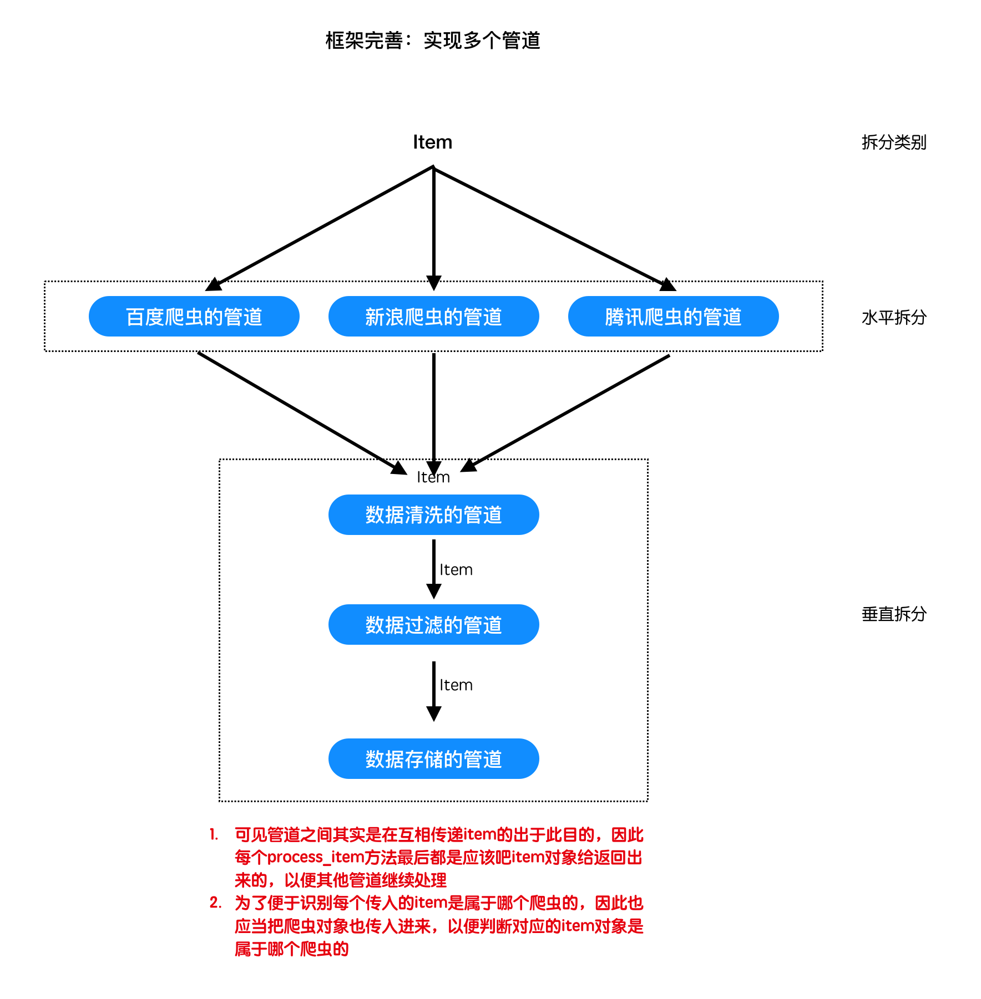

## 实现多个管道

##### 学习目标
1. 实现对引擎的修改，达到数据通过多个管道的目的

----

### 1 为什么需要多个管道
同爬虫文件一样，不同的爬虫可能需要不同的管道文件，因此管道文件需要在项目中进行实现




### 2 项目文件夹中实现管道文件

在项目文件夹下建立pipelines.py文件，不同在于：
- 这里的process_item必须把item对象最后再返回回来，因为是多个管道文件的设置了
- 需要增加一个参数，也就是传入爬虫对象，以此来判断当前item是属于那个爬虫对象的

```
# project_dir/pipelines.py
from spiders.baidu import BaiduSpider
from spiders.douban import DoubanSpider


class BaiduPipeline(object):

    # 这里有所不同的是，需要增加一个参数，也就是传入爬虫对象
    # 以此来判断当前item是属于那个爬虫对象的
    def process_item(self, item, spider):
        '''处理item'''
        if isinstance(spider, BaiduSpider):
            print("百度爬虫的数据：", item)
        return item    # 最后必须返回item


class DoubanPipeline(object):

    # 这里有所不同的是，需要增加一个参数，也就是传入爬虫对象
    # 以此来判断当前item是属于那个爬虫对象的
    def process_item(self, item, spider):
        '''处理item'''
        if isinstance(spider, DoubanSpider):
            print("豆瓣爬虫的数据：", item)
        return item    # 最后必须返回item
```

### 3 修改引擎的代码
- 管道对象将从外部传入
- 调用管道的process_item方法时，需要遍历出管道
- 并且需要传递第二个参数，爬虫对象:修改框架pipelines.py中的process_item()函数，增加一个spider参数

```python
# scrapy_plus/core/engine.py
......

class Engine:
    '''完成对引擎模块的封装'''

    # 此处修改
    def __init__(self,spiders,pipelines=[]):
        '''
        实例化其他的组件，在引起中能够通过调用组件的方法实现功能
        '''
        ......
        self.pipelines = pipelines # 此处修改
        ......

    def _execute_request_response_item(self):
        '''根据请求、发起请求获取响应、解析响应、处理响应结果'''
        ......
            else:
                # 此处修改
                # 就通过process_item()传递数据给管道
                for pipeline in self.pipelines:
                    pipeline.process_item(result, spider)

        self.total_response_nums += 1
......
```

### 4 修改`main.py`
为引擎传入项目中的管道对象:

```python
# project_dir/main.py
from scrapy_plus.core.engine import Engine    # 导入引擎

from spiders.baidu import BaiduSpider
from spiders.douban import DoubanSpider
from pipelines import BaiduPipeline, DoubanPipeline

if __name__ == '__main__':
    baidu_spider = BaiduSpider()    # 实例化爬虫对象
    douban_spider = DoubanSpider()    # 实例化爬虫对象

    spiders = {BaiduSpider.name: baidu_spider, DoubanSpider.name: douban_spider}    # 爬虫们
    pipelines = [BaiduPipeline(), DoubanPipeline()]    # 管道们
    engine = Engine(spiders, pipelines=pipelines)    # 传入爬虫对象
    engine.start()    # 启动引擎
```

-----

### 小结
1. 完成代码的重构，实现多个管道的效果

-----

### 本小结涉及修改的完整代码

项目路径/main.py

```
from scrapy_plus.core.engine import Engine    # 导入引擎

from spiders.baidu import BaiduSpider
from spiders.douban import DoubanSpider
from pipelines import BaiduPipeline, DoubanPipeline

if __name__ == '__main__':
    baidu_spider = BaiduSpider()    # 实例化爬虫对象
    douban_spider = DoubanSpider()    # 实例化爬虫对象

    spiders = {BaiduSpider.name: baidu_spider, DoubanSpider.name: douban_spider}    # 爬虫们
    pipelines = [BaiduPipeline(), DoubanPipeline()]    # 管道们
    engine = Engine(spiders, pipelines=pipelines)    # 传入爬虫对象
    engine.start()    # 启动引擎
```

项目路径/pipelines.py

```
from spiders.baidu import BaiduSpider
from spiders.douban import DoubanSpider


class BaiduPipeline(object):

    # 这里有所不同的是，需要增加一个参数，也就是传入爬虫对象
    # 以此来判断当前item是属于那个爬虫对象的
    def process_item(self, item, spider):
        '''处理item'''
        if isinstance(spider, BaiduSpider):
            print("百度爬虫的数据：", item)
        return item    # 最后必须返回item


class DoubanPipeline(object):

    # 这里有所不同的是，需要增加一个参数，也就是传入爬虫对象
    # 以此来判断当前item是属于那个爬虫对象的

    def process_item(self, item, spider):
        '''处理item'''
        if isinstance(spider, DoubanSpider):
            print("豆瓣爬虫的数据：", item)
        return item    # 最后必须返回item
```

scrapy_plus/core/engine.py

```
from scrapy_plus.http.request import Request    # 导入Request对象

from .scheduler import Scheduler
from .downloader import Downloader
from .pipeline import Pipeline
from .spider import Spider

from scrapy_plus.middlewares.spider_middlewares import SpiderMiddleware
from scrapy_plus.middlewares.downloader_middlewares import DownloaderMiddleware

from datetime import datetime
from scrapy_plus.utils.log import logger    # 导入logger

import time


class Engine(object):
    '''
    a. 对外提供整个的程序的入口
    b. 依次调用其他组件对外提供的接口，实现整个框架的运作(驱动)
    '''

    def __init__(self, spiders, pipelines=[]): # 此处修改
        self.spiders = spiders   # 接收爬虫字典
        self.scheduler = Scheduler()    # 初始化调度器对象
        self.downloader = Downloader()    # 初始化下载器对象
        self.pipelines = pipelines    # 初始化管道对象 此处修改

        self.spider_mid = SpiderMiddleware()    # 初始化爬虫中间件对象
        self.downloader_mid = DownloaderMiddleware()    # 初始化下载器中间件对象

        self.total_request_nums = 0
        self.total_response_nums = 0

    def start(self):
        '''启动整个引擎'''
        start_time = datetime.now()  # 起始时间
        logger.info("开始运行时间：%s" % start_time)  # 使用日志记录起始运行时间
        self._start_engine()
        end_time = datetime.now()
        logger.info("爬虫结束：{}".format(end_time))
        logger.info("爬虫一共运行：{}秒".format((end_time-start_time).total_seconds()))
        logger.info("总的请求数量:{}".format(self.total_request_nums))
        logger.info("总的响应数量:{}".format(self.total_response_nums))

    def _start_request(self):
        for spider_name, spider in self.spiders.items():
            for start_request in spider.start_requests():
                #1. 对start_request进过爬虫中间件进行处理
                start_request = self.spider_mid.process_request(start_request)

                # 为请求对象绑定它所属的爬虫的名称
                start_request.spider_name = spider_name

                #2. 调用调度器的add_request方法，添加request对象到调度器中
                self.scheduler.add_request(start_request)
                #请求数+1
                self.total_request_nums += 1

    def _execute_request_response_item(self):
        '''根据请求、发起请求获取响应、解析响应、处理响应结果'''
        #3. 调用调度器的get_request方法，获取request对象
        request = self.scheduler.get_request()
        if request is None: #如果没有获取到请求对象，直接返回
            return

        #request对象经过下载器中间件的process_request进行处理
        request = self.downloader_mid.process_request(request)

        #4. 调用下载器的get_response方法，获取响应
        response = self.downloader.get_response(request)

        response.meta = request.meta

        #response对象经过下载器中间件的process_response进行处理
        response = self.downloader_mid.process_response(response)
        #response对象经过下爬虫中间件的process_response进行处理
        response = self.spider_mid.process_response(response)

        # 根据request的spider_name属性，获取对应的爬虫对象
        spider = self.spiders[request.spider_name]
        # parse方法
        parse = getattr(spider, request.parse)  # getattr(类, 类中方法名的字符串) = 类方法对象

        #5. 调用爬虫的parse方法，处理响应
        for result in parse(response):
            #6.判断结果的类型，如果是request，重新调用调度器的add_request方法
            if isinstance(result,Request):
                #在解析函数得到request对象之后，使用process_request进行处理
                result = self.spider_mid.process_request(result)

                # 给request对象增加一个spider_name属性
                result.spider_name = request.spider_name

                self.scheduler.add_request(result)
                self.total_request_nums += 1
            #7如果不是，调用pipeline的process_item方法处理结果
            else:
                # 此处修改
                # 就通过process_item()传递数据给管道
                for pipeline in self.pipelines:
                    pipeline.process_item(result, spider)

        self.total_response_nums += 1

    def _start_engine(self):
        '''
        具体的实现引擎的细节
        :return:
        '''
        self._start_request()
        while True:
            time.sleep(0.001)
            self._execute_request_response_item()
            if self.total_response_nums>= self.total_request_nums:
                break
```

