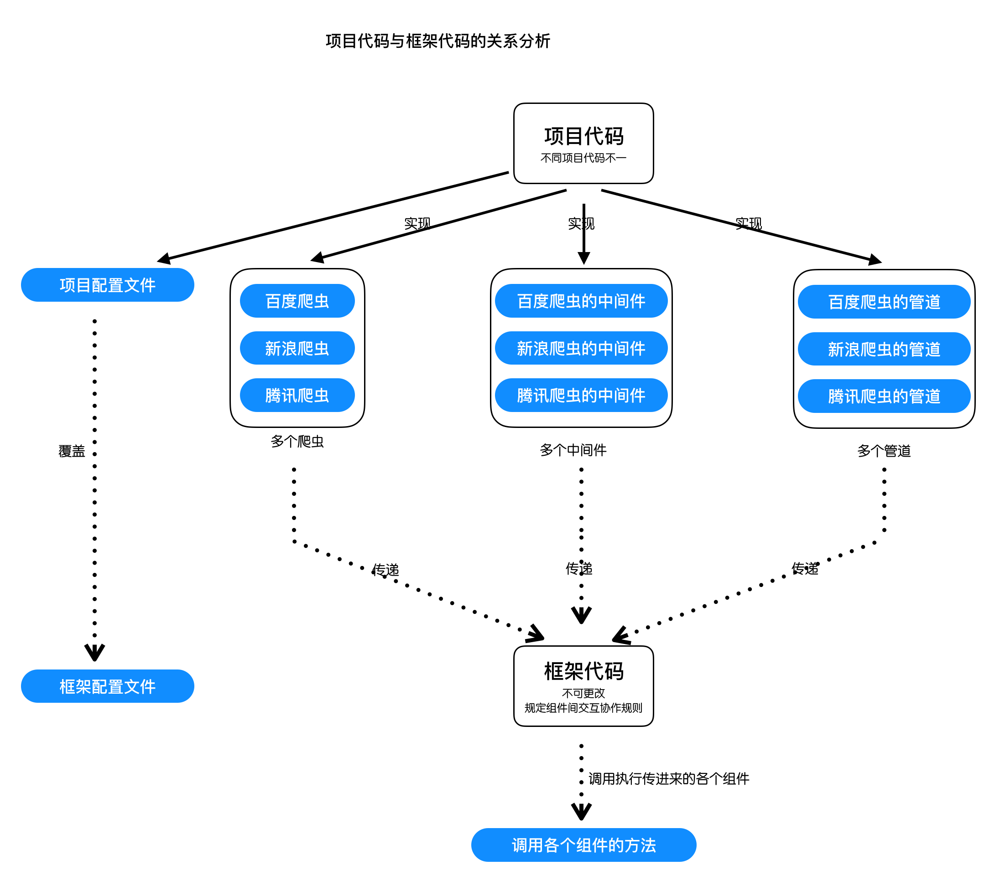

## 完善框架的基础功能

### 介绍
前面我们完成了框架的基本雏形，但是目前能够实现的功能非常简单，还达不到完成一个爬虫的基本需求，对应的需要在本节中对爬虫框架做进行进一步的完善

### 项目代码与框架代码完善分析

项目代码与框架代码的关系分析：

`项目`中除了实现main.py以外，还需要实现：
- 项目配置文件
- 爬虫文件
- 管道文件
- 中间件文件

`框架`中还需要实现：
- 框架配置文件，并且需要实现导入项目配置文件，同时覆盖默认配置文件的属性
- 支持多个爬虫的传入以及使用
- 支持多个管道的传入以及使用
- 支持多个中间件的传入以及使用

### 内容

1. 日志的使用
2. 配置文件的实现
3. 具备较高的通用性：尽可能多的使用多数爬虫场景
4. 具备较好的扩展性：自定义功能或者组件的新增和维护
5. 请求的去重
6. 异步实现

