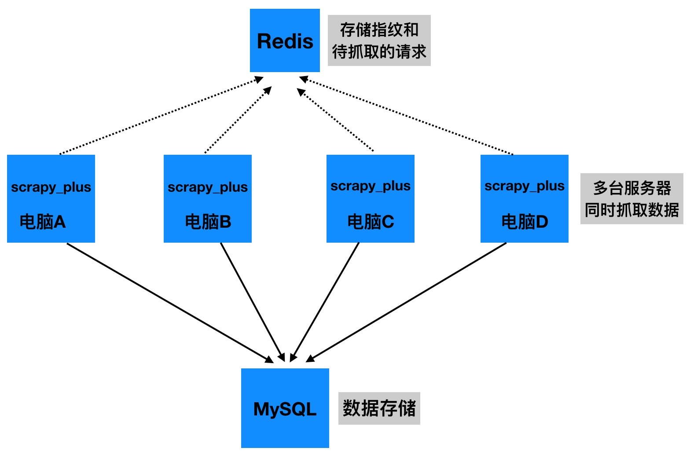

## 框架升级  --  分布式爬虫设计原理及其实现

##### 学习目标
1. 理解分布式爬虫的原理
2. 理解如何通过redis构建一个队列
3. 完成代理的重构，实现分布式

-----

### 1 分布式爬虫原理
分布式爬虫设计原理：

多台服务器同时抓取数据，请求和指纹存储在同一个redis中



### 2 实现方案

利用redis实现队列

1. 注意pickle模块的使用：如果将对象存入redis中，需要先将其序列化为二进制数据，取出后反序列化就可以再得到原始对象
2. 接口定义一致性：利用redis使用一个Queue，使其接口同python的内置队列接口一致，可以实现无缝转换

在scrapy_plus包下的utils中添加queue.py文件：（该文件网上找的修改成我们能用的）

```python
# scrapy_plus/utils/queue.py
import time
import pickle
import redis # 修改requirements.txt
from six.moves import queue as BaseQueue

# 导入redis配置
from scrapy_plus.conf.settings import REDIS_QUEUE_NAME, REDIS_HOST, REDIS_PORT, REDIS_DB


# 利用redis实现一个Queue，使其接口同python的内置队列接口一致，可以实现无缝转换
class Queue(object):
    """
    A Queue like message built over redis
    """
    Empty = BaseQueue.Empty
    Full = BaseQueue.Full
    max_timeout = 0.3

    def __init__(self, maxsize=0, name=REDIS_QUEUE_NAME, host=REDIS_HOST, port=REDIS_PORT, db=REDIS_DB,
                lazy_limit=True, password=None):
        """
        Constructor for RedisQueue
        maxsize:    an integer that sets the upperbound limit on the number of
                    items that can be placed in the queue.
        lazy_limit: redis queue is shared via instance, a lazy size limit is used
                    for better performance.
        """
        self.name = name
        self.redis = redis.StrictRedis(host=host, port=port, db=db, password=password)
        self.maxsize = maxsize
        self.lazy_limit = lazy_limit
        self.last_qsize = 0

    def qsize(self):
        self.last_qsize = self.redis.llen(self.name)
        return self.last_qsize

    def empty(self):
        if self.qsize() == 0:
            return True
        else:
            return False

    def full(self):
        if self.maxsize and self.qsize() >= self.maxsize:
            return True
        else:
            return False

    def put_nowait(self, obj):
        if self.lazy_limit and self.last_qsize < self.maxsize:
            pass
        elif self.full():
            raise self.Full
        self.last_qsize = self.redis.rpush(self.name, pickle.dumps(obj)) # pickle.dumps(obj)把对象转换为二进制
        return True

    def put(self, obj, block=True, timeout=None):
        if not block:
            return self.put_nowait(obj)

        start_time = time.time()
        while True:
            try:
                return self.put_nowait(obj)
            except self.Full:
                if timeout:
                    lasted = time.time() - start_time
                    if timeout > lasted:
                        time.sleep(min(self.max_timeout, timeout - lasted))
                    else:
                        raise
                else:
                    time.sleep(self.max_timeout)

    def get_nowait(self):
        ret = self.redis.lpop(self.name)
        if ret is None:
            raise self.Empty
        return pickle.loads(ret) # pickle.loads(ret)把二进制字符串转为对象 反序列化

    def get(self, block=True, timeout=None):
        if not block:
            return self.get_nowait()

        start_time = time.time()
        while True:
            try:
                return self.get_nowait()
            except self.Empty:
                if timeout:
                    lasted = time.time() - start_time
                    if timeout > lasted:
                        time.sleep(min(self.max_timeout, timeout - lasted))
                    else:
                        raise
                else:
                    time.sleep(self.max_timeout)
```

### 2 通过项目配置文件选择是否启用分布式
在scrapy_plus包的默认配置文件中添加

```python
# scrapy_plus/conf/default_settings.py
......
# 设置调度器的内容是否要持久化
# 量个值：True和False
# 如果是True，那么就是使用分布式，同时也是基于请求的增量式爬虫
# 如果是False, 不使用redis队列，会使用python的set存储指纹和请求
SCHEDULER_PERSIST = False

# redis默认配置,默认为本机的redis
REDIS_SET_NAME = 'scrapy_plus_fp_set' # fp集合
REDIS_QUEUE_NAME = 'scrapy_plus_request_queue' # request队列
REDIS_HOST = '127.0.0.1'
REDIS_PORT = 6379
REDIS_DB = 0
```

### 3 利用Redis的集合类型实现去重

如果分布式中请求去重的去重容器各个服务器用的不是同一个，那么就无法达到去重的目的，因此这里同样的需要使用redis来实现去重容器，也就是把所有的去重指纹都存储在redis中

在scrapy_plus/utils/set.py中，实现一个自定义的set：

```python
# scrapy_plus/utils/set.py
import redis
from scrapy_plus.conf import settings


class BaseFilterContainer(object):

    def add_fp(self, fp):
        '''往去重容器添加一个指纹'''
        pass

    def exists(self, fp):
        '''判断指纹是否在去重容器中'''
        pass

class NoramlFilterContainer(BaseFilterContainer):
    '''利用python的集合类型'''

    def __init__(self):
        self._filter_container = set()

    def add_fp(self, fp):
        ''''''
        self._filter_container.add(fp)

    def exists(self, fp):
        '''判断指纹是否在去重容器中'''
        if fp in self._filter_container:
            return True
        else:
            return False

class RedisFilterContainer(BaseFilterContainer):
    '''利用redis的指纹集合'''
    REDIS_SET_NAME = settings.REDIS_SET_NAME
    REDIS_SET_HOST = settings.REDIS_HOST
    REDIS_SET_PORT = settings.REDIS_PORT
    REDIS_SET_DB = settings.REDIS_DB

    def __init__(self):
        self._redis = redis.StrictRedis(host=self.REDIS_SET_HOST, port=self.REDIS_SET_PORT ,db=self.REDIS_SET_DB)
        self._name = self.REDIS_SET_NAME

    def add_fp(self, fp):
        '''往去重容器添加一个指纹'''
        self._redis.sadd(self._name, fp)

    def exists(self, fp):
        '''判断指纹是否在去重容器中'''
        return self._redis.sismember(self._name, fp) # 存在返回1 不存在返回0

```

修改scheduler.py，在调度器中使用这个`set.py`， 使得分布式模式下的去重功能正常运作

```python
# scrapy_plus/core/scheduler.py
......
# 此处新增
from scrapy_plus.utils.queue import Queue as ReidsQueue
from scrapy_plus.conf.settings import SCHEDULER_PERSIST
from scrapy_plus.utils.set import NoramlFilterContainer, RedisFilterContainer


class Scheduler():
    """
    缓存请求对象(Request)，并为下载器提供请求对象，实现请求的调度：
    对请求对象进行去重判断：实现去重方法_filter_request，该方法对内提供，因此设置为私有方法
    """
    # 此处修改
    def __init__(self, collector):
        if SCHEDULER_PERSIST: #如果使用分布式或者是持久化，使用redis的队列
            self.queue = ReidsQueue()
            self._filter_container = RedisFilterContainer() # 使用redis作为python的去重的容器
        else:
            self.queue = Queue()
            self._filter_container = NoramlFilterContainer() # 使用Python的set()集合
        self.repeate_request_num = 0  # 统计重复的数量
        # 在engine中阻塞的位置判断程序结束的条件：成功的响应数+重复的数量>=总的请求数量
        # self._filter_container = set() # 去重容器,是一个集合,存储已经发过的请求的特征 url

    ......

    def _filter_request(self, request):        
        """去重方法"""
        request.fp = self._gen_fp(request) # 给request对象增加一个fp指纹属性
        # if request.fp not in self._filter_container:
        # 此处修改
        if not self._filter_container.exists(request.fp):
            # 此处修改
            self._filter_container.add_fp(request.fp) # 向指纹容器集合添加一个指纹
            return True
        else:
            self.repeate_request_num += 1
            logger.info("发现重复的请求：<{} {}>".format(request.method, request.url))
            return False
```

##### 此时运行项目程序会出现异常：
> TypeError: put() missing 1 required positional argument: 'item'

解决：
1. 开启redis服务
2. 正确配置redis
3. 在项目的settings.py中设置SCHEDULER_PERSIST = True


### 5 程序结束的条件
在之前的单机版本的代码中，通过：总的响应+总的重复数>=总的请求来判断程序结束，但是在分布式的版本那种，每个服务器的请求数量和响应数量不在相同

因为每个服务器存入队列的请求，和成功发送的请求中间可能很多请求被其他的服务器发送了，导致数量不一致，所以可以把总的请求，总的响应，总的重复等信息记录在redis中，那么所有的服务端修改的数据的位置是同一个redis中的内容，所有的服务端判断退出的时候也是通过比较同一个redis中的这些数据来决定

此时，在utils中新建stats_collector.py文件，来实现对各种数量的统计，包括总的请求数量，总的响应数量，总的重复数量

为了保证在使用redis和未使用redis的情况下统计数量的方法相同，故封装了两个版本的StatsCollector对象，分别使用内存中的字典和redis来统计数量

```python
# scrapy_plus/utils/stats_collector.py

import redis
from scrapy_plus.conf.settings import REDIS_HOST, REDIS_PORT, REDIS_DB, FP_PERSIST, REDIS_SET_NAME


class NormalStatsCollector(object):
    def __init__(self, spider_names=[]):
        #存储请求数量的键
        self.request_nums_key = "_".join(spider_names) + "_request_nums"
        #存储响应数量的键
        self.response_nums_key = "_".join(spider_names) + "_response_nums"
        #存储重复请求的键
        self.repeat_request_nums_key = "_".join(spider_names) + "_repeat_request_nums"
        #存储start_request数量的键
        self.start_request_nums_key = "_".join(spider_names) + "_start_request_nums"

        #初始化收集数据的字典
        self.dict_collector = {
            self.request_nums_key :0,
            self.response_nums_key:0,
            self.repeat_request_nums_key:0,
            self.start_request_nums_key:0
        }

    def incr(self, key):
        self.dict_collector[key] +=1

    def get(self, key):
        return self.dict_collector[key]

    def clear(self):
        del self.dict_collector

    @property
    def request_nums(self):
        '''获取请求数量'''
        return self.get(self.request_nums_key)

    @property
    def response_nums(self):
        '''获取响应数量'''
        return self.get(self.response_nums_key)

    @property
    def repeat_request_nums(self):
        '''获取重复请求数量'''
        return self.get(self.repeat_request_nums_key)

    @property
    def start_request_nums(self):
        '''获取start_request数量'''
        return self.get(self.start_request_nums_key)


class ReidsStatsCollector(object):

    def __init__(self, spider_names=[],
                 host=REDIS_HOST, port=REDIS_PORT,
                 db=REDIS_DB, password=None):

        self.redis = redis.StrictRedis(host=host, port=port, db=db, password=password)
        #存储请求数量的键
        self.request_nums_key = "_".join(spider_names) + "_request_nums"
        #存储响应数量的键
        self.response_nums_key = "_".join(spider_names) + "_response_nums"
        #存储重复请求的键
        self.repeat_request_nums_key = "_".join(spider_names) + "_repeat_request_nums"
        #存储start_request数量的键
        self.start_request_nums_key = "_".join(spider_names) + "_start_request_nums"

    def incr(self, key):
        '''给键对应的值增加1，不存在会自动创建，并且值为1，'''
        self.redis.incr(key)

    def get(self, key):
        '''获取键对应的值，不存在是为0，存在则获取并转化为int类型'''
        ret = self.redis.get(key)
        if not ret:
            ret = 0
        else:
            ret = int(ret)
        return ret

    def clear(self):
        '''程序结束后清空所有的值'''
        self.redis.delete(self.request_nums_key, self.response_nums_key,
                          self.repeat_request_nums_key, self.start_request_nums_key)
        # 判断是否清空指纹集合
        if not FP_PERSIST: # not True 不持久化，就清空指纹集合
            self.redis.delete(REDIS_SET_NAME)

    @property
    def request_nums(self):
        '''获取请求数量'''
        return self.get(self.request_nums_key)

    @property
    def response_nums(self):
        '''获取响应数量'''
        return self.get(self.response_nums_key)

    @property
    def repeat_request_nums(self):
        '''获取重复请求数量'''
        return self.get(self.repeat_request_nums_key)

    @property
    def start_request_nums(self):
        '''获取start_request数量'''
        return self.get(self.start_request_nums_key)
```

##### 修改`scheduler.py`调度器代码

```python
# scrapy_plus/core/scheduler.py
......
class Scheduler():
    """
    缓存请求对象(Request)，并为下载器提供请求对象，实现请求的调度：
    对请求对象进行去重判断：实现去重方法_filter_request，该方法对内提供，因此设置为私有方法
    """
    def __init__(self, collector): # 此处修改

        if SCHEDULER_PERSIST: #如果使用分布式或者是持久化，使用redis的队列
            self.queue = ReidsQueue()
            self._filter_container = RedisFilterContainer() # 使用redis作为python的去重的容器
        else:
            self.queue = Queue()
            self._filter_container = NoramlFilterContainer()
        # 此处修改
        # self.repeate_request_num = 0  # 统计重复的数量
        self.collector = collector
    ......
    def _filter_request(self, request):
        """去重方法"""
        request.fp = self._gen_fp(request) # 给request对象增加一个fp指纹属性
        # if request.fp not in self._filter_container:
        if not self._filter_container.exists(request.fp):
            self._filter_container.add_fp(request.fp) # 向指纹容器集合添加一个指纹
            return True
        else:
            # 此处修改
            # self.repeate_request_num += 1
            self.collector.incr(self.collector.repeat_request_nums_key)
            logger.info("发现重复的请求：<{} {}>".format(request.method, request.url))
            return False
    ......
```

##### 修改`engine.py`

```python
# coding=utf-8
......
from scrapy_plus.utils.stats_collector import StatsCollector # 此处新增
from scrapy_plus.conf.settings import SCHEDULER_PERSIST

class Engine():
    
    def __init__(self):
        self.spiders = self._auto_import_instances(SPIDERS, isspider=True)
       if SCHEDULER_PERSIST:
            self.collector = ReidsStatsCollector()  #新增
        else:
            # self.total_request_nums = 0  # 修改
            # self.total_response_nums = 0 # 修改
            self.collector = NormalStatsCollector()  #新增
        self.scheduler = Scheduler(self.collector)
        
        self.downloader = Downloader()

        self.pipelines = self._auto_import_instances(PIPELINES)
        self.spider_mids = self._auto_import_instances(SPIDER_MIDDLEWARES)
        self.downloader_mids = self._auto_import_instances(DOWNLOADER_MIDDLEWARES)

        self.pool = Pool()
        self.is_running = False # 判断程序是否需要结束的标志

    ......

    # 此处修改--增加了更为详细的日志记录
    def start_engin(self):
        """启动引擎"""
        t_start = datetime.now()
        logger.info("爬虫开始启动：{}".format(t_start))
        logger.info("爬虫运行模式：{}".format(ASYNC_TYPE))
        logger.info("最大并发数：{}".format(MAX_ASYNC_THREAD_NUMBER))
        logger.info("启动的爬虫有：{}".format(list(self.spiders.keys())))
        logger.info("启动的下载中间件有：\n{}".format(DOWNLOADER_MIDDLEWARES))
        logger.info("启动的爬虫中间件有：\n{}".format(SPIDER_MIDDLEWARES))
        logger.info("启动的管道有：\n{}".format(PIPELINES))
        self._start_engine()
        t_end = datetime.now()
        logger.info("爬虫结束：{}".format(t_end))
        logger.info("耗时：%s" % (t_end - t_start).total_seconds())
        # logger.info("一共获取了请求：{}个".format(self.total_request_nums))
        # logger.info("重复的请求：{}个".format(self.scheduler.repeate_request_num))
        # logger.info("成功的请求：{}个".format(self.total_response_nums))
        logger.info("一共获取了请求：{}个".format(self.collector.request_nums))
        logger.info("重复的请求：{}个".format(self.collector.repeate_request_nums))
        logger.info("成功的请求：{}个".format(self.collector.response_nums))
        self.collector.clear() # 清除redis中所有的计数的值,但不清除指纹集合


    def _start_request(self):
        """单独处理爬虫模块中start_requests()产生的request对象"""
        ......
                # 改用collector进行数据的收集
                # self.total_request_nums += 1
                self.collector.incr(self.collector.request_nums_key)


    def _execute_request_response_item(self):
        """处理解析过程中产生的request对象"""
        ......

                    # 请求数+1
                    # self.total_request_nums += 1
                    # 改用collector进行数据的收集
                    self.collector.incr(self.collector.request_nums_key)

                # 如果不是，调用pipeline的process_item方法处理结果
                else:
                    # 就通过process_item()传递数据给管道
                    for pipeline in self.pipelines:
                        pipeline.process_item(result, spider)

        # 改用collector进行数据的收集
        # self.total_response_nums += 1
        self.collector.incr(self.collector.response_nums_key)

    ......
    
    def _start_engine(self):
        """具体实现引擎的逻辑"""
        self.is_running = True  # 启动引擎，设置状态为True
        # 处理strat_urls产生的request
        # self._start_request()
        self.pool.apply_async(self._start_request)  # 使用异步线程池中的线程执行指定的函数

        # 不断的处理解析过程中产生的request
        for i in range(MAX_ASYNC_THREAD_NUMBER): # 控制最大并发数
            self.pool.apply_async(self._execute_request_response_item, callback=self._call_back, error_callback=self._error_callback)

        # 控制判断程序何时中止
        while True:
            time.sleep(0.001) # 避免cpu空转,避免性能消耗

            # if self.total_response_nums != 0: # 因为异步，需要增加判断，响应数不能为0
            #     # 成功的响应数+重复的数量>=总的请求数量 程序结束
            #     if self.total_response_nums + self.scheduler.repeat_request_num >= self.total_request_nums:
            #         self.is_running = False
            #         break

            # 此处修改
            if self.collector.request_nums != 0: # 注意这个地方不能用response_nums作为判断标准了!
                if self.collector.response_nums+self.collector.repeat_request_nums >= self.collector.request_nums:
                    self.is_running = False
                    break

```

-----

### 小结
1. 了解分布式的实现原理
2. 了解在redis实现的队列中，put和put_nowait以及get和get_nowait的区别
3. 完成代码的重构，实现分布式

-----

### 本小结涉及修改的完整代码

scrapy_plus/conf/default_settings.py

```python
import logging

# 默认的日志配置
DEFAULT_LOG_LEVEL = logging.INFO    # 默认等级
DEFAULT_LOG_FMT = '%(asctime)s %(filename)s[line:%(lineno)d] \
                  %(levelname)s: %(message)s'   # 默认日志格式
DEFUALT_LOG_DATEFMT = '%Y-%m-%d %H:%M:%S'  # 默认时间格式
DEFAULT_LOG_FILENAME = 'log.log'    # 默认日志文件名称

# 启用的默认管道类
PIPELINES = []

# 启用的默认爬虫中间件类
SPIDER_MIDDLEWARES = []

# 启用的默认下载器中间件类
DOWNLOADER_MIDDLEWARES = []

# 默认异步线程最大并发数，此参数可以在项目的settings.py中重新设置自动覆盖
MAX_ASYNC_THREAD_NUMBER = 5

# 异步并发的方式 thread or coroutine 线程 或 协程
# 可以在项目的settings.py中重新设置该值，自动覆盖
ASYNC_TYPE = 'thread' # 默认为线程的方式

# 设置调度器的内容是否要持久化
# 量个值：True和False
# 如果是True，那么就是使用分布式，同时也是基于请求的增量式爬虫
# 如果是False, 不使用redis队列，会使用python的set存储指纹和请求
SCHEDULER_PERSIST = False

# redis默认配置,默认为本机的redis
REDIS_SET_NAME = 'scrapy_plus_fp_set' # fp集合
REDIS_QUEUE_NAME = 'scrapy_plus_request_queue' # request队列
REDIS_HOST = '127.0.0.1'
REDIS_PORT = 6379
REDIS_DB = 0
```

scrapy_plus/core/engine.py

```python
'''引擎组件'''
import time
import importlib
from datetime import datetime

from scrapy_plus.utils.log import logger
from scrapy_plus.conf.settings import SPIDERS, PIPELINES, SPIDER_MIDDLEWARES, DOWNLOADER_MIDDLEWARES, MAX_ASYNC_THREAD_NUMBER, ASYNC_TYPE

# 判断使用什么异步模式，改用对应的异步池
if ASYNC_TYPE == 'thread':
    from multiprocessing.dummy import Pool  # 导入线程池对象
elif ASYNC_TYPE == 'coroutine':
    from scrapy_plus.async.coroutine import Pool # 导入协程池对象
else:
    raise Exception("不支持的异步类型：{}, 只能是'thread'或者'coroutine'".format(ASYNC_TYPE))
# 注意：
# 由于打patch补丁是为了替换掉socket为非阻塞的
# 而下载器中正好使用了requests模块，如果在这之后导入协程池，会导致requests中使用的socket没有被替换成功
# 从而有可能导致使用出现问题
# 所以在导入并发池对象之后再导入框架的各种类对象
from scrapy_plus.http.request import Request
from scrapy_plus.core.scheduler import Scheduler
from scrapy_plus.core.downloader import Downloader
from scrapy_plus.utils.stats_collector import StatsCollector # 修改


class Engine(object):
    '''
    a. 对外提供整个的程序的入口
    b. 依次调用其他组件对外提供的接口，实现整个框架的运作(驱动)
    '''

    def __init__(self):
        self.spiders = self._auto_import_instances(SPIDERS,isspider=True)   # 接收爬虫字典
        # self.scheduler = Scheduler()    # 初始化调度器对象
        if SCHEDULER_PERSIST:
            self.collector = ReidsStatsCollector()  #新增
        else:
            self.collector = NormalStatsCollector()  #新增
        self.scheduler = Scheduler(self.collector)

        self.downloader = Downloader()    # 初始化下载器对象

        self.pipelines = self._auto_import_instances(PIPELINES) # 管道
        self.spider_mids = self._auto_import_instances(SPIDER_MIDDLEWARES) # 爬虫中间件
        self.downloader_mids = self._auto_import_instances(DOWNLOADER_MIDDLEWARES) # 下载中间件


        self.pool = Pool()
        self.is_running = False # 判断程序是否需要结束的标志

    def _auto_import_instances(self, path=[], isspider=False):
        '''通过配置文件，动态导入类并实例化
        path: 表示配置文件中配置的导入类的路径
        isspider: 由于爬虫需要返回的是一个字典，因此对其做对应的判断和处理
        '''
        instances = {} if isspider else []
        for p in path:
            module_name = p.rsplit(".", 1)[0]  # 取出模块名称
            cls_name = p.rsplit(".", 1)[1]  # 取出类名称
            ret = importlib.import_module(module_name)  # 动态导入爬虫模块
            cls = getattr(ret, cls_name)  # 根据类名称获取类对象

            if isspider:
                instances[cls.name] = cls()  # 组装成爬虫字典{spider_name:spider(),}
            else:
                instances.append(cls())  # 实例化类对象
                # 把管道中间件分别组装成 管道列表=[管道类1(),管道类2()] / 中间件列表 = [中间件类1(),中间件类2()]
        return instances  # 返回类对象字典或列表

    def start(self):
        '''启动整个引擎'''
        t_start = datetime.now()
        logger.info("爬虫开始启动：{}".format(t_start))
        logger.info("爬虫运行模式：{}".format(ASYNC_TYPE))
        logger.info("最大并发数：{}".format(MAX_ASYNC_THREAD_NUMBER))
        logger.info("启动的爬虫有：{}".format(list(self.spiders.keys())))
        logger.info("启动的下载中间件有：\n{}".format(DOWNLOADER_MIDDLEWARES))
        logger.info("启动的爬虫中间件有：\n{}".format(SPIDER_MIDDLEWARES))
        logger.info("启动的管道有：\n{}".format(PIPELINES))
        self._start_engine()
        t_end = datetime.now()
        logger.info("爬虫结束：{}".format(t_end))
        logger.info("耗时：%s" % (t_end - t_start).total_seconds())
        # logger.info("一共获取了请求：{}个".format(self.total_request_nums))
        # logger.info("重复的请求：{}个".format(self.scheduler.repeate_request_num))
        # logger.info("成功的请求：{}个".format(self.total_response_nums))
        logger.info("一共获取了请求：{}个".format(self.collector.request_nums))
        logger.info("重复的请求：{}个".format(self.collector.repeat_request_nums))
        logger.info("成功的请求：{}个".format(self.collector.response_nums))
        self.collector.clear() # 清除redis中所有的计数的值,但不清除指纹集合 # 修改

    def _start_request(self):
        """单独处理爬虫模块中start_requests()产生的request对象"""
        for spider_name, spider in self.spiders.items():
            for start_request in spider.start_requests():
                #1. 对start_request进过爬虫中间件进行处理
                for spider_mid in self.spider_mids:
                    start_request = spider_mid.process_request(start_request)

                # 为请求对象绑定它所属的爬虫的名称
                start_request.spider_name = spider_name

                #2. 调用调度器的add_request方法，添加request对象到调度器中
                self.scheduler.add_request(start_request)
                # 改用collector进行数据的收集
                # self.total_request_nums += 1
                self.collector.incr(self.collector.request_nums_key)

    def _execute_request_response_item(self):
        '''根据请求、发起请求获取响应、解析响应、处理响应结果'''
        #3. 调用调度器的get_request方法，获取request对象
        request = self.scheduler.get_request()
        if request is None: #如果没有获取到请求对象，直接返回
            return

        #request对象经过下载器中间件的process_request进行处理
        for downloader_mid in self.downloader_mids:
            request = downloader_mid.process_request(request)

        #4. 调用下载器的get_response方法，获取响应
        response = self.downloader.get_response(request)

        response.meta = request.meta

        #response对象经过下载器中间件的process_response进行处理
        for downloader_mid in self.downloader_mids:
            response = downloader_mid.process_response(response)

        #response对象经过下爬虫中间件的process_response进行处理
        for spider_mid in self.spider_mids:
            response = spider_mid.process_response(response)

        # 根据request的spider_name属性，获取对应的爬虫对象
        spider = self.spiders[request.spider_name]
        # parse方法
        parse = getattr(spider, request.parse)  # getattr(类, 类中方法名的字符串) = 类方法对象

        #5. 调用爬虫的parse方法，处理响应
        results = parse(response)
        # 增加一个判断！
        if results is not None: # 如果项目中爬虫的解析函数不返回可迭代对象就会报错
            for result in results:

                #6.判断结果的类型，如果是request，重新调用调度器的add_request方法
                if isinstance(result,Request):
                    #在解析函数得到request对象之后，使用process_request进行处理

                    for spider_mid in self.spider_mids:
                        result = spider_mid.process_request(result)

                    # 给request对象增加一个spider_name属性
                    result.spider_name = request.spider_name
                    # 将request对象添加到调度器队列中
                    self.scheduler.add_request(result)
                    # 请求数+1
                    # self.total_request_nums += 1
                    # 改用collector进行数据的收集
                    self.collector.incr(self.collector.request_nums_key)

                #7如果不是，调用pipeline的process_item方法处理结果
                else:
                    # 就通过process_item()传递数据给管道
                    for pipeline in self.pipelines:
                        pipeline.process_item(result, spider)

        # 改用collector进行数据的收集
        # self.total_response_nums += 1
        self.collector.incr(self.collector.response_nums_key)

    def _call_back(self, temp): # 这是异步线程池的callback参数指向的函数,temp参数为固定写法
        if self.is_running:
            self.pool.apply_async(self._execute_request_response_item, callback=self._call_back, error_callback=self._error_callback)

    def _error_callback(self, exception):
        """异常回调函数"""
        try:
            raise exception    # 抛出异常后，才能被日志进行完整记录下来
        except Exception as e:
            logger.exception(e)

    def _start_engine(self):
        '''
        具体的实现引擎的细节
        :return:
        '''
        self.is_running = True  # 启动引擎，设置状态为True
        # 处理strat_urls产生的request
        self.pool.apply_async(self._start_request, error_callback=self._error_callback)  # 使用异步线程池中的线程执行指定的函数

        # 不断的处理解析过程中产生的request
        for i in range(MAX_ASYNC_THREAD_NUMBER): # 控制最大并发数
            self.pool.apply_async(self._execute_request_response_item, callback=self._call_back, error_callback=self._error_callback)


        # 控制判断程序何时中止
        while True:
            time.sleep(0.001) # 避免cpu空转,避免性能消耗

            # if self.total_response_nums != 0: # 因为异步，需要增加判断，响应数不能为0
            #     # 成功的响应数+重复的数量>=总的请求数量 程序结束
            #     if self.total_response_nums + self.scheduler.repeat_request_num >= self.total_request_nums:
            #         self.is_running = False
            #         break

            if self.collector.request_nums != 0: # 注意这个地方不能用response_nums作为判断标准了!
                if self.collector.response_nums+self.collector.repeat_request_nums >= self.collector.request_nums:
                    self.is_running = False
                    break
```

scrapy_plus/core/scheduler.py

```python
'''调度器模块封住'''
from six.moves.queue import Queue # 兼容py2py3 修改requirements.txt文件
# from queue import Queue # py3

import six
import w3lib.url
from hashlib import sha1

from scrapy_plus.utils.log import logger

from scrapy_plus.utils.queue import Queue as ReidsQueue
from scrapy_plus.conf.settings import SCHEDULER_PERSIST
from scrapy_plus.utils.set import NoramlFilterContainer, RedisFilterContainer


class Scheduler():
    """
    缓存请求对象(Request)，并为下载器提供请求对象，实现请求的调度：
    对请求对象进行去重判断：实现去重方法_filter_request，该方法对内提供，因此设置为私有方法
    """
    def __init__(self, collector):
        # self.queue = Queue()
        if SCHEDULER_PERSIST: #如果使用分布式或者是持久化，使用redis的队列
            self.queue = ReidsQueue()
            self._filter_container = RedisFilterContainer()  # 使用redis作为python的去重的容器
        else:
            self.queue = Queue
            self._filter_container = NoramlFilterContainer()  # 使用Python的set()集合
        # self.repeat_request_num = 0  # 统计重复的数量
        self.collector = collector

    def add_request(self, request):
        # 添加请求对象,前提是指纹没有重复
        if self._filter_request(request):
            self.queue.put(request)

    def get_request(self):
        # 获取请求对象
        # return self.queue.get()
        try:
            request = self.queue.get(False) # 从队列获取请求对象设置为非阻塞，否则会造成程序无法退出
        except:
            return None
        else:
            return request

    def _filter_request(self, request):
        # 去重方法
        request.fp = self._gen_fp(request) # 给request对象增加一个fp指纹属性
        if not self._filter_container.exists(request.fp):
            self._filter_container.add_fp(request.fp) # 向指纹容器集合添加一个指纹
            return True
        else:
            # self.repeat_request_num += 1
            self.collector.incr(self.collector.repeat_request_nums_key)
            logger.info("发现重复的请求：<{} {}>".format(request.method, request.url))
            return False

    def _gen_fp(self, request):
        """生成并返回request对象的指纹
        用来判断请求是否重复的属性：url，method，params(在url中)，data
        为保持唯一性，需要对他们按照同样的排序规则进行排序
        """
        # 1. url排序：借助w3lib.url模块中的canonicalize_url方法
        url = w3lib.url.canonicalize_url(request.url)
        # 2. method不需要排序，只要保持大小写一致就可以 upper()方法全部转换为大写
        method = request.method.upper()
        # 3. data排序：如果有提供则是一个字典，如果没有则是空字典
        data = request.data if request.data is not None else {}
        data = sorted(data.items(), key=lambda x: x[0]) # 用sorted()方法 按data字典的key进行排序
        # items()返回元祖 key参数表示按什么进行排序 x表示data.items() x[0]表示元祖第一个值,也就是data的键

        # 4. 利用sha1计算获取指纹
        s1 = sha1()
        s1.update(self._to_bytes(url)) # sha1计算的对象必须是字节类型
        s1.update(self._to_bytes(method))
        s1.update(self._to_bytes(str(data)))

        fp = s1.hexdigest()
        return fp

    def _to_bytes(self, string):
        """为了兼容py2和py3，利用_to_bytes方法，把所有的字符串转化为字节类型"""
        if six.PY2:
            if isinstance(string, str):
                return string
            else: # 如果是python2的unicode类型，转化为字节类型
                return string.encode('utf-8')
        elif six.PY3:
            if isinstance(string, str):  # 如果是python3的str类型，转化为字节类型
                return string.encode("utf-8")
            else:
                return string
```

scrapy_plus/utils/queue.py

```python
import time
import pickle
import redis # 修改requirements.txt
from six.moves import queue as BaseQueue

# 导入redis配置
from scrapy_plus.conf.settings import REDIS_QUEUE_NAME, REDIS_HOST, REDIS_PORT, REDIS_DB


# 利用redis实现一个Queue，使其接口同python的内置队列接口一致，可以实现无缝转换
class Queue(object):
    """
    A Queue like message built over redis
    """
    Empty = BaseQueue.Empty
    Full = BaseQueue.Full
    max_timeout = 0.3

    def __init__(self, maxsize=0, name=REDIS_QUEUE_NAME, host=REDIS_HOST, port=REDIS_PORT, db=REDIS_DB,
                lazy_limit=True, password=None):
        """
        Constructor for RedisQueue
        maxsize:    an integer that sets the upperbound limit on the number of
                    items that can be placed in the queue.
        lazy_limit: redis queue is shared via instance, a lazy size limit is used
                    for better performance.
        """
        self.name = name
        self.redis = redis.StrictRedis(host=host, port=port, db=db, password=password)
        self.maxsize = maxsize
        self.lazy_limit = lazy_limit
        self.last_qsize = 0

    def qsize(self):
        self.last_qsize = self.redis.llen(self.name)
        return self.last_qsize

    def empty(self):
        if self.qsize() == 0:
            return True
        else:
            return False

    def full(self):
        if self.maxsize and self.qsize() >= self.maxsize:
            return True
        else:
            return False

    def put_nowait(self, obj):
        if self.lazy_limit and self.last_qsize < self.maxsize:
            pass
        elif self.full():
            raise self.Full
        self.last_qsize = self.redis.rpush(self.name, pickle.dumps(obj)) # pickle.dumps(obj)把对象转换为二进制
        return True

    def put(self, obj, block=True, timeout=None):
        if not block:
            return self.put_nowait(obj)

        start_time = time.time()
        while True:
            try:
                return self.put_nowait(obj)
            except self.Full:
                if timeout:
                    lasted = time.time() - start_time
                    if timeout > lasted:
                        time.sleep(min(self.max_timeout, timeout - lasted))
                    else:
                        raise
                else:
                    time.sleep(self.max_timeout)

    def get_nowait(self):
        ret = self.redis.lpop(self.name)
        if ret is None:
            raise self.Empty
        return pickle.loads(ret) # pickle.loads(ret)把二进制字符串转为对象 反序列化

    def get(self, block=True, timeout=None):
        if not block:
            return self.get_nowait()

        start_time = time.time()
        while True:
            try:
                return self.get_nowait()
            except self.Empty:
                if timeout:
                    lasted = time.time() - start_time
                    if timeout > lasted:
                        time.sleep(min(self.max_timeout, timeout - lasted))
                    else:
                        raise
                else:
                    time.sleep(self.max_timeout)
```

scrapy_plus/utils/set.py

```python
import redis
from scrapy_plus.conf import settings


class BaseFilterContainer(object):

    def add_fp(self, fp):
        '''往去重容器添加一个指纹'''
        pass

    def exists(self, fp):
        '''判断指纹是否在去重容器中'''
        pass

class NoramlFilterContainer(BaseFilterContainer):
    '''利用python的集合类型'''

    def __init__(self):
        self._filter_container = set()

    def add_fp(self, fp):
        ''''''
        self._filter_container.add(fp)

    def exists(self, fp):
        '''判断指纹是否在去重容器中'''
        if fp in self._filter_container:
            return True
        else:
            return False

class RedisFilterContainer(BaseFilterContainer):
    '''利用redis的指纹集合'''
    REDIS_SET_NAME = settings.REDIS_SET_NAME
    REDIS_SET_HOST = settings.REDIS_HOST
    REDIS_SET_PORT = settings.REDIS_PORT
    REDIS_SET_DB = settings.REDIS_DB

    def __init__(self):
        self._redis = redis.StrictRedis(host=self.REDIS_SET_HOST, port=self.REDIS_SET_PORT ,db=self.REDIS_SET_DB)
        self._name = self.REDIS_SET_NAME

    def add_fp(self, fp):
        '''往去重容器添加一个指纹'''
        self._redis.sadd(self._name, fp)

    def exists(self, fp):
        '''判断指纹是否在去重容器中'''
        return self._redis.sismember(self._name, fp) # 存在返回1 不存在返回0
```

scrapy_plus/stats_collector.py

```python
import redis
from scrapy_plus.conf.settings import REDIS_HOST, REDIS_PORT, REDIS_DB


class StatsCollector(object):
    """对各种数量的统计，包括总的请求数量，总的响应数量，总的重复数量"""
    def __init__(self, spider_names=[], host=REDIS_HOST,
                 port=REDIS_PORT, db=REDIS_DB, password=None):

        self.redis = redis.StrictRedis(host=host, port=port, db=db, password=password)
        #存储请求数量的键
        self.request_nums_key = "_".join(spider_names) + "_request_nums"
        #存储响应数量的键
        self.response_nums_key = "_".join(spider_names) + "_response_nums"
        #存储重复请求的键
        self.repeat_request_nums_key = "_".join(spider_names) + "_repeat_request_nums"
        #存储start_request数量的键
        self.start_request_nums_key = "_".join(spider_names) + "_start_request_nums"

    def incr(self, key):
        '''给键对应的值增加1，不存在会自动创建，并且值为1，'''
        self.redis.incr(key)

    def get(self, key):
        '''获取键对应的值，不存在是为0，存在则获取并转化为int类型'''
        ret = self.redis.get(key)
        if not ret:
            ret = 0
        else:
            ret = int(ret)
        return ret

    def clear(self):
        '''程序结束后清空所有的值'''
        self.redis.delete(self.request_nums_key, self.response_nums_key,
                          self.repeat_request_nums_key, self.start_request_nums_key)

    @property
    def request_nums(self):
        '''获取请求数量'''
        return self.get(self.request_nums_key)

    @property
    def response_nums(self):
        '''获取响应数量'''
        return self.get(self.response_nums_key)

    @property
    def repeat_request_nums(self):
        '''获取重复请求数量'''
        return self.get(self.repeat_request_nums_key)

    @property
    def start_request_nums(self):
        '''获取start_request数量'''
        return self.get(self.start_request_nums_key)
```


项目路径/settings.py

```python
# 修改默认日志文件名称
DEFAULT_LOG_FILENAME = '日志.log'    # 默认日志文件名称

# 启用的爬虫类
SPIDERS = [
    'spiders.baidu.BaiduSpider',
    'spiders.douban.DoubanSpider'
]

# 启用的管道类
PIPELINES = [
    'pipelines.BaiduPipeline',
    'pipelines.DoubanPipeline'
]

# 启用的爬虫中间件类
SPIDER_MIDDLEWARES = []

# 启用的下载器中间件类
DOWNLOADER_MIDDLEWARES = []

SCHEDULER_PERSIST = True

ASYNC_TYPE = 'coroutine' # 默认为线程的方式
```

