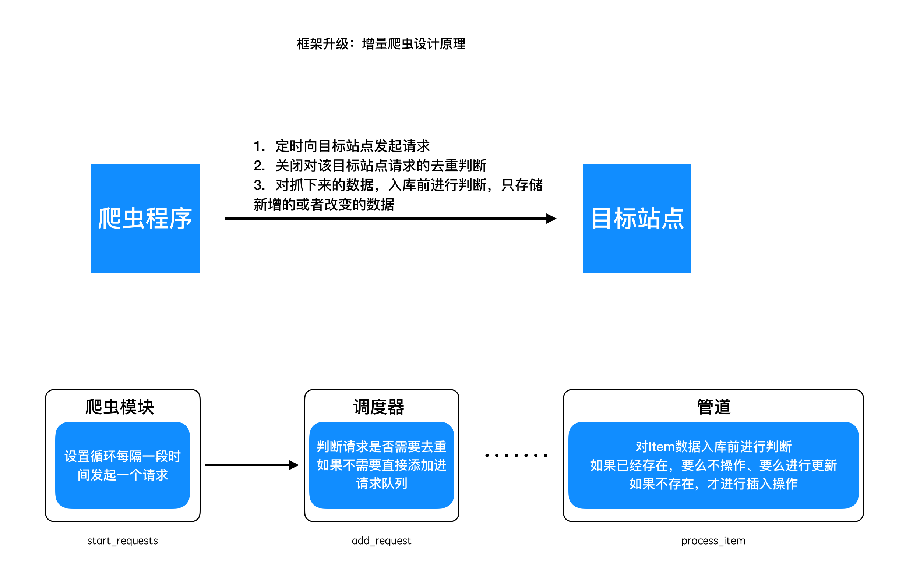

## 框架升级  --  增量爬虫设计原理及其实现

##### 学习目标
1. 理解增量式爬虫的原理
2. 完成增量式爬虫的实现

----

### 1 增量爬虫设计原理

增量抓取，意即针对某个站点的数据抓取，当网站的新增数据或者该站点的数据发生了变化后，自动地抓取它新增的或者变化后的数据

设计原理：



### 2 实现关闭请求去重

##### 2.1 为Request对象增加属性filter

```python
# scrapy/http/reqeust.py
class Request():
    """
    框架内封装的request对象
    """
    def __init__(self, url, method='GET', headers=None, params=None,
                 data=None, parse='parse', meta={}, filter=True): # 此处修改
        ......
        # 此处新增
        self.filter = filter  # 是否进行去重，默认是True 表示去重!
```

##### 2.2 修改调度器，进行判断

```python
# scrapy_plus/core/scheduler.py
class Scheduler(object):

    ......

    # 此处修改
    def add_request(self,request):
        '''
        实现添加request到队列中
        :param request: 请求对象
        :return: None
        '''
        #判断请求是否需要进行去重，如果不需要，直接添加到队列
        if not request.filter:#不需要去重
            request.fp = self._gen_fp(request)
            self.queue.put(request)
            logger.info("添加不去重的请求<{} {}>".format(request.method,request.url))
            return  #必须return

        if self._filter_request(request):
            self.queue.put(request)

    ......

```

##### 2.3 修改项目中代码

```python
# project/spiders/baidu.py
......
class BaiduSpider(Spider):

    name = 'baidu'
    start_urls = ['http://www.baidu.com']

    total = 0

    def parse(self, response):
        self.total += 1
        if self.total > 10:
            return
        yield Request(self.start_urls[0], filter=False, parse='parse')
```

```
# project/settings.py
......
# 启用的爬虫类
SPIDERS = [
    'spiders.baidu.BaiduSpider',
    # 'spiders.douban.DoubanSpider'
]
......
```

### 3 实现无限发起请求:

##### 3.1 修改scrapy_plus/core/spider.py
添加一个timed_task属性

```python
# scrapy_plus/core/spider.py
......
class Spider():
    """
    构建请求信息(初始的)，也就是生成请求对象(Request)
    解析响应对象，返回数据对象(Item)或者新的请求对象(Request)
    """
    name = ''
    start_urls = [] # 默认初始请求地址

    # 定时爬虫标识
    # 默认为false,表示不是定时爬虫
    timed_task = False
    ......
```

##### 3.2 修改引擎代码
修改处理初始urls的_start_request函数

- 但由于框架调用start_requests方法是同步的，如果设置为死循环后，那么启动后其他的爬虫的start_requests方法就不会被调用，因此需要在调用每个爬虫的start_reqeusts时设置为异步的

修改引擎的逻辑函数_start_engine的退出逻辑

- 把所有爬虫的timed_task组成一个列表并sum()求和，等于0就表示都是False，没有定时任务
- 如果不等于0就表示有定时任务，此时引擎一直执行

```python
scrapy_plus/core/engine.py
    ......
    # 此处修改
    def _start_request(self):
        """单独处理爬虫模块中start_requests()产生的request对象"""
        def _func(spider_name, spider):
            for start_request in spider.start_requests():
                #1. 对start_request进过爬虫中间件进行处理
                for spider_mid in self.spider_mids:
                    start_request = spider_mid.process_request(start_request)
                # 为请求对象绑定它所属的爬虫的名称
                start_request.spider_name = spider_name
                #2. 调用调度器的add_request方法，添加request对象到调度器中
                self.scheduler.add_request(start_request)
                self.collector.incr(self.collector.request_nums_key)
        for spider_name, spider in self.spiders.items():
            # 把执行每个爬虫的start_requests方法，设置为异步的
            self.pool.apply_async(_func, args=(spider_name, spider), error_callback=self._error_callback) 
    ......
    def _start_engine(self):
        '''
        具体的实现引擎的细节
        :return:
        '''
        self.is_running = True  # 启动引擎，设置状态为True
        # 处理strat_urls产生的request
        self.pool.apply_async(self._start_request, error_callback=self._error_callback)  # 使用异步线程池中的线程执行指定的函数

        # 不断的处理解析过程中产生的request
        for i in range(MAX_ASYNC_THREAD_NUMBER): # 控制最大并发数
            self.pool.apply_async(self._execute_request_response_item, callback=self._call_back, error_callback=self._error_callback)

        # 此处修改
        timed_task_sum = sum([spider.timed_task for spider in self.spiders.values()])  # 对[False,True]求和
        start_urls_nums = sum([len(spider.start_urls) for spider in self.spiders.values()])
        # 控制判断程序何时中止
        while True:
            time.sleep(1) # 避免cpu空转,避免性能消耗
            # 有定时爬虫时,一直不退出程序; 没有定时增量爬虫,才判断是否退出!
            if self.collector.request_nums+self.collector.repeat_request_nums >= start_urls_nums and timed_task_sum == 0:
                if self.collector.response_nums+self.collector.repeat_request_nums >= self.collector.request_nums:
                    self.is_running = False
                    break
```


##### 3.3 项目代码中新增一个baidu2.py爬虫，在start_reqeusts中改成无限循环，并设置对应请求为非去重模式。（注意filter参数）

```Python
# project/spiders/baidu2.py
import time
from scrapy_plus.core.spider import Spider
from scrapy_plus.http.request import Request

class Baidu2Spider(Spider):
    name = 'baidu2_spider'
    start_urls = ['https://www.baidu.com']
    timed_task = True # 表示 这是一个定时爬虫

    def start_requests(self):
        while True:
            for url in self.start_urls:
                yield Request(url, parse='parse', filter=False) # 注意这个parse接收的是字符串
                time.sleep(6)  # 定时发起请求，此时程序不会停止！

    def parse(self, response):
        print(response.body)
        yield response.body # 一定要写yield
```

##### 3.4 并在项目的settings.py中添加baidu2爬虫

```python
# project/settings.py
......
# 启用的爬虫类
SPIDERS = [
    'spiders.baidu.BaiduSpider',
    'spiders.baidu2.Baidu2Spider',
]
......
```

-----

### 小结
1. 理解增量式爬虫的内涵
2. 理解增量式爬虫的具体实现方法

-----

### 本小结涉及修改的完整代码

scrapy_plus/core/engine.py

```python
'''引擎组件'''
import time
import importlib
from datetime import datetime

from scrapy_plus.utils.log import logger
from scrapy_plus.conf.settings import SPIDERS, PIPELINES, SPIDER_MIDDLEWARES, DOWNLOADER_MIDDLEWARES, MAX_ASYNC_THREAD_NUMBER, ASYNC_TYPE

# 判断使用什么异步模式，改用对应的异步池
if ASYNC_TYPE == 'thread':
    from multiprocessing.dummy import Pool  # 导入线程池对象
elif ASYNC_TYPE == 'coroutine':
    from scrapy_plus.async.coroutine import Pool # 导入协程池对象
else:
    raise Exception("不支持的异步类型：{}, 只能是'thread'或者'coroutine'".format(ASYNC_TYPE))
# 注意：
# 由于打patch补丁是为了替换掉socket为非阻塞的
# 而下载器中正好使用了requests模块，如果在这之后导入协程池，会导致requests中使用的socket没有被替换成功
# 从而有可能导致使用出现问题
# 所以在导入并发池对象之后再导入框架的各种类对象
from scrapy_plus.http.request import Request
from scrapy_plus.core.scheduler import Scheduler
from scrapy_plus.core.downloader import Downloader
from scrapy_plus.utils.stats_collector import StatsCollector


class Engine(object):
    '''
    a. 对外提供整个的程序的入口
    b. 依次调用其他组件对外提供的接口，实现整个框架的运作(驱动)
    '''

    def __init__(self):
        self.spiders = self._auto_import_instances(SPIDERS,isspider=True)   # 接收爬虫字典
        # self.scheduler = Scheduler()    # 初始化调度器对象
         if SCHEDULER_PERSIST:
            self.collector = ReidsStatsCollector()  #新增
        else:
            # self.total_request_nums = 0  # 修改
            # self.total_response_nums = 0 # 修改
            self.collector = NormalStatsCollector()  #新增
        self.scheduler = Scheduler(self.collector)

        self.downloader = Downloader()    # 初始化下载器对象

        self.pipelines = self._auto_import_instances(PIPELINES) # 管道
        self.spider_mids = self._auto_import_instances(SPIDER_MIDDLEWARES) # 爬虫中间件
        self.downloader_mids = self._auto_import_instances(DOWNLOADER_MIDDLEWARES) # 下载中间件

        self.pool = Pool()
        self.is_running = False # 判断程序是否需要结束的标志

    def _auto_import_instances(self, path=[], isspider=False):
        '''通过配置文件，动态导入类并实例化
        path: 表示配置文件中配置的导入类的路径
        isspider: 由于爬虫需要返回的是一个字典，因此对其做对应的判断和处理
        '''
        instances = {} if isspider else []
        for p in path:
            module_name = p.rsplit(".", 1)[0]  # 取出模块名称
            cls_name = p.rsplit(".", 1)[1]  # 取出类名称
            ret = importlib.import_module(module_name)  # 动态导入爬虫模块
            cls = getattr(ret, cls_name)  # 根据类名称获取类对象

            if isspider:
                instances[cls.name] = cls()  # 组装成爬虫字典{spider_name:spider(),}
            else:
                instances.append(cls())  # 实例化类对象
                # 把管道中间件分别组装成 管道列表=[管道类1(),管道类2()] / 中间件列表 = [中间件类1(),中间件类2()]
        return instances  # 返回类对象字典或列表

    def start(self):
        '''启动整个引擎'''
        t_start = datetime.now()
        logger.info("爬虫开始启动：{}".format(t_start))
        logger.info("爬虫运行模式：{}".format(ASYNC_TYPE))
        logger.info("最大并发数：{}".format(MAX_ASYNC_THREAD_NUMBER))
        logger.info("启动的爬虫有：{}".format(list(self.spiders.keys())))
        logger.info("启动的下载中间件有：\n{}".format(DOWNLOADER_MIDDLEWARES))
        logger.info("启动的爬虫中间件有：\n{}".format(SPIDER_MIDDLEWARES))
        logger.info("启动的管道有：\n{}".format(PIPELINES))
        self._start_engine()
        t_end = datetime.now()
        logger.info("爬虫结束：{}".format(t_end))
        logger.info("耗时：%s" % (t_end - t_start).total_seconds())
        # logger.info("一共获取了请求：{}个".format(self.total_request_nums))
        # logger.info("重复的请求：{}个".format(self.scheduler.repeate_request_num))
        # logger.info("成功的请求：{}个".format(self.total_response_nums))
        logger.info("一共获取了请求：{}个".format(self.collector.request_nums))
        logger.info("重复的请求：{}个".format(self.collector.repeat_request_nums))
        logger.info("成功的请求：{}个".format(self.collector.response_nums))
        self.collector.clear() # 清除redis中所有的计数的值,但不清除指纹集合 # 修改

    def _start_request(self):
        """单独处理爬虫模块中start_requests()产生的request对象"""
        def _func(spider_name, spider):
            for start_request in spider.start_requests():
                #1. 对start_request进过爬虫中间件进行处理
                for spider_mid in self.spider_mids:
                    start_request = spider_mid.process_request(start_request)
                # 为请求对象绑定它所属的爬虫的名称
                start_request.spider_name = spider_name
                #2. 调用调度器的add_request方法，添加request对象到调度器中
                self.scheduler.add_request(start_request)
                # 改用collector进行数据的收集
                # self.total_request_nums += 1
                self.collector.incr(self.collector.request_nums_key)
        for spider_name, spider in self.spiders.items():
            # 把执行每个爬虫的start_requests方法，设置为异步的
            self.pool.apply_async(_func, args=(spider_name, spider), error_callback=self._error_callback)

    def _execute_request_response_item(self):
        '''根据请求、发起请求获取响应、解析响应、处理响应结果'''
        #3. 调用调度器的get_request方法，获取request对象
        request = self.scheduler.get_request()
        if request is None: #如果没有获取到请求对象，直接返回
            return

        #request对象经过下载器中间件的process_request进行处理
        for downloader_mid in self.downloader_mids:
            request = downloader_mid.process_request(request)

        #4. 调用下载器的get_response方法，获取响应
        response = self.downloader.get_response(request)

        response.meta = request.meta

        #response对象经过下载器中间件的process_response进行处理
        for downloader_mid in self.downloader_mids:
            response = downloader_mid.process_response(response)

        #response对象经过下爬虫中间件的process_response进行处理
        for spider_mid in self.spider_mids:
            response = spider_mid.process_response(response)

        # 根据request的spider_name属性，获取对应的爬虫对象
        spider = self.spiders[request.spider_name]
        # parse方法
        parse = getattr(spider, request.parse)  # getattr(类, 类中方法名的字符串) = 类方法对象

        #5. 调用爬虫的parse方法，处理响应
        results = parse(response)
        # 增加一个判断！
        if results is not None: # 如果项目中爬虫的解析函数不返回可迭代对象就会报错
            for result in results:

                #6.判断结果的类型，如果是request，重新调用调度器的add_request方法
                if isinstance(result,Request):
                    #在解析函数得到request对象之后，使用process_request进行处理

                    for spider_mid in self.spider_mids:
                        result = spider_mid.process_request(result)

                    # 给request对象增加一个spider_name属性
                    result.spider_name = request.spider_name
                    # 将request对象添加到调度器队列中
                    self.scheduler.add_request(result)
                    # 请求数+1
                    # self.total_request_nums += 1
                    # 改用collector进行数据的收集
                    self.collector.incr(self.collector.request_nums_key)

                #7如果不是，调用pipeline的process_item方法处理结果
                else:
                    # 就通过process_item()传递数据给管道
                    for pipeline in self.pipelines:
                        pipeline.process_item(result, spider)

        # 改用collector进行数据的收集
        # self.total_response_nums += 1
        self.collector.incr(self.collector.response_nums_key)

    def _call_back(self, temp): # 这是异步线程池的callback参数指向的函数,temp参数为固定写法
        if self.is_running:
            self.pool.apply_async(self._execute_request_response_item, callback=self._call_back, error_callback=self._error_callback)

    def _error_callback(self, exception):
        """异常回调函数"""
        try:
            raise exception    # 抛出异常后，才能被日志进行完整记录下来
        except Exception as e:
            logger.exception(e)

    def _start_engine(self):
        '''
        具体的实现引擎的细节
        :return:
        '''
        self.is_running = True  # 启动引擎，设置状态为True
        # 处理strat_urls产生的request
        self.pool.apply_async(self._start_request, error_callback=self._error_callback)  # 使用异步线程池中的线程执行指定的函数

        # 不断的处理解析过程中产生的request
        for i in range(MAX_ASYNC_THREAD_NUMBER): # 控制最大并发数
            self.pool.apply_async(self._execute_request_response_item, callback=self._call_back, error_callback=self._error_callback)

        timed_task_sum = sum([spider.timed_task for spider in self.spiders.values()])  # 对[False,True]求和
        start_urls_nums = sum([len(spider.start_urls) for spider in self.spiders.values()])
        # 控制判断程序何时中止
        while True:
            time.sleep(1) # 避免cpu空转,避免性能消耗

            # 有定时爬虫时,一直不退出程序; 没有定时增量爬虫,才判断是否退出!
            if self.collector.request_nums+self.collector.repeat_request_nums >= start_urls_nums and timed_task_sum == 0:
                if self.collector.response_nums+self.collector.repeat_request_nums >= self.collector.request_nums:
                    self.is_running = False
                    break
```

scrapy_plus/core/scheduler.py

```python
'''调度器模块封住'''
from six.moves.queue import Queue # 兼容py2py3 修改requirements.txt文件
# from queue import Queue # py3

import six
import w3lib.url
from hashlib import sha1

from scrapy_plus.utils.log import logger

from scrapy_plus.utils.queue import Queue as ReidsQueue
from scrapy_plus.conf.settings import SCHEDULER_PERSIST
from scrapy_plus.utils.set import NoramlFilterContainer, RedisFilterContainer


class Scheduler():
    """
    缓存请求对象(Request)，并为下载器提供请求对象，实现请求的调度：
    对请求对象进行去重判断：实现去重方法_filter_request，该方法对内提供，因此设置为私有方法
    """
    def __init__(self, collector):
        # self.queue = Queue()
        if SCHEDULER_PERSIST: #如果使用分布式或者是持久化，使用redis的队列
            self.queue = ReidsQueue()
            self._filter_container = RedisFilterContainer()  # 使用redis作为python的去重的容器
        else:
            self.queue = Queue
            self._filter_container = NoramlFilterContainer()  # 使用Python的set()集合
        # self.repeat_request_num = 0  # 统计重复的数量
        self.collector = collector

    def add_request(self, request):
        # 添加请求对象,前提是指纹没有重复
        #判断请求是否需要进行去重，如果不需要，直接添加到队列
        if not request.filter:#不需要去重
            request.fp = self._gen_fp(request)
            self.queue.put(request)
            logger.info("添加不去重的请求<{} {}>".format(request.method,request.url))
            return  #必须return

        if self._filter_request(request):
            self.queue.put(request)

    def get_request(self):
        # 获取请求对象
        # return self.queue.get()
        try:
            request = self.queue.get(False) # 从队列获取请求对象设置为非阻塞，否则会造成程序无法退出
        except:
            return None
        else:
            return request

    def _filter_request(self, request):
        # 去重方法
        request.fp = self._gen_fp(request) # 给request对象增加一个fp指纹属性
        if not self._filter_container.exists(request.fp):
            self._filter_container.add_fp(request.fp) # 向指纹容器集合添加一个指纹
            return True
        else:
            # self.repeat_request_num += 1
            self.collector.incr(self.collector.repeat_request_nums_key)
            logger.info("发现重复的请求：<{} {}>".format(request.method, request.url))
            return False

    def _gen_fp(self, request):
        """生成并返回request对象的指纹
        用来判断请求是否重复的属性：url，method，params(在url中)，data
        为保持唯一性，需要对他们按照同样的排序规则进行排序
        """
        # 1. url排序：借助w3lib.url模块中的canonicalize_url方法
        url = w3lib.url.canonicalize_url(request.url)
        # 2. method不需要排序，只要保持大小写一致就可以 upper()方法全部转换为大写
        method = request.method.upper()
        # 3. data排序：如果有提供则是一个字典，如果没有则是空字典
        data = request.data if request.data is not None else {}
        data = sorted(data.items(), key=lambda x: x[0]) # 用sorted()方法 按data字典的key进行排序
        # items()返回元祖 key参数表示按什么进行排序 x表示data.items() x[0]表示元祖第一个值,也就是data的键

        # 4. 利用sha1计算获取指纹
        s1 = sha1()
        s1.update(self._to_bytes(url)) # sha1计算的对象必须是字节类型
        s1.update(self._to_bytes(method))
        s1.update(self._to_bytes(str(data)))

        fp = s1.hexdigest()
        return fp

    def _to_bytes(self, string):
        """为了兼容py2和py3，利用_to_bytes方法，把所有的字符串转化为字节类型"""
        if six.PY2:
            if isinstance(string, str):
                return string
            else: # 如果是python2的unicode类型，转化为字节类型
                return string.encode('utf-8')
        elif six.PY3:
            if isinstance(string, str):  # 如果是python3的str类型，转化为字节类型
                return string.encode("utf-8")
            else:
                return string
```

scrapy_plus/core/spider.py

```python
'''爬虫组件封装'''
from scrapy_plus.item import Item    # 导入Item对象
from scrapy_plus.http.request import Request    # 导入Request对象


class Spider(object):
    '''
    1. 构建请求信息(初始的)，也就是生成请求对象(Request)
    2. 解析响应对象，返回数据对象(Item)或者新的请求对象(Request)
    '''
    name = ''
    start_urls = []

    # 定时爬虫标识
    # 默认为false,表示不是定时爬虫
    timed_task = False

    # 利用生成器方式实现，提高程序的资源消耗
    def start_requests(self):
        '''构建初始请求对象并返回'''
        for url in self.start_urls:
            yield Request(url)

    def parse(self, response):
        '''解析请求
        并返回新的请求对象、或者数据对象
        返回值应当是一个容器，如start_requests返回值方法一样，改为生成器即可
        '''
        yield Item(response.body)   # 返回item对象 改为生成器即可
```

scrapy_plus/http/request.py

```python
'''封装Request对象'''

class Request(object):
    '''框架内置请求对象，设置请求信息'''

    def __init__(self, url, method='GET',
                 headers=None, params=None, data=None,
                 parse='parse', meta={}, filter=True):
        self.url = url    # 请求地址
        self.method = method    # 请求方法
        self.headers = headers    # 请求头
        self.params = params    # 请求参数
        self.data = data    # 请求体

        self.parse = parse    # 指明它的解析函数, 默认是parse方法
        self.meta = meta

        self.filter = filter  # 是否进行去重，默认是True 表示去重!
```

项目路径/settings.py

```python
# 修改默认日志文件名称
DEFAULT_LOG_FILENAME = '日志.log'    # 默认日志文件名称

# 启用的爬虫类
SPIDERS = [
    'spiders.baidu.BaiduSpider',
    'spiders.baidu2.Baidu2Spider',
    # 'spiders.douban.DoubanSpider',
]

# 启用的管道类
PIPELINES = [
    'pipelines.BaiduPipeline',
    'pipelines.DoubanPipeline'
]

# 启用的爬虫中间件类
SPIDER_MIDDLEWARES = []

# 启用的下载器中间件类
DOWNLOADER_MIDDLEWARES = []

SCHEDULER_PERSIST = True

ASYNC_TYPE = 'coroutine' # 默认为线程的方式
```

项目路径/spiders/baidu.py

```python
from scrapy_plus.core.spider import Spider
from scrapy_plus.http.request import Request

# 继承框架的爬虫基类
class BaiduSpider(Spider):

    name = 'baidu'
    start_urls = ['http://www.baidu.com']

    total = 0

    def parse(self, response):
        self.total += 1
        if self.total > 10:
            return
        yield Request(self.start_urls[0], filter=False, parse='parse')
```

项目路径/spiders/baidu2.py

```python
import time
from scrapy_plus.core.spider import Spider
from scrapy_plus.http.request import Request

class Baidu2Spider(Spider):
    name = 'baidu2_spider'
    start_urls = ['https://www.baidu.com']
    timed_task = True # 表示 这是一个定时爬虫

    def start_requests(self):
        while True:
            for url in self.start_urls:
                yield Request(url, parse='parse', filter=False) # 注意这个parse接收的是字符串
                time.sleep(3)  # 定时发起请求，此时程序不会停止！

    def parse(self, response):
        print(response.body)
        yield response.body # 一定要写yield
```

