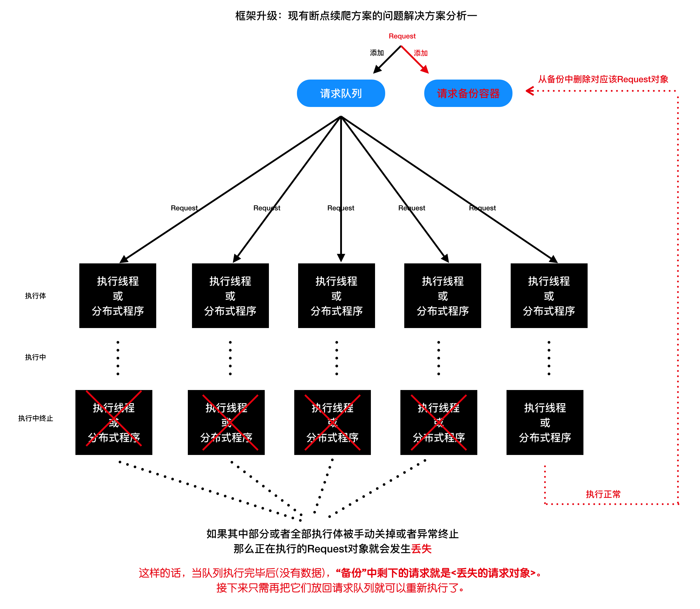
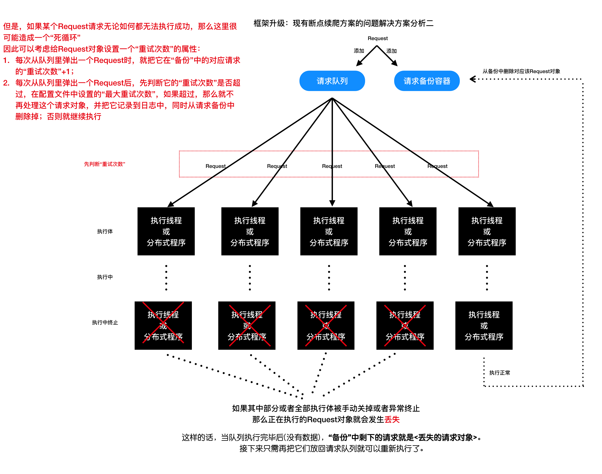

## 框架升级  --  断点续爬设计原理及其实现
##### 学习目标
1. 了解断点续爬的内涵
2. 了解分布式爬虫中请求丢失的情况
3. 了解使用备份队列保留请求的过程

-----

### 1 断点续爬的原理
在《框架升级-分布式爬虫设计原理及其实现》这一节当中，我们通过redis指纹集合已经实现了断点续爬的功能：
- 即利用持久化的指纹集合对request进行去重。
- 通过配置SCHEDULER_PERSIST=True来使用redis的同时也开启了断点续爬的功能

问题：那如何关闭断点续爬的功能呢？
- 思路：新增一个FP_PERSIST=True默认配置项，当它等于False的时候，引擎运行结束时删除redis中的指纹集合，这样就达到关闭断点续爬功能的目的了

### 2 实现关闭断点续爬的功能

##### 2.1 修改默认配置文件

```python
# scrapy_plus/conf/default_settings.py
......
# 指纹是否持久化
# 默认为True 即持久化请求对象的指纹,达到断点续爬的目的
# 如果为False,则在爬虫结束的时候清空指纹库
# 可以在项目的settings.py中重新赋值进行覆盖
FP_PERSIST = True
......
```

##### 2.2 修改utils下stats_collector.py中的clear()函数

```python
# scrapy_plus/utils/stats_collector.py
from scrapy_plus.conf.settings import REDIS_HOST, REDIS_PORT, REDIS_DB, FP_PERSIST, REDIS_SET_NAME
......
    def clear(self):
        '''程序结束后清空所有计数的值'''
        self.redis.delete(self.request_nums_key, self.response_nums_key,
                          self.repeat_request_nums_key, self.start_request_nums_key)
        # 判断是否清空指纹集合
        if not FP_PERSIST: # not True 不持久化,就清空指纹集合
            self.redis.delete(REDIS_SET_NAME)
......

```

##### 2.3 修改项目的settings.py文件

```
......
# 启用的爬虫类
SPIDERS = [
    'spiders.baidu.BaiduSpider',
    # 'spiders.baidu2.Baidu2Spider',
    # 'spiders.douban.DoubanSpider',
]
......

FP_PERSIST = False
```

### 3. 请求丢失的情况

##### 3.1 产生请求丢失的场景
- 当项目运行后，Ctrl+C主动终止进程，或爬虫代码异常等程序非正常结束的情况下，某个request对象已经从队列中取出，但最终获取的数据的过程没有完成。
- 此时fp指纹集合中已经存在了该指纹，再启动项目运行，因该请求设置了去重，那么再也无法发出该请求。
- 这个情况就是请求丢失。

##### 3.2 不光我们的scrapy_plus会出现这个情况；scrapy框架同样如此
- 解决请求丢失情况的需求，本身就是个伪需求，没有必要，多次一举。
- 如果真的要解决请求丢失也是可以的。

##### 3.3 解决请求丢失的方案（了解）
- 方案一
    - 持久化fp指纹集合的同时保存fp相应的request对象，并在获取的数据中添加fp字段，保存获取该数据的request指纹
    - 全部数据抓取完成后，删除数据中相同的fp指纹，最后指纹集合中剩下的fp对应的request对象，就是丢失的请求
    

- 方案二
    - 添加一个请求备份容器 
    

    - 给request对象设置一个重试次数的属性
    
    
-----

### 小结
1. 了解断点续爬的内涵
2. 了解分布式爬虫中请求丢失的情况
3. 了解使用备份队列保留请求的过程
4. 完成代码重构

-----

### 本小结涉及修改的完整代码

scrapy_plus/default_settings.py

```python
import logging

# 默认的日志配置
DEFAULT_LOG_LEVEL = logging.INFO    # 默认等级
DEFAULT_LOG_FMT = '%(asctime)s %(filename)s[line:%(lineno)d] \
                  %(levelname)s: %(message)s'   # 默认日志格式
DEFUALT_LOG_DATEFMT = '%Y-%m-%d %H:%M:%S'  # 默认时间格式
DEFAULT_LOG_FILENAME = 'log.log'    # 默认日志文件名称

# 启用的默认管道类
PIPELINES = []

# 启用的默认爬虫中间件类
SPIDER_MIDDLEWARES = []

# 启用的默认下载器中间件类
DOWNLOADER_MIDDLEWARES = []

# 默认异步线程最大并发数，此参数可以在项目的settings.py中重新设置自动覆盖
MAX_ASYNC_THREAD_NUMBER = 5

# 异步并发的方式 thread or coroutine 线程 或 协程
# 可以在项目的settings.py中重新设置该值，自动覆盖
ASYNC_TYPE = 'thread' # 默认为线程的方式

# 设置调度器的内容是否要持久化
# 量个值：True和False
# 如果是True，那么就是使用分布式，同时也是基于请求的增量式爬虫
# 如果是False, 不使用redis队列，会使用python的set存储指纹和请求
SCHEDULER_PERSIST = False

# redis默认配置,默认为本机的redis
REDIS_SET_NAME = 'scrapy_plus_fp_set' # fp集合
REDIS_QUEUE_NAME = 'scrapy_plus_request_queue' # request队列
REDIS_HOST = '127.0.0.1'
REDIS_PORT = 6379
REDIS_DB = 0

# 指纹是否持久化
# 默认为True 即持久化请求对象的指纹,达到断点续爬的目的
# 如果为False,则在爬虫结束的时候清空指纹库
# 可以在项目的settings.py中重新赋值进行覆盖
FP_PERSIST = True
```

scrapy_plus/utils/stats_collector.py

```python
import redis
from scrapy_plus.conf.settings import REDIS_HOST, REDIS_PORT, REDIS_DB, FP_PERSIST, REDIS_SET_NAME

class NormalStatsCollector(object):
    def __init__(self, spider_names=[]):
        #存储请求数量的键
        self.request_nums_key = "_".join(spider_names) + "_request_nums"
        #存储响应数量的键
        self.response_nums_key = "_".join(spider_names) + "_response_nums"
        #存储重复请求的键
        self.repeat_request_nums_key = "_".join(spider_names) + "_repeat_request_nums"
        #存储start_request数量的键
        self.start_request_nums_key = "_".join(spider_names) + "_start_request_nums"

        #初始化收集数据的字典
        self.dict_collector = {
            self.request_nums_key :0,
            self.response_nums_key:0,
            self.repeat_request_nums_key:0,
            self.start_request_nums_key:0
        }

    def incr(self, key):
        self.dict_collector[key] +=1

    def get(self, key):
        return self.dict_collector[key]

    def clear(self):
        del self.dict_collector

    @property
    def request_nums(self):
        '''获取请求数量'''
        return self.get(self.request_nums_key)

    @property
    def response_nums(self):
        '''获取响应数量'''
        return self.get(self.response_nums_key)

    @property
    def repeat_request_nums(self):
        '''获取重复请求数量'''
        return self.get(self.repeat_request_nums_key)

    @property
    def start_request_nums(self):
        '''获取start_request数量'''
        return self.get(self.start_request_nums_key)


class StatsCollector(object):
    """对各种数量的统计，包括总的请求数量，总的响应数量，总的重复数量"""
    def __init__(self, spider_names=[], host=REDIS_HOST,
                 port=REDIS_PORT, db=REDIS_DB, password=None):

        self.redis = redis.StrictRedis(host=host, port=port, db=db, password=password)
        #存储请求数量的键
        self.request_nums_key = "_".join(spider_names) + "_request_nums"
        #存储响应数量的键
        self.response_nums_key = "_".join(spider_names) + "_response_nums"
        #存储重复请求的键
        self.repeat_request_nums_key = "_".join(spider_names) + "_repeat_request_nums"
        #存储start_request数量的键
        self.start_request_nums_key = "_".join(spider_names) + "_start_request_nums"

    def incr(self, key):
        '''给键对应的值增加1，不存在会自动创建，并且值为1，'''
        self.redis.incr(key)

    def get(self, key):
        '''获取键对应的值，不存在是为0，存在则获取并转化为int类型'''
        ret = self.redis.get(key)
        if not ret:
            ret = 0
        else:
            ret = int(ret)
        return ret

    def clear(self):
        '''程序结束后清空所有的值'''
        self.redis.delete(self.request_nums_key, self.response_nums_key,
                          self.repeat_request_nums_key, self.start_request_nums_key)
        # 判断是否清空指纹集合
        if not FP_PERSIST:  # not True 不持久化,就清空指纹集合
            self.redis.delete(REDIS_SET_NAME)

    @property
    def request_nums(self):
        '''获取请求数量'''
        return self.get(self.request_nums_key)

    @property
    def response_nums(self):
        '''获取响应数量'''
        return self.get(self.response_nums_key)

    @property
    def repeat_request_nums(self):
        '''获取重复请求数量'''
        return self.get(self.repeat_request_nums_key)

    @property
    def start_request_nums(self):
        '''获取start_request数量'''
        return self.get(self.start_request_nums_key)
```

项目路径/settings.py

```python
# 修改默认日志文件名称
DEFAULT_LOG_FILENAME = '日志.log'    # 默认日志文件名称

# 启用的爬虫类
SPIDERS = [
    'spiders.baidu.BaiduSpider',
    # 'spiders.baidu2.Baidu2Spider',
    # 'spiders.douban.DoubanSpider',
]

# 启用的管道类
PIPELINES = [
    'pipelines.BaiduPipeline',
    'pipelines.DoubanPipeline'
]

# 启用的爬虫中间件类
SPIDER_MIDDLEWARES = []

# 启用的下载器中间件类
DOWNLOADER_MIDDLEWARES = []

SCHEDULER_PERSIST = True

ASYNC_TYPE = 'coroutine' # 默认为线程的方式

FP_PERSIST = False
```

