## Linux基本命令\(二\)

### 1. 输出重定向命令：&gt;

Linux允许将命令执行结果重定向到一个文件，本应显示在终端上的内容保存到指定文件中。

如：ls &gt; test.txt \( test.txt 如果不存在，则创建，存在则覆盖其内容 \)

  
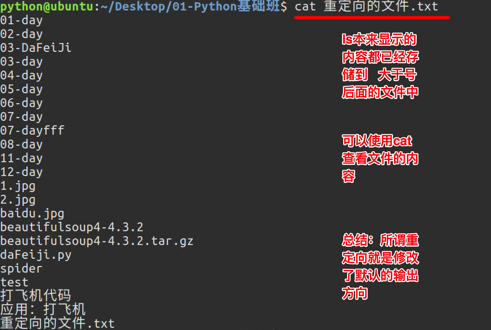

注意：  
`>输出重定向会覆盖原来的内容，>>输出重定向则会追加到文件的尾部。`

### 2. 分屏显示：more

查看内容时，在信息过长无法在一屏上显示时，会出现快速滚屏，使得用户无法看清文件的内容，此时可以使用more命令，每次只显示一页，按下空格键可以显示下一页，按下q键退出显示，按下h键可以获取帮助。

  
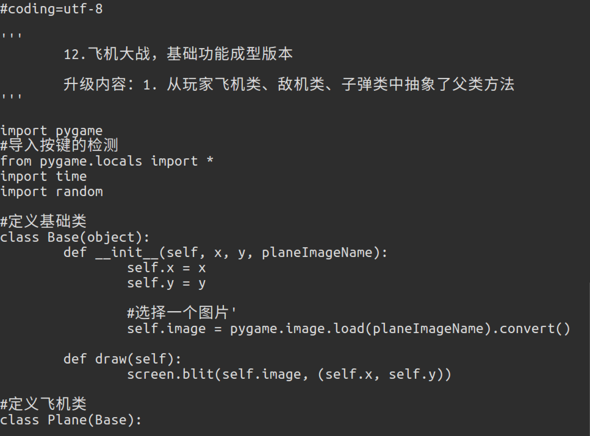

### 3. 管道：\|

管道：一个命令的输出可以通过管道做为另一个命令的输入。

管道我们可以理解现实生活中的管子，管子的一头塞东西进去，另一头取出来，这里“ \| ”的左右分为两端，左端塞东西\(写\)，右端取东西\(读\)。


### 4. 建立链接文件：ln

Linux链接文件类似于Windows下的快捷方式。

链接文件分为软链接和硬链接。

软链接：软链接不占用磁盘空间，源文件删除则软链接失效。

硬链接：硬链接只能链接普通文件，不能链接目录。

使用格式：

```
ln 源文件 链接文件
ln -s 源文件 链接文件
```

如果`没有-s`选项代表建立一个硬链接文件，两个文件占用相同大小的硬盘空间，即使删除了源文件，链接文件还是存在，所以-s选项是更常见的形式。

注意：如果软链接文件和源文件不在同一个目录，源文件要使用绝对路径，不能使用相对路径。

  
  
  
  
  
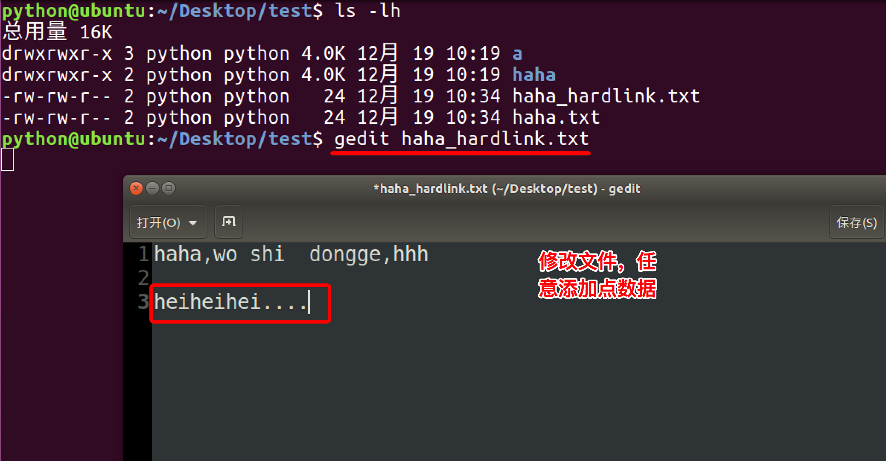  
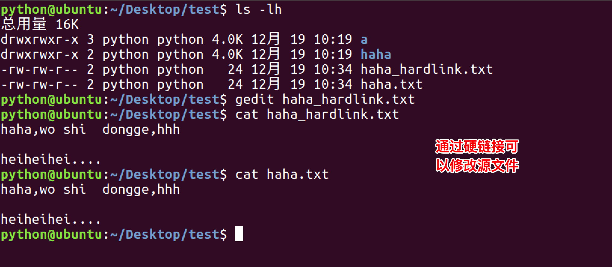  
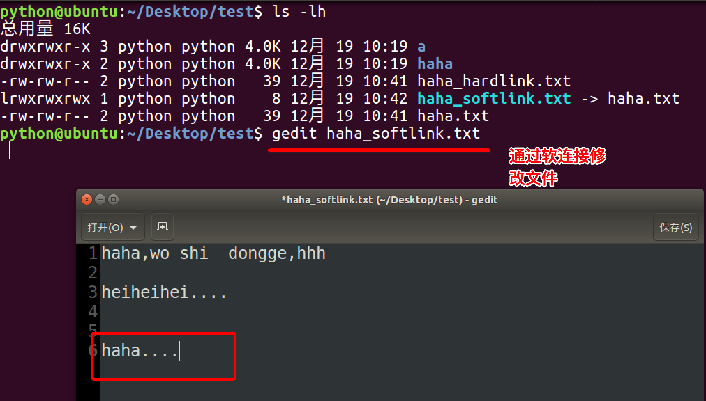  
  
  
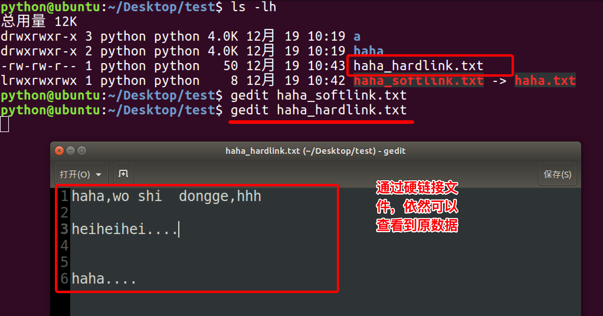  
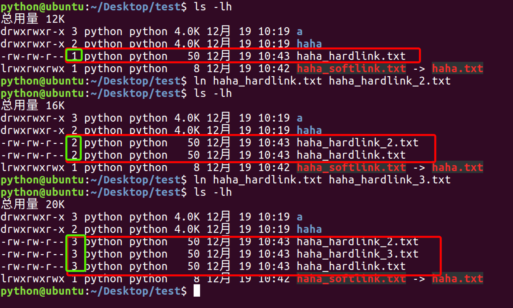  
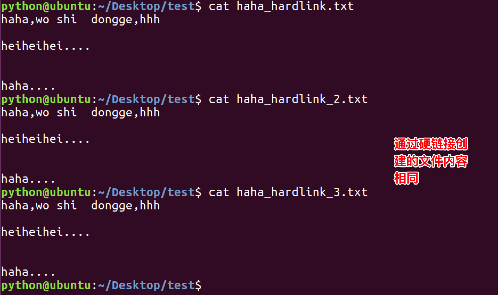  
  
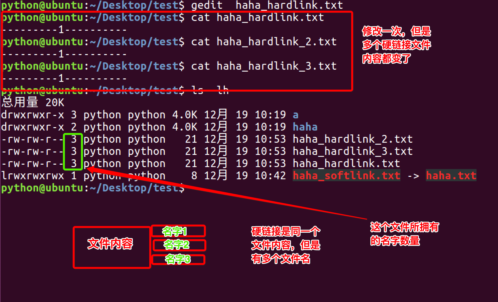

### 5. 查看或者合并文件内容：cat

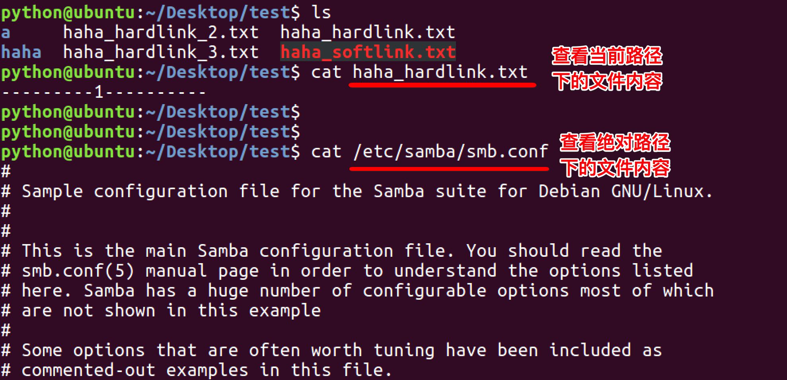  


### 6. 文本搜索：grep

Linux系统中grep命令是一种强大的文本搜索工具，grep允许对文本文件进行模式查找。如果找到匹配模式， grep打印包含模式的所有行。

grep一般格式为：

```
grep [-选项] ‘搜索内容串’文件名
```

在grep命令中输入字符串参数时，最好引号或双引号括起来。

例如：

```
grep 'a' 1.txt
```

常用选项说明：

| 选项 | 含义 |
| :--- | --- |
| -v | 显示不包含匹配文本的所有行（相当于求反） |
| -n | 显示匹配行及行号 |
| -i | 忽略大小写 |

grep搜索内容串可以是正则表达式。

正则表达式是对字符串操作的一种逻辑公式，就是用事先定义好的一些特定字符、及这些特定字符的组合，组成一个“规则字符串”，这个“规则字符串”用来表达对字符串的一种过滤逻辑。

grep常用正则表达式：

| 参数 | 含义 |
| :--- | --- |
| ^a | 行首,搜寻以 m 开头的行；grep -n '^a' 1.txt |
| ke$ | 行尾,搜寻以 ke 结束的行；grep -n 'ke$' 1.txt |
| \[Ss\]igna\[Ll\] | 匹配 \[\] 里中一系列字符中的一个；搜寻匹配单词signal、signaL、Signal、SignaL的行；grep -n '\[Ss\]igna\[Ll\]' 1.txt |
| . | \(点\)匹配一个非换行符的字符；匹配 e 和 e 之间有任意一个字符，可以匹配 eee，eae，eve，但是不匹配 ee，eaae；grep -n 'e.e' 1.txt |


### 7. 查找文件：find

find命令功能非常强大，通常用来在特定的目录下搜索符合条件的文件，也可以用来搜索特定用户属主的文件。

常用用法：

| 命令 | 含义 |
| :--- | --- |
| find ./ -name test.sh | 查找当前目录下所有名为test.sh的文件 |
| find ./ -name '\*.sh' | 查找当前目录下所有后缀为.sh的文件 |
| find ./ -name "\[A-Z\]\*" | 查找当前目录下所有以大写字母开头的文件 |
| find  /tmp  -size   2M | 查找在/tmp 目录下等于2M的文件 |
| find  /tmp  -size  +2M | 查找在/tmp 目录下大于2M的文件 |
| find  /tmp  -size  -2M | 查找在/tmp 目录下小于2M的文件 |
| find ./ -size +4k -size -5M | 查找当前目录下大于4k，小于5M的文件 |
| find ./ -perm 777 | 查找当前目录下权限为 777 的文件或目录 |

### 8. 归档管理：tar

计算机中的数据经常需要备份，tar是Unix/Linux中最常用的备份工具，此命令可以把一系列文件归档到一个大文件中，也可以把档案文件解开以恢复数据。

tar使用格式  
tar  \[参数\]  打包文件名  文件

tar命令很特殊，其参数前面可以使用“-”，也可以不使用。

常用参数：

| 参数 | 含义 |
| :--- | --- |
| -c | 生成档案文件，创建打包文件 |
| -v | 列出归档解档的详细过程，显示进度 |
| -f | 指定档案文件名称，f后面一定是.tar文件，所以必须放选项最后 |
| -t | 列出档案中包含的文件 |
| -x | 解开档案文件 |

注意：除了f需要放在参数的最后，其它参数的顺序任意。

  
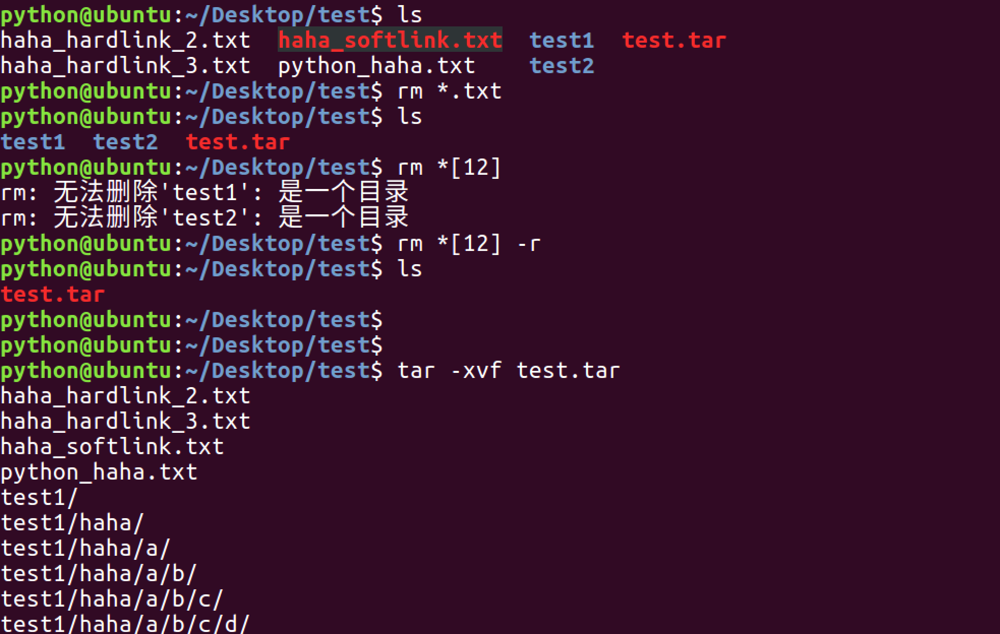  


### 9. 文件压缩解压：gzip

tar与gzip命令结合使用实现文件打包、压缩。  
tar只负责打包文件，但不压缩，用gzip压缩tar打包后的文件，其扩展名一般用xxxx.tar.gz。

gzip使用格式如下：

```
gzip  [选项]  被压缩文件
```

常用选项：

| 选项 | 含义 |
| :--- | --- |
| -d | 解压 |
| -r | 压缩所有子目录 |

  
  


tar这个命令并没有压缩的功能，它只是一个打包的命令，但是在tar命令中增加一个选项\(-z\)可以调用gzip实现了一个压缩的功能，实行一个先打包后压缩的过程。

压缩用法：tar cvzf 压缩包包名 文件1 文件2 ...

```
-z ：指定压缩包的格式为：file.tar.gz
```


解压用法： tar zxvf 压缩包包名

```
-z:指定压缩包的格式为：file.tar.gz
```


解压到指定目录：-C （大写字母“C”）

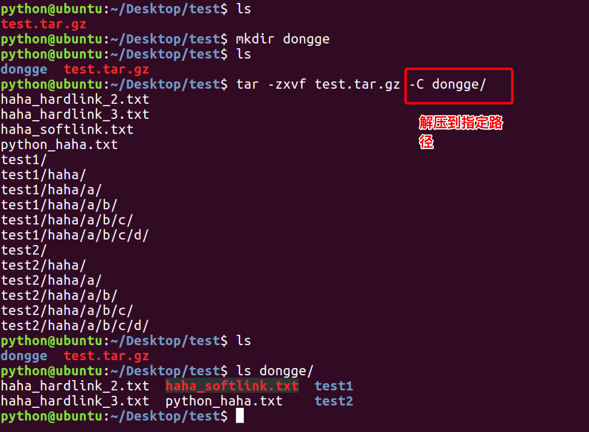

### 10. 文件压缩解压：bzip2

tar与bzip2命令结合使用实现文件打包、压缩\(用法和gzip一样\)。

tar只负责打包文件，但不压缩，用bzip2压缩tar打包后的文件，其扩展名一般用xxxx.tar.gz2。

在tar命令中增加一个选项\(-j\)可以调用bzip2实现了一个压缩的功能，实行一个先打包后压缩的过程。

压缩用法：tar -jcvf 压缩包包名 文件...\(tar jcvf bk.tar.bz2 \*.c\)

解压用法：tar -jxvf 压缩包包名 \(tar jxvf bk.tar.bz2\)

### 11. 文件压缩解压：zip、unzip

通过zip压缩文件的目标文件不需要指定扩展名，默认扩展名为zip。

压缩文件：zip  \[-r\] 目标文件\(没有扩展名\) 源文件

解压文件：unzip -d 解压后目录文件 压缩文件

  


### 12. 查看命令位置：which


### 13. 修改文件权限：chmod

chmod 修改文件权限有两种使用格式：字母法与数字法。

字母法：chmod u/g/o/a  +/-/=  rwx  文件

| \[ u/g/o/a \] | 含义 |
| :--- | --- |
| u | user 表示该文件的所有者 |
| g | group 表示与该文件的所有者属于同一组\( group \)者，即用户组 |
| o | other 表示其他以外的人 |
| a | all 表示这三者皆是 |

| \[ +-= \] | 含义 |
| --- | --- |
| + | 增加权限 |
| - | 撤销权限 |
| = | 设定权限 |

| rwx | 含义 |
| --- | --- |
| r | read 表示可读取，对于一个目录，如果没有r权限，那么就意味着不能通过ls查看这个目录的内容。 |
| w | write 表示可写入，对于一个目录，如果没有w权限，那么就意味着不能在目录下创建新的文件。 |
| x | excute 表示可执行，对于一个目录，如果没有x权限，那么就意味着不能通过cd进入这个目录。 |

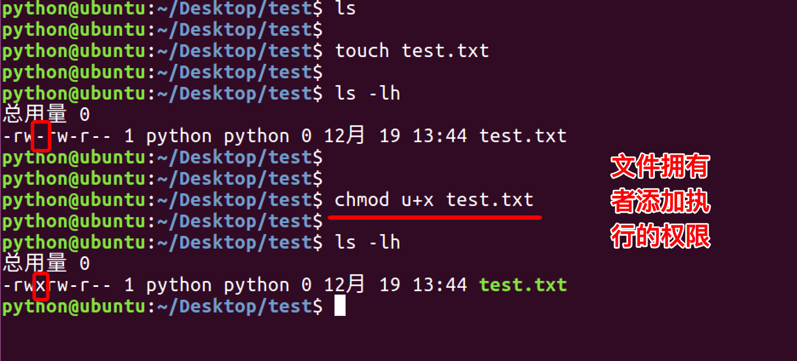  
  


如果需要同时进行设定拥有者、同组者以及其他人的权限，参考如下：


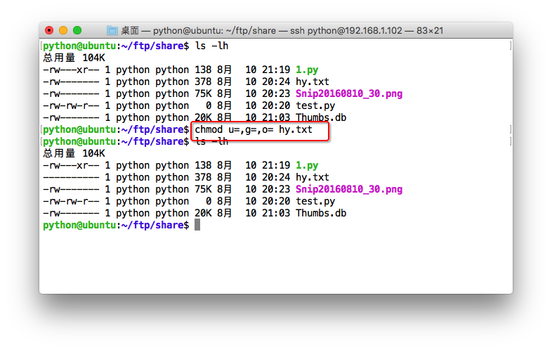

数字法：“rwx” 这些权限也可以用数字来代替

| 字母 | 说明 |
| --- | --- |
| r | 读取权限，数字代号为 "4" |
| w | 写入权限，数字代号为 "2" |
| x | 执行权限，数字代号为 "1" |
| - | 不具任何权限，数字代号为 "0" |

如执行：chmod u=rwx,g=rx,o=r filename   
就等同于：chmod u=7,g=5,o=4 filename

chmod 751 file：

* 文件所有者：读、写、执行权限
* 同组用户：读、执行的权限
* 其它用户：执行的权限

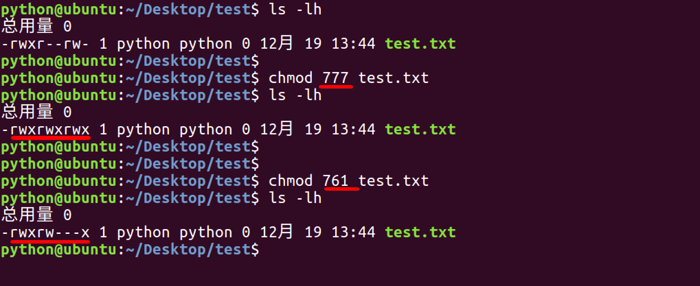

注意：如果想递归所有目录加上相同权限，需要加上参数“ -R ”。  
如：chmod 777 test/ -R 递归 test 目录下所有文件加 777 权限

### 14. 切换到管理员账号

Ubuntu下切换到root的简单命令:


### 15. 设置用户密码：passwd

在Unix/Linux中，超级用户可以使用passwd命令为普通用户设置或修改用户密码。用户也可以直接使用该命令来修改自己的密码，而无需在命令后面使用用户名。


### 16. 退出登录账户： exit

* 如果是图形界面，退出当前终端；
* 如果是使用ssh远程登录，退出登陆账户；
* 如果是切换后的登陆用户，退出则返回上一个登陆账号。

### 17. 查看登录用户：who

who命令用于查看当前所有登录系统的用户信息。

常用选项：

| 选项 | 含义 |
| :--- | --- |
| -q或--count | 只显示用户的登录账号和登录用户的数量 |
| -u或--heading | 显示列标题 |


### 18. 关机重启：reboot、shutdown、init

| 命令 | 含义 |
| :--- | --- |
| reboot | 重新启动操作系统 |
| shutdown –r now | 重新启动操作系统，shutdown会给别的用户提示 |
| shutdown -h now | 立刻关机，其中now相当于时间为0的状态 |
| shutdown -h 20:25 | 系统在今天的20:25 会关机 |
| shutdown -h +10 | 系统再过十分钟后自动关机 |


