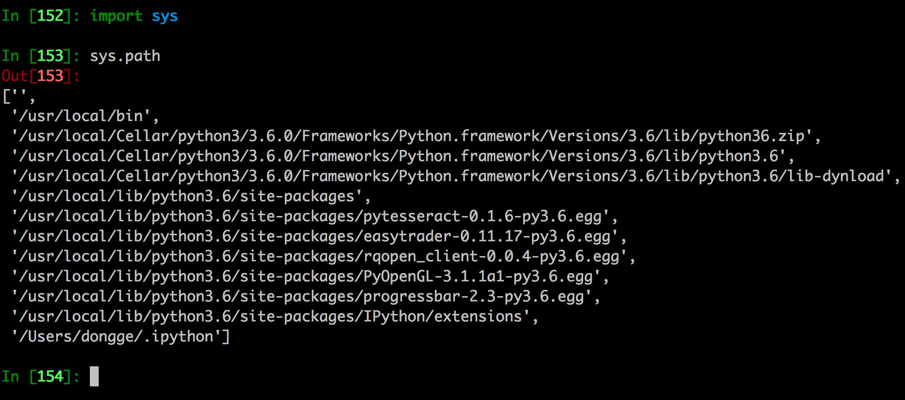
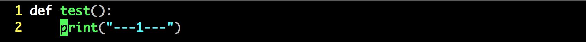
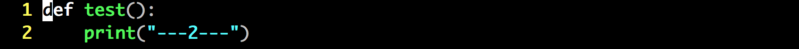
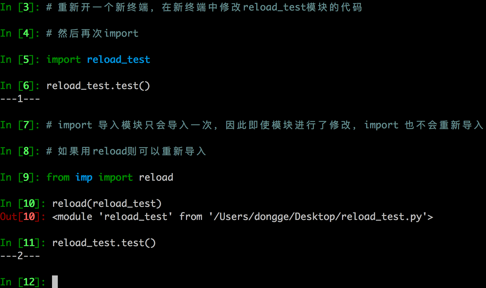

## import导入模块

### 1. import 搜索路径



### 路径搜索

* 从上面列出的目录里依次查找要导入的模块文件
* '' 表示当前路径
* 列表中的路径的先后顺序代表了python解释器在搜索模块时的先后顺序

### 程序执行时添加新的模块路径

```python
sys.path.append('/home/itcast/xxx')
sys.path.insert(0, '/home/itcast/xxx')  # 可以确保先搜索这个路径
```

```python
In [37]: sys.path.insert(0,"/home/python/xxxx")
In [38]: sys.path
Out[38]:
['/home/python/xxxx',
 '',
 '/usr/bin',
 '/usr/lib/python35.zip',
 '/usr/lib/python3.5',
 '/usr/lib/python3.5/plat-x86_64-linux-gnu',
 '/usr/lib/python3.5/lib-dynload',
 '/usr/local/lib/python3.5/dist-packages',
 '/usr/lib/python3/dist-packages',
 '/usr/lib/python3/dist-packages/IPython/extensions',
 '/home/python/.ipython']

```

### 2. 重新导入模块
模块被导入后，`import module`不能重新导入模块，重新导入需用`reload`









### 3. 多模块开发时的注意点
> main.py

```python

from send import *
from show import *

# 主流程
def main():
    # 发女朋友
    send()
    # 秀恩爱
    show()


if __name__ == '__main__':
    main()

```
> send.py

```python
#import girl
from girl import *

# 发女朋友
def send():
    print("发女朋友了,翠花是你的了")
    #girl.have_girl = True
    have_girl = True
```

> show.py

```python
# import girl
from girl import *

# 秀恩爱
def show():
    if have_girl == True:
    #if girl.have_girl == True:
        print("我有女朋友了,好开心")
    else:
        print("单身贵族")

```

> girl.py

```python
# 共同变量模块

have_girl = False #False代表没有女朋友 True代表有女朋友
```
