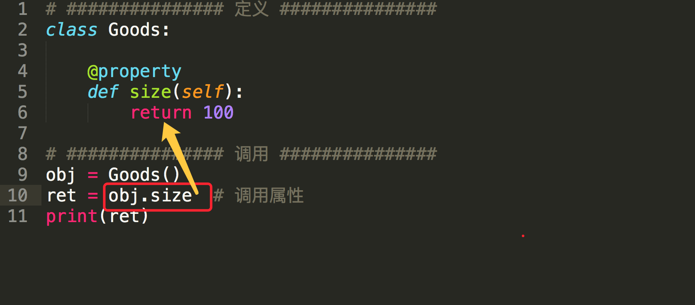

## property属性

### 1. 什么是property属性

一种用起来像是使用的实例属性一样的特殊属性，可以对应于某个方法

```python
# ############### 定义 ###############
class Foo:
    def func(self):
        pass

    # 定义property属性
    @property
    def prop(self):
        pass

# ############### 调用 ###############
foo_obj = Foo()
foo_obj.func()  # 调用实例方法
foo_obj.prop  # 调用property属性
```




##### property属性的定义和调用要注意一下几点：

* 定义时，在实例方法的基础上添加 @property 装饰器；并且仅有一个self参数
* 调用时，无需括号
    ```python
    方法：foo_obj.func()
    property属性：foo_obj.prop
    ```


### 2. 简单的实例
> 对于京东商城中显示电脑主机的列表页面，每次请求不可能把数据库中的所有内容都显示到页面上，而是通过分页的功能局部显示，所以在向数据库中请求数据时就要显示的指定获取从第m条到第n条的所有数据
> 这个分页的功能包括：
>
> * 根据用户请求的当前页和总数据条数计算出 m 和 n
>
> * 根据m 和 n 去数据库中请求数据

```python
# ############### 定义 ###############
class Pager:
    def __init__(self, current_page):
        # 用户当前请求的页码（第一页、第二页...）
        self.current_page = current_page
        # 每页默认显示10条数据
        self.per_items = 10

    @property
    def start(self):
        val = (self.current_page - 1) * self.per_items
        return val

    @property
    def end(self):
        val = self.current_page * self.per_items
        return val

# ############### 调用 ###############
p = Pager(1)
p.start  # 就是起始值，即：m
p.end  # 就是结束值，即：n
```

#### 从上述可见
* Python的property属性的功能是：property属性内部进行一系列的逻辑计算，最终将计算结果返回。


### 3. property属性的完整使用
#### 三种@property装饰器

```python
#coding=utf-8
# ############### 定义 ###############
class Goods:
    """定义一个商品类
       第一种装饰器:@property
       第二种装饰器:@property方法名.setter
       第三种装饰器:@property方法名.deleter
    """
    @property
    def price(self):
        print('@property')

    @price.setter
    def price(self, value):
        print('@price.setter')

    @price.deleter
    def price(self):
        print('@price.deleter')

# ############### 调用 ###############
obj = Goods()
obj.price          # 自动执行 @property 修饰的 price 方法，并获取方法的返回值
obj.price = 123    # 自动执行 @price.setter 修饰的 price 方法，并将  123 赋值给方法的参数value
del obj.price      # 自动执行 @price.deleter 修饰的 price 方法

```

#### 注意
* 经典类中的属性只有一种访问方式，其对应被 @property 修饰的方法
* 新式类中的属性有三种访问方式，并分别对应了三个被@property、@方法名.setter、@方法名.deleter修饰的方法

###三种装饰器的应用
```python
class Goods(object):

    def __init__(self):
        # 原价
        self.original_price = 100
        # 折扣
        self.discount = 0.8

    @property
    def price(self):
        # 实际价格 = 原价 * 折扣
        new_price = self.original_price * self.discount
        return new_price

    @price.setter
    def price(self, value):
        self.original_price = value

    @price.deleter
    def price(self):
        del self.original_price

obj = Goods()
obj.price         # 获取商品价格
obj.price = 200   # 修改商品原价
del obj.price     # 删除商品原价

```

#### 4.property属性的第二种使用方式:类属性方式


```python
# property属性的第二种定义方式:类属性定义方式
class Goods(object):

    def get_price(self):
        print("get price...")
        return 100

    def set_price(self, value):
        """必须两个参数"""
        print("set price...")
        print(value)

    def del_price(self):
        print("del price")

    price = property(get_price, set_price, del_price, "相关描述...")

obj = Goods()

obj.price  # 自动调用第一个参数中定义的方法：get_price
obj.price = "价格"  # 自动调用第二个参数中定义的方法：set_price方法，并将“价格”当作参数传入
desc = Goods.price.__doc__  # 自动获取第四个参数中设置的值："相关描述..."
print(desc)
del obj.price  # 自动调用第三个参数中定义的方法：del_price方法
```

property方法中有个四个参数

* 第一个参数是方法名，调用 对象.属性 时自动触发执行方法
* 第二个参数是方法名，调用 对象.属性 ＝ XXX 时自动触发执行方法
* 第三个参数是方法名，调用 del 对象.属性 时自动触发执行方法
* 第四个参数是字符串，调用 对象.属性.\_\_doc\_\_ ，此参数是该属性的描述信息


###类属性定义方式的案例

```python
class Goods(object):

    def __init__(self):
        # 原价
        self.original_price = 100
        # 折扣
        self.discount = 0.8

    def get_price(self):
        # 实际价格 = 原价 * 折扣
        new_price = self.original_price * self.discount
        return new_price

    def set_price(self, value):
        self.original_price = value

    def del_price(self):
        del self.original_price

    PRICE = property(get_price, set_price, del_price, '价格属性描述...')

obj = Goods()
obj.PRICE          # 获取商品价格
obj.PRICE = 200    # 修改商品原价
del obj.PRICE      # 删除商品原价
Goods.PRICE.__doc__# 获取价格的描述信息
```


#### 综上所述:
* 定义property属性共有两种方式，分别是【装饰器】和【类属性】，而【装饰器】方式针对经典类和新式类又有所不同。
* 通过使用property属性，能够简化调用者在获取数据的流程
